# SketchUp 3e : L'espace complet, en détail

!!! abstract "Objectif de la séance"
    Organiser le modèle en balises, ajouter l'ombrière, le solaire et la signalétique, vérifier l'ensoleillement, coter et exporter le dossier.

| Durée | Outil | Étapes | Test |
|---|---|---|---|
| 45 minutes, demi-groupe | SketchUp Free, app.sketchup.com | 12 | [Test en ligne](quiz-3e.html) |

## À préparer

- Le fichier de 4e avec la cour, les huit bacs, le fût et le réseau
- Les cotes de l'ombrière et du panneau solaire
- La liste des huit plantes retenues

## Le pas à pas

| # | Geste | À taper |
|---|---|---|
| 1 | Ouvrir le modèle de 4e et l'enregistrer sous jardin-complet-nom. |  |
| 2 | Panneau Balises, bouton plus : créer les cinq balises du projet. | `Site, Bacs, Eau, Énergie, Végétation` |
| 3 | Sélectionner un groupe, panneau Infos sur l'entité, choisir sa balise. Répéter. |  |
| 4 | Cliquer l'œil devant la balise Bacs pour la masquer. |  |
| 5 | Ombrière : quatre poteaux, deux pannes, une toile. | `0,08 ; 0,08 ; 2,1 puis toile` |
| 6 | Panneau solaire : rectangle, Pousser/Tirer, puis Rotation. | `0,17 ; 0,14 ; 0,01 puis 15°` |
| 7 | Jardinières murales sur le mur, puis copie en série. | `1,2 ; 0,14 ; 0,8 puis 3x` |
| 8 | Panneau Ombres : cocher Afficher, régler la date et l'heure. | `21/12 à 12 h` |
| 9 | Outil Cotation : porter les quatre cotes obligatoires. | `12,00 / 4,00 / 1,90 / 1,20` |
| 10 | Texte 3D : poser le nom de chaque plante devant son bac. | `hauteur 0,12` |
| 11 | Panneau Scènes, bouton plus : créer la scène Avant, puis la scène Après. |  |
| 12 | Fichier, Exporter, PNG. Largeur 1920. Enregistrer le modèle. | `1920 px` |

## La planche des douze étapes

**1.** Ouvrir le modèle de 4e et l'enregistrer sous jardin-complet-nom.

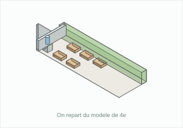

**2.** Panneau Balises, bouton plus : créer les cinq balises du projet. `Site, Bacs, Eau, Énergie, Végétation`

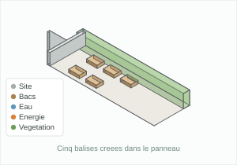

**3.** Sélectionner un groupe, panneau Infos sur l'entité, choisir sa balise. Répéter.

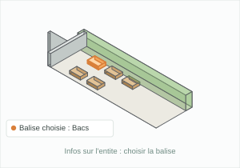

**4.** Cliquer l'œil devant la balise Bacs pour la masquer.

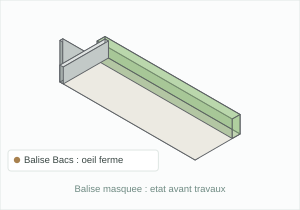

**5.** Ombrière : quatre poteaux, deux pannes, une toile. `0,08 ; 0,08 ; 2,1 puis toile`

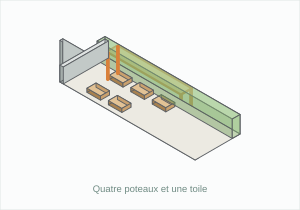

**6.** Panneau solaire : rectangle, Pousser/Tirer, puis Rotation. `0,17 ; 0,14 ; 0,01 puis 15°`

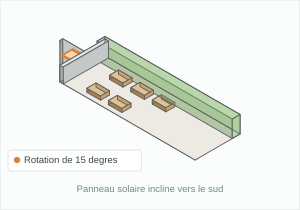

**7.** Jardinières murales sur le mur, puis copie en série. `1,2 ; 0,14 ; 0,8 puis 3x`

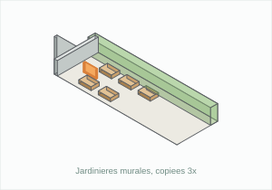

**8.** Panneau Ombres : cocher Afficher, régler la date et l'heure. `21/12 à 12 h`

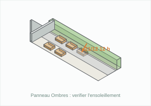

**9.** Outil Cotation : porter les quatre cotes obligatoires. `12,00 / 4,00 / 1,90 / 1,20`

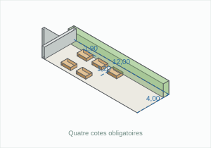

**10.** Texte 3D : poser le nom de chaque plante devant son bac. `hauteur 0,12`

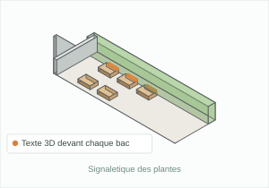

**11.** Panneau Scènes, bouton plus : créer la scène Avant, puis la scène Après.

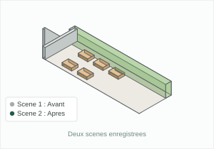

**12.** Fichier, Exporter, PNG. Largeur 1920. Enregistrer le modèle. `1920 px`

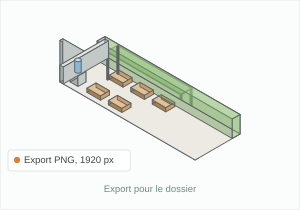

## Raccourcis

| Touche | Outil |
|---|---|
| Q | Rotation |
| T | Mètre |
| Maj+A | Panneau Balises |
| Cotation | Menu Outils |
| Ombres | Panneau latéral |
| Scènes | Panneau latéral |

## Ce que je retiens

Les _________, appelées calques dans les autres logiciels, regroupent les objets par famille : Site, Bacs, Eau, Énergie, Végétation.  
On masque une balise en cliquant l'________ devant son nom, ce qui permet de comparer l'état ________ et l'état ________ sans rien supprimer.  
Une ________ enregistre un point de vue et l'état des balises, et se rappelle d'un seul clic.  
Le panneau ________ affiche l'ombre réelle si l'on règle la ________ et l'________ : on vérifie ainsi que le panneau solaire reste au soleil le ________ décembre à midi.  
L'outil ___________ porte les dimensions sur le modèle : longueur, largeur, entraxe et passage libre.  
L'export se fait en ________ de ________ pixels de large, largeur suffisante pour le dossier de présentation.

## Test en ligne

[Faire le test des huit questions](quiz-3e.html)
