# SketchUp 4e : Le bac et les espaces extérieurs

!!! abstract "Objectif de la séance"
    Poser la cour, ses murs et sa haie, y implanter les huit bacs par copie en série, puis ajouter le fût et la ligne d'arrosage.

| Durée | Outil | Étapes | Test |
|---|---|---|---|
| 45 minutes, demi-groupe | SketchUp Free, app.sketchup.com | 12 | [Test en ligne](quiz-4e.html) |

## À préparer

- Le fichier bac-nom-prenom de 5e, ou le composant Bac_5e fourni
- Le relevé de la cour : 12 m sur 4 m
- Les cotes du fût : diamètre 0,58 m, hauteur 0,90 m

## Le pas à pas

| # | Geste | À taper |
|---|---|---|
| 1 | Ouvrir le fichier de 5e. Si le bac manque, insérer le composant Bac_5e. |  |
| 2 | Rectangle à l'origine : le sol de la cour. | `12 ; 4` |
| 3 | Sélectionner le sol, clic droit, Créer un groupe. |  |
| 4 | Rectangle le long du bord droit, puis Pousser/Tirer. C'est le mur du bâtiment. | `12 ; 0,25 puis 3,2` |
| 5 | Rectangle au fond, puis Pousser/Tirer. C'est le mur de soutènement. | `0,3 ; 4 puis 1,3` |
| 6 | Rectangle le long du bord gauche, Pousser/Tirer, puis Colorier en vert. C'est la haie. | `12 ; 0,7 puis 1,5` |
| 7 | Déplacer le bac, cliquer son coin, taper les coordonnées absolues entre crochets. | `[2 ; 0,8 ; 0]` |
| 8 | Déplacer avec Ctrl vers la droite de 1,90 m, puis taper le nombre de copies. | `1,9 puis 3x` |
| 9 | Sélectionner les quatre bacs, Déplacer avec Ctrl de 2 m vers le mur. | `2` |
| 10 | Cercle puis Pousser/Tirer : le fût. Le poser sur un socle. | `rayon 0,29 puis 0,9` |
| 11 | Ligne le long de l'allée, Cercle de rayon 0,008 à son extrémité, outil Suivez-moi. | `0,008` |
| 12 | Outil Mètre : contrôler le passage libre entre les deux rangées. Enregistrer. | `1,20 m attendu` |

## La planche des douze étapes

**1.** Ouvrir le fichier de 5e. Si le bac manque, insérer le composant Bac_5e.

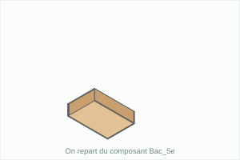

**2.** Rectangle à l'origine : le sol de la cour. `12 ; 4`

**3.** Sélectionner le sol, clic droit, Créer un groupe.

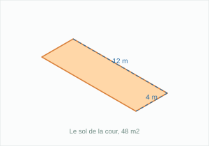

**4.** Rectangle le long du bord droit, puis Pousser/Tirer. C'est le mur du bâtiment. `12 ; 0,25 puis 3,2`

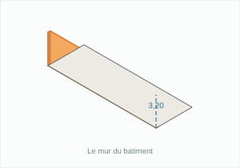

**5.** Rectangle au fond, puis Pousser/Tirer. C'est le mur de soutènement. `0,3 ; 4 puis 1,3`

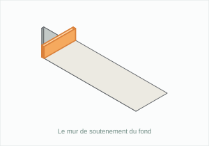

**6.** Rectangle le long du bord gauche, Pousser/Tirer, puis Colorier en vert. C'est la haie. `12 ; 0,7 puis 1,5`

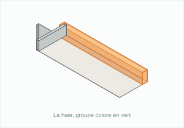

**7.** Déplacer le bac, cliquer son coin, taper les coordonnées absolues entre crochets. `[2 ; 0,8 ; 0]`

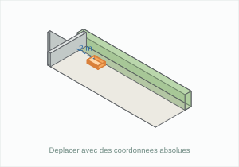

**8.** Déplacer avec Ctrl vers la droite de 1,90 m, puis taper le nombre de copies. `1,9 puis 3x`

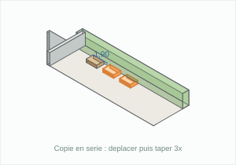

**9.** Sélectionner les quatre bacs, Déplacer avec Ctrl de 2 m vers le mur. `2`

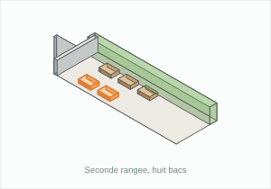

**10.** Cercle puis Pousser/Tirer : le fût. Le poser sur un socle. `rayon 0,29 puis 0,9`

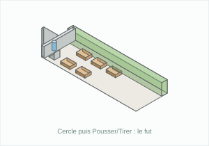

**11.** Ligne le long de l'allée, Cercle de rayon 0,008 à son extrémité, outil Suivez-moi. `0,008`

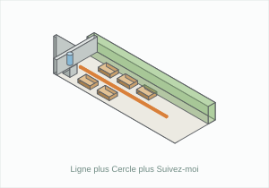

**12.** Outil Mètre : contrôler le passage libre entre les deux rangées. Enregistrer. `1,20 m attendu`

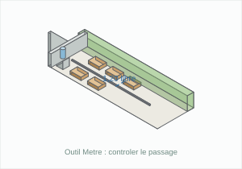

## Raccourcis

| Touche | Outil |
|---|---|
| R | Rectangle |
| C | Cercle |
| L | Ligne |
| P | Pousser/Tirer |
| M | Déplacer |
| T | Mètre |
| Ctrl | Copier en déplaçant |

## Ce que je retiens

La cour mesure ________ m sur ________ m, soit ________ m2. Chaque élément est enfermé dans un ________ pour rester modifiable seul.  
Pour placer un objet à un endroit précis, on tape ses _______________ absolues entre crochets, par exemple [2 ; 0,8 ; 0].  
La ___________________ se fait avec Déplacer et la touche ________, puis en tapant le nombre de copies suivi de la lettre ________.  
L'entraxe entre deux bacs est de ________ m, et le passage libre à conserver de ________ m.  
Le fût est un ________ extrudé, surélevé de ________ m pour créer la charge hydraulique.  
Le tuyau se construit avec l'outil ______________ : un cercle de rayon ________ m parcourt une ligne.

## Test en ligne

[Faire le test des huit questions](quiz-4e.html)
