# SketchUp 5e : Créer le bac dans SketchUp Free

!!! abstract "Objectif de la séance"
    Construire, coter et enregistrer une jardinière de 1,20 m sur 0,80 m, aux dimensions du cahier des charges.

| Durée | Outil | Étapes | Test |
|---|---|---|---|
| 45 minutes, demi-groupe | SketchUp Free, app.sketchup.com | 12 | [Test en ligne](quiz-5e.html) |

## À préparer

- Un compte Trimble par élève, créé à l'avance
- app.sketchup.com ouvert dans Chrome
- Le cahier des charges de la séance 3 sous les yeux

## Le pas à pas

| # | Geste | À taper |
|---|---|---|
| 1 | Ouvrir app.sketchup.com, cliquer Créer un modèle, choisir le modèle Mètres. |  |
| 2 | Cliquer sur le personnage, appuyer sur Suppr. |  |
| 3 | Outil Rectangle. Cliquer à l'origine, taper la valeur, Entrée. | `1,2 ; 0,8` |
| 4 | Outil Pousser/Tirer. Cliquer la face, taper la valeur, Entrée. C'est le fond. | `0,02` |
| 5 | Rectangle sur le dessus du fond, le long du bord avant. | `1,2 ; 0,02` |
| 6 | Pousser/Tirer cette bande vers le haut. C'est la première paroi longue. | `0,3` |
| 7 | Refaire les étapes 5 et 6 sur le bord arrière. | `1,2 ; 0,02 puis 0,3` |
| 8 | Rectangle entre les deux parois, côté gauche, puis Pousser/Tirer. | `0,02 ; 0,76 puis 0,3` |
| 9 | Refaire l'étape 8 à droite. Le caisson est fermé. | `0,02 ; 0,76 puis 0,3` |
| 10 | Outil Mètre. Mesurer la hauteur totale du bac. | `0,32 m attendu` |
| 11 | Sélectionner tout, clic droit, Créer un composant. Nom : Bac_5e. | `Bac_5e` |
| 12 | Ajouter la terre et le paillage, puis enregistrer sous bac-nom-prenom. | `0,25 puis 0,03` |

## La planche des douze étapes

**1.** Ouvrir app.sketchup.com, cliquer Créer un modèle, choisir le modèle Mètres.

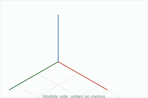

**2.** Cliquer sur le personnage, appuyer sur Suppr.

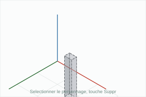

**3.** Outil Rectangle. Cliquer à l'origine, taper la valeur, Entrée. `1,2 ; 0,8`

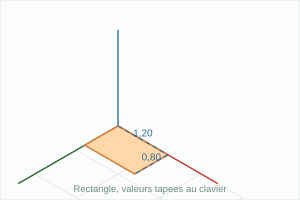

**4.** Outil Pousser/Tirer. Cliquer la face, taper la valeur, Entrée. C'est le fond. `0,02`

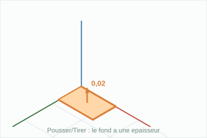

**5.** Rectangle sur le dessus du fond, le long du bord avant. `1,2 ; 0,02`

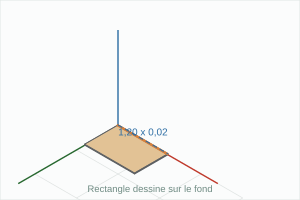

**6.** Pousser/Tirer cette bande vers le haut. C'est la première paroi longue. `0,3`

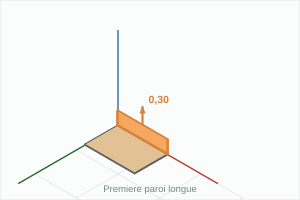

**7.** Refaire les étapes 5 et 6 sur le bord arrière. `1,2 ; 0,02 puis 0,3`

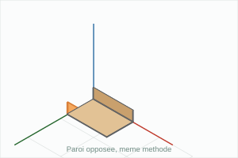

**8.** Rectangle entre les deux parois, côté gauche, puis Pousser/Tirer. `0,02 ; 0,76 puis 0,3`

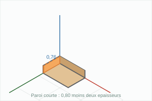

**9.** Refaire l'étape 8 à droite. Le caisson est fermé. `0,02 ; 0,76 puis 0,3`

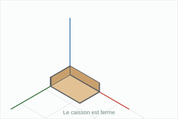

**10.** Outil Mètre. Mesurer la hauteur totale du bac. `0,32 m attendu`

**11.** Sélectionner tout, clic droit, Créer un composant. Nom : Bac_5e. `Bac_5e`

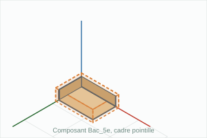

**12.** Ajouter la terre et le paillage, puis enregistrer sous bac-nom-prenom. `0,25 puis 0,03`

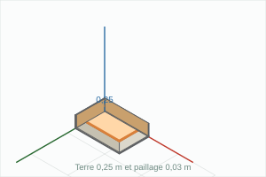

## Raccourcis

| Touche | Outil |
|---|---|
| R | Rectangle |
| P | Pousser/Tirer |
| M | Déplacer |
| T | Mètre |
| O | Orbite |
| Espace | Sélection |

## Ce que je retiens

SketchUp Free s'ouvre sur ______________________ et fonctionne dans le navigateur, sans installation.  
On choisit toujours le modèle en ________, sinon toutes les cotes sont fausses.  
L'outil ____________ dessine une surface, l'outil __________________ lui donne une épaisseur.  
On tape les dimensions au _________, on ne clique pas au jugé : la case ______________ affiche la valeur.  
Le bac mesure ________ m sur ________ m, ses parois font ________ m, sa hauteur totale ________ m.  
Les parois courtes mesurent ________ m, parce qu'il faut retirer les deux ______________ de 0,02 m.  
Un ____________ se met à jour dans toutes ses copies, un groupe non.

## Test en ligne

[Faire le test des huit questions](quiz-5e.html)
