# Palier 1 (vert) : Premiers scripts

Premiers pas : faire bouger un lutin, le faire parler, changer de costume, dessiner avec le stylo et répéter un motif.

Classe de départ : **5e**. Les élèves qui ont terminé le palier précédent continuent ici.

| Mission | Titre | Notions |
|---|---|---|
| [00](#mission-00) | Je découvre Scratch | lutin, scène, script |
| [01](#mission-01) | Océan 1 | séquence d'instructions, bulle de pensée et de parole, son |
| [02](#mission-02) | Créneaux 1 | boucle répéter, motif, stylo |
| [03](#mission-03) | Le chat 1 | boucle répéter, animation par costumes, son |
| [04](#mission-04) | Triangle 1 | stylo, angle de rotation, attendre |
| [05](#mission-05) | Papillon 1 | animation par costumes, deux boucles à la suite |
| [06](#mission-06) | Papillon 2 | deux lutins, scripts en parallèle, attendre |
| [07](#mission-07) | Danseuse 1 | costume choisi, boucle, rythme |
| [08](#mission-08) | Break 1 | costumes, boucle, son de fond |
| [A1](#mission-A1) | Frère Jacques | extension Musique, boucle, programmeur astucieux |
| [A2](#mission-A2) | La mauvaise blague | dialogue, message (envoyer à tous), événement |

!!! info "Comment travailler"
    Je regarde la vidéo, j'ouvre l'exercice, je lis le pas à pas et je programme. Je compare mon résultat avec la vidéo. Si je suis bloqué, j'ouvre « Les blocs que je vais utiliser ». En fin de séance, j'envoie ma progression avec une capture d'écran (bas de la page).

## Mission 00 · Je découvre Scratch { #mission-00 }

<strong>Ce que je dois obtenir.</strong> Le chat de Scratch marche vers la droite en changeant de costume, puis il se présente et miaule.

[:material-play-circle: Ouvrir l'exercice](https://turbowarp.org/editor?project_url=https://numerica-lfh.github.io/Techno/missions-scratch/exercices/mission-00.sb3){ .md-button .md-button--primary target=_blank rel=noopener } [:material-download: Télécharger le fichier .sb3](exercices/mission-00.sb3){ .md-button }

**Notions :** lutin, scène, script, costume, son.

**Pas à pas**

1. J'ouvre l'exercice. Je repère la scène (en haut à droite), la liste des lutins (en bas à droite) et la zone des scripts (au centre).
2. Je clique sur le lutin Chat puis sur l'onglet Costumes : le chat a deux costumes. Je reviens sur l'onglet Code.
3. Je glisse le bloc « quand le drapeau vert est cliqué » puis j'emboîte dessous « aller à x: y: » pour placer le chat au départ.
4. J'ajoute « répéter 10 fois » et, à l'intérieur, « avancer de 10 pas », « costume suivant » et « attendre 0.1 secondes ».
5. Je termine avec « dire » puis « jouer le son Meow jusqu'au bout ». Je clique sur le drapeau vert pour tester.

??? note "Les blocs que je vais utiliser"
    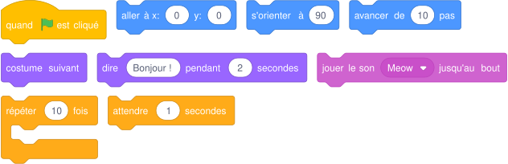{ .blocs }

    Les valeurs sont celles proposées par Scratch : à moi de choisir les bonnes et d'assembler les blocs.

!!! tip "Mon défi"
    Je fais revenir le chat à son point de départ en le faisant marcher vers la gauche.

<label class="mission-reussie"><input type="checkbox" data-mission="00"> J'ai réussi la mission 00</label>

## Mission 01 · Océan 1 { #mission-01 }

<strong>Ce que je dois obtenir.</strong> Un nageur se déplace de gauche à droite sous la mer. Il pense, il parle et on entend un bruitage.

<iframe loading="lazy" title="Mission 01 : Océan 1" src="https://tube-numerique-educatif.apps.education.fr/videos/embed/q3HjsBT3Pom8i2doQf38kg" frameborder="0" allow="fullscreen" allowfullscreen></iframe>

Vidéo du résultat attendu : <a href="https://tube-numerique-educatif.apps.education.fr/w/q3HjsBT3Pom8i2doQf38kg" target="_blank" rel="noopener">ouvrir sur Tube Numérique éducatif</a>

[:material-play-circle: Ouvrir l'exercice](https://turbowarp.org/editor?project_url=https://numerica-lfh.github.io/Techno/missions-scratch/exercices/mission-01.sb3){ .md-button .md-button--primary target=_blank rel=noopener } [:material-download: Télécharger le fichier .sb3](exercices/mission-01.sb3){ .md-button }

**Notions :** séquence d'instructions, bulle de pensée et de parole, son.

**Pas à pas**

1. Je regarde la vidéo et j'écris dans l'ordre ce que fait le plongeur : il pense, il nage, il fait des bulles, il parle.
2. Je place le plongeur au départ avec « aller à x: -170 y: 0 ».
3. J'ajoute « penser à » pendant 2 secondes.
4. Je le fais traverser la scène avec « glisser en 3 secondes à x: y: ».
5. J'ajoute le son Bubbles (onglet Sons) et le bloc « jouer le son », puis « dire » pendant 2 secondes.

??? note "Les blocs que je vais utiliser"
    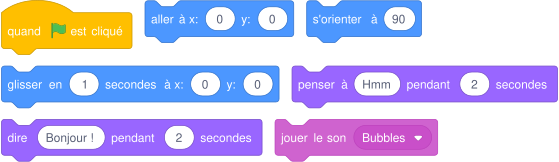{ .blocs }

    Les valeurs sont celles proposées par Scratch : à moi de choisir les bonnes et d'assembler les blocs.

!!! tip "Mon défi"
    Le plongeur fait demi-tour et revient vers la gauche sans se retrouver la tête en bas (bloc « fixer le sens de rotation »).

<label class="mission-reussie"><input type="checkbox" data-mission="01"> J'ai réussi la mission 01</label>

## Mission 02 · Créneaux 1 { #mission-02 }

<strong>Ce que je dois obtenir.</strong> Le crayon trace une ligne brisée en forme de créneaux, comme le haut d'un mur de château.

<iframe loading="lazy" title="Mission 02 : Créneaux 1" src="https://tube-numerique-educatif.apps.education.fr/videos/embed/pg1SzdKmozwWSsJ9xSWusL" frameborder="0" allow="fullscreen" allowfullscreen></iframe>

Vidéo du résultat attendu : <a href="https://tube-numerique-educatif.apps.education.fr/w/pg1SzdKmozwWSsJ9xSWusL" target="_blank" rel="noopener">ouvrir sur Tube Numérique éducatif</a>

[:material-play-circle: Ouvrir l'exercice](https://turbowarp.org/editor?project_url=https://numerica-lfh.github.io/Techno/missions-scratch/exercices/mission-02.sb3){ .md-button .md-button--primary target=_blank rel=noopener } [:material-download: Télécharger le fichier .sb3](exercices/mission-02.sb3){ .md-button }

**Notions :** boucle répéter, motif, stylo.

**Pas à pas**

1. J'ajoute l'extension Stylo (bouton en bas à gauche).
2. Sur une feuille, je dessine un seul créneau et j'écris les déplacements du crayon : avancer, tourner à gauche, avancer, tourner à droite, avancer, tourner à droite, avancer, tourner à gauche.
3. Au début du script, j'efface tout, je relève le stylo, je place le crayon à gauche et je l'oriente à 90.
4. Je mets le stylo en position d'écriture puis je place le motif d'un créneau dans « répéter 10 fois ».

??? note "Les blocs que je vais utiliser"
    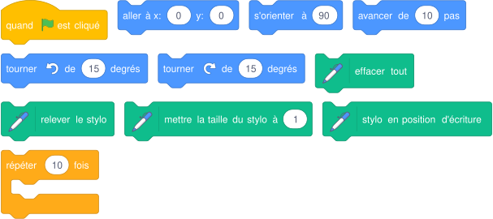{ .blocs }

    Les valeurs sont celles proposées par Scratch : à moi de choisir les bonnes et d'assembler les blocs.

!!! tip "Mon défi"
    Je change la couleur du stylo à chaque créneau.

<label class="mission-reussie"><input type="checkbox" data-mission="02"> J'ai réussi la mission 02</label>

## Mission 03 · Le chat 1 { #mission-03 }

<strong>Ce que je dois obtenir.</strong> Le chat traverse la scène de gauche à droite en marchant, puis il miaule.

<iframe loading="lazy" title="Mission 03 : Le chat 1" src="https://tube-numerique-educatif.apps.education.fr/videos/embed/3YtYkSPChfk4keF3s8Nmmg" frameborder="0" allow="fullscreen" allowfullscreen></iframe>

Vidéo du résultat attendu : <a href="https://tube-numerique-educatif.apps.education.fr/w/3YtYkSPChfk4keF3s8Nmmg" target="_blank" rel="noopener">ouvrir sur Tube Numérique éducatif</a>

[:material-play-circle: Ouvrir l'exercice](https://turbowarp.org/editor?project_url=https://numerica-lfh.github.io/Techno/missions-scratch/exercices/mission-03.sb3){ .md-button .md-button--primary target=_blank rel=noopener } [:material-download: Télécharger le fichier .sb3](exercices/mission-03.sb3){ .md-button }

**Notions :** boucle répéter, animation par costumes, son.

**Pas à pas**

1. Je place le chat au bord gauche avec « aller à x: y: ».
2. Je fais marcher le chat : dans « répéter », j'avance, je passe au costume suivant et j'attends un peu.
3. Je règle le nombre de répétitions et la longueur des pas pour qu'il s'arrête avant le bord droit.
4. Après la boucle, je fais miauler le chat.

??? note "Les blocs que je vais utiliser"
    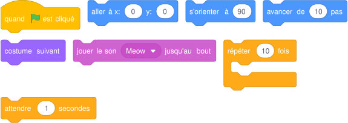{ .blocs }

    Les valeurs sont celles proposées par Scratch : à moi de choisir les bonnes et d'assembler les blocs.

!!! tip "Mon défi"
    Le chat miaule à chaque pas, sans ralentir sa marche.

<label class="mission-reussie"><input type="checkbox" data-mission="03"> J'ai réussi la mission 03</label>

## Mission 04 · Triangle 1 { #mission-04 }

<strong>Ce que je dois obtenir.</strong> Le crayon dessine un triangle dont chaque côté a une couleur différente, en marquant une pause après chaque côté.

<iframe loading="lazy" title="Mission 04 : Triangle 1" src="https://tube-numerique-educatif.apps.education.fr/videos/embed/kKpeU1Xnz1DzndURVTt57G" frameborder="0" allow="fullscreen" allowfullscreen></iframe>

Vidéo du résultat attendu : <a href="https://tube-numerique-educatif.apps.education.fr/w/kKpeU1Xnz1DzndURVTt57G" target="_blank" rel="noopener">ouvrir sur Tube Numérique éducatif</a>

[:material-play-circle: Ouvrir l'exercice](https://turbowarp.org/editor?project_url=https://numerica-lfh.github.io/Techno/missions-scratch/exercices/mission-04.sb3){ .md-button .md-button--primary target=_blank rel=noopener } [:material-download: Télécharger le fichier .sb3](exercices/mission-04.sb3){ .md-button }

**Notions :** stylo, angle de rotation, attendre.

**Pas à pas**

1. J'efface tout, je relève le stylo, je place le crayon en bas à gauche et je l'oriente à 90.
2. Je choisis la couleur du premier côté, je pose le stylo et j'avance.
3. J'attends une demi-seconde puis je tourne. Je cherche de combien de degrés tourner pour que les trois côtés se referment.
4. Je répète pour les deux autres côtés en changeant la couleur.

??? note "Les blocs que je vais utiliser"
    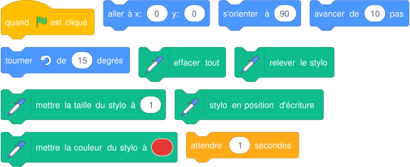{ .blocs }

    Les valeurs sont celles proposées par Scratch : à moi de choisir les bonnes et d'assembler les blocs.

!!! tip "Mon défi"
    Je dessine un carré de quatre couleurs.

<label class="mission-reussie"><input type="checkbox" data-mission="04"> J'ai réussi la mission 04</label>

## Mission 05 · Papillon 1 { #mission-05 }

<strong>Ce que je dois obtenir.</strong> Le papillon bat des ailes sur place puis il s'envole.

<iframe loading="lazy" title="Mission 05 : Papillon 1" src="https://tube-numerique-educatif.apps.education.fr/videos/embed/n53isFmj8MWoqcyjHNVEoq" frameborder="0" allow="fullscreen" allowfullscreen></iframe>

Vidéo du résultat attendu : <a href="https://tube-numerique-educatif.apps.education.fr/w/n53isFmj8MWoqcyjHNVEoq" target="_blank" rel="noopener">ouvrir sur Tube Numérique éducatif</a>

[:material-play-circle: Ouvrir l'exercice](https://turbowarp.org/editor?project_url=https://numerica-lfh.github.io/Techno/missions-scratch/exercices/mission-05.sb3){ .md-button .md-button--primary target=_blank rel=noopener } [:material-download: Télécharger le fichier .sb3](exercices/mission-05.sb3){ .md-button }

**Notions :** animation par costumes, deux boucles à la suite.

**Pas à pas**

1. Je regarde les costumes du papillon : ailes ouvertes, ailes fermées.
2. Première boucle : le papillon bat des ailes sans bouger (« costume suivant » et « attendre »).
3. Deuxième boucle : il avance et monte un peu à chaque fois tout en battant des ailes.
4. Il disparaît à la fin. Je n'oublie pas de le montrer au départ.

??? note "Les blocs que je vais utiliser"
    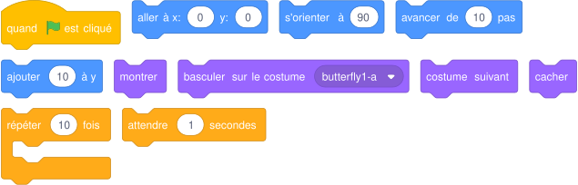{ .blocs }

    Les valeurs sont celles proposées par Scratch : à moi de choisir les bonnes et d'assembler les blocs.

!!! tip "Mon défi"
    Le papillon s'envole en zigzag.

<label class="mission-reussie"><input type="checkbox" data-mission="05"> J'ai réussi la mission 05</label>

## Mission 06 · Papillon 2 { #mission-06 }

<strong>Ce que je dois obtenir.</strong> Un papillon et une libellule sont posés sur des fleurs. Le papillon bat des ailes et s'envole. La libellule attend puis s'envole dans l'autre sens.

<iframe loading="lazy" title="Mission 06 : Papillon 2" src="https://tube-numerique-educatif.apps.education.fr/videos/embed/jAFrMhYQFP1DHYTbFvaMt8" frameborder="0" allow="fullscreen" allowfullscreen></iframe>

Vidéo du résultat attendu : <a href="https://tube-numerique-educatif.apps.education.fr/w/jAFrMhYQFP1DHYTbFvaMt8" target="_blank" rel="noopener">ouvrir sur Tube Numérique éducatif</a>

[:material-play-circle: Ouvrir l'exercice](https://turbowarp.org/editor?project_url=https://numerica-lfh.github.io/Techno/missions-scratch/exercices/mission-06.sb3){ .md-button .md-button--primary target=_blank rel=noopener } [:material-download: Télécharger le fichier .sb3](exercices/mission-06.sb3){ .md-button }

**Notions :** deux lutins, scripts en parallèle, attendre.

**Pas à pas**

1. Je reprends le script du papillon de la mission 5.
2. Je clique sur la libellule : elle a son propre script.
3. La libellule commence par attendre, puis elle s'envole vers la gauche.
4. Je règle le sens de rotation gauche-droite pour qu'elle ne vole pas sur le dos.

??? note "Les blocs que je vais utiliser"
    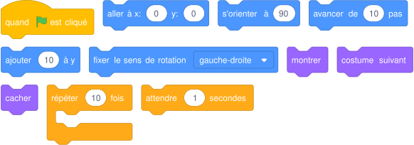{ .blocs }

    Les valeurs sont celles proposées par Scratch : à moi de choisir les bonnes et d'assembler les blocs.

!!! tip "Mon défi"
    Les deux insectes se croisent au milieu de la scène.

<label class="mission-reussie"><input type="checkbox" data-mission="06"> J'ai réussi la mission 06</label>

## Mission 07 · Danseuse 1 { #mission-07 }

<strong>Ce que je dois obtenir.</strong> La danseuse traverse la scène en pas chassés : elle avance en alternant deux costumes.

<iframe loading="lazy" title="Mission 07 : Danseuse 1" src="https://tube-numerique-educatif.apps.education.fr/videos/embed/8LAjtR6CCkqiwM2GMZhUdA" frameborder="0" allow="fullscreen" allowfullscreen></iframe>

Vidéo du résultat attendu : <a href="https://tube-numerique-educatif.apps.education.fr/w/8LAjtR6CCkqiwM2GMZhUdA" target="_blank" rel="noopener">ouvrir sur Tube Numérique éducatif</a>

[:material-play-circle: Ouvrir l'exercice](https://turbowarp.org/editor?project_url=https://numerica-lfh.github.io/Techno/missions-scratch/exercices/mission-07.sb3){ .md-button .md-button--primary target=_blank rel=noopener } [:material-download: Télécharger le fichier .sb3](exercices/mission-07.sb3){ .md-button }

**Notions :** costume choisi, boucle, rythme.

**Pas à pas**

1. J'observe les quatre costumes de la danseuse et je choisis les deux qui forment un pas chassé.
2. Dans une boucle : costume a, avancer, attendre, costume b, avancer, attendre.
3. Je termine sur une pose finale avec un troisième costume.

??? note "Les blocs que je vais utiliser"
    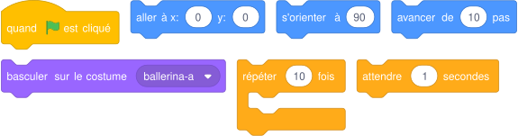{ .blocs }

    Les valeurs sont celles proposées par Scratch : à moi de choisir les bonnes et d'assembler les blocs.

!!! tip "Mon défi"
    La danseuse fait l'aller-retour.

<label class="mission-reussie"><input type="checkbox" data-mission="07"> J'ai réussi la mission 07</label>

## Mission 08 · Break 1 { #mission-08 }

<strong>Ce que je dois obtenir.</strong> Un danseur enchaîne plusieurs figures en musique.

<iframe loading="lazy" title="Mission 08 : Break 1" src="https://tube-numerique-educatif.apps.education.fr/videos/embed/7UxtJn4Zm7xDdiKS47H51D" frameborder="0" allow="fullscreen" allowfullscreen></iframe>

Vidéo du résultat attendu : <a href="https://tube-numerique-educatif.apps.education.fr/w/7UxtJn4Zm7xDdiKS47H51D" target="_blank" rel="noopener">ouvrir sur Tube Numérique éducatif</a>

[:material-play-circle: Ouvrir l'exercice](https://turbowarp.org/editor?project_url=https://numerica-lfh.github.io/Techno/missions-scratch/exercices/mission-08.sb3){ .md-button .md-button--primary target=_blank rel=noopener } [:material-download: Télécharger le fichier .sb3](exercices/mission-08.sb3){ .md-button }

**Notions :** costumes, boucle, son de fond.

**Pas à pas**

1. Je lance la musique avec « démarrer le son » : le script continue pendant que la musique joue.
2. Je choisis quatre costumes de danse et je les enchaîne avec une pause entre chaque.
3. Je place l'enchaînement dans une boucle.
4. À la fin, le danseur revient en position de repos et la musique s'arrête.

??? note "Les blocs que je vais utiliser"
    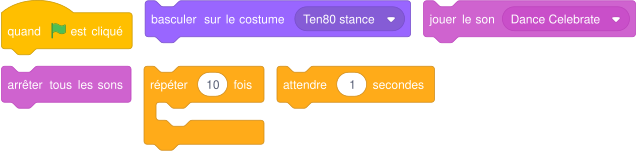{ .blocs }

    Les valeurs sont celles proposées par Scratch : à moi de choisir les bonnes et d'assembler les blocs.

!!! tip "Mon défi"
    La musique et la danse durent exactement le même temps.

<label class="mission-reussie"><input type="checkbox" data-mission="08"> J'ai réussi la mission 08</label>

## Mission A1 · Frère Jacques { #mission-A1 }

<strong>Ce que je dois obtenir.</strong> Le chat joue la mélodie de Frère Jacques. Chaque ligne de la chanson est jouée deux fois grâce à une boucle.

[:material-play-circle: Ouvrir l'exercice](https://turbowarp.org/editor?project_url=https://numerica-lfh.github.io/Techno/missions-scratch/exercices/mission-A1.sb3){ .md-button .md-button--primary target=_blank rel=noopener } [:material-download: Télécharger le fichier .sb3](exercices/mission-A1.sb3){ .md-button }

**Notions :** extension Musique, boucle, programmeur astucieux.

**Pas à pas**

1. J'ajoute l'extension Musique.
2. Je choisis l'instrument et le tempo (120).
3. Première ligne : do ré mi do (notes 60, 62, 64, 60), dans « répéter 2 fois ».
4. Ligne 2 : mi fa sol (64, 65, 67), la dernière note dure 2 temps.
5. Ligne 3 : sol la sol fa (notes rapides, 0.5 temps) puis mi do.
6. Ligne 4 : do, sol grave (55), do.

??? note "Les blocs que je vais utiliser"
    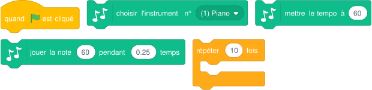{ .blocs }

    Les valeurs sont celles proposées par Scratch : à moi de choisir les bonnes et d'assembler les blocs.

!!! tip "Mon défi"
    Le chat danse pendant la musique : j'écris un deuxième script qui démarre aussi au drapeau vert.

<label class="mission-reussie"><input type="checkbox" data-mission="A1"> J'ai réussi la mission A1</label>

## Mission A2 · La mauvaise blague { #mission-A2 }

<strong>Ce que je dois obtenir.</strong> Deux personnages se racontent une blague chacun à leur tour, puis le décor change.

[:material-play-circle: Ouvrir l'exercice](https://turbowarp.org/editor?project_url=https://numerica-lfh.github.io/Techno/missions-scratch/exercices/mission-A2.sb3){ .md-button .md-button--primary target=_blank rel=noopener } [:material-download: Télécharger le fichier .sb3](exercices/mission-A2.sb3){ .md-button }

**Notions :** dialogue, message (envoyer à tous), événement.

**Pas à pas**

1. J'écris le dialogue sur papier dans un tableau à deux colonnes : ce que dit Abby, ce que dit Devin.
2. Version 1 : je règle les temps avec « attendre » pour que chacun parle à son tour.
3. Version 2 : Abby envoie un message (« envoyer à tous et attendre ») et Devin répond avec « quand je reçois ».
4. À la fin, la scène reçoit un message et passe à l'arrière-plan suivant.

??? note "Les blocs que je vais utiliser"
    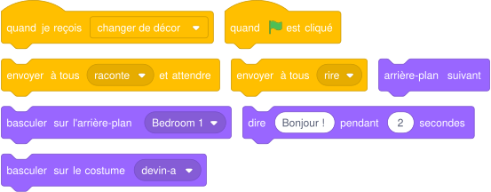{ .blocs }

    Les valeurs sont celles proposées par Scratch : à moi de choisir les bonnes et d'assembler les blocs.

!!! tip "Mon défi"
    J'invente ma propre blague avec trois personnages.

<label class="mission-reussie"><input type="checkbox" data-mission="A2"> J'ai réussi la mission A2</label>

## Je vérifie que j'ai compris

**Question 1.** Le chat avance-t-il d'un seul coup ou pas à pas ? Pourquoi ?

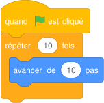{ .blocs }

**Question 2.** Combien de fois le lutin avance-t-il de 10 pas ?

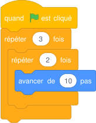{ .blocs }

**Question 3.** Le programmeur veut que le chat danse pendant la musique, mais il danse seulement après. Pourquoi ?

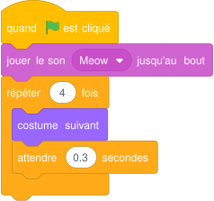{ .blocs }

**Question 4.** Quelle est la différence entre « costume suivant » et « basculer sur le costume » ?

## Où j'en suis

En fin de séance, j'indique la dernière mission terminée et j'ajoute une capture d'écran de mon programme. Le professeur la reçoit directement.

*Missions d'après les cartes « Missions Scratch » de Réseau Canopé (CC BY-NC-SA) et le livret « Bien commencer avec Scratch » (Inria). Détail des sources sur la [page d'accueil des missions](index.md#sources-et-licences).*
