# Palier 1 bis (rose) : Je consolide les bases

Douze missions pour s'entraîner avant le palier bleu : figures au stylo, coordonnées, clavier, clic, rebonds et estampilles. Pas de vidéo pour ces missions : une image montre le résultat attendu.

Classe de départ : **5e**. Les élèves qui ont terminé le palier précédent continuent ici.

| Mission | Titre | Notions |
|---|---|---|
| [09](#mission-09) | Le carré | boucle répéter, angle droit, stylo |
| [10](#mission-10) | L'escalier | motif répété, tourner à gauche et à droite |
| [11](#mission-11) | Le soleil | stylo posé et relevé, aller et revenir, angle 360 / 12 |
| [12](#mission-12) | Les cent pas | rebondir si le bord est atteint, sens de rotation |
| [13](#mission-13) | Le chat téléporté | position aléatoire, boucle, retour au point de départ |
| [14](#mission-14) | Les quatre coins | coordonnées x et y, glisser vers un point, repère de la scène |
| [15](#mission-15) | Le pilote | événement touche pressée, plusieurs scripts, déplacement en x et en y |
| [16](#mission-16) | Le ballon magique | quand ce lutin est cliqué, taille, effet couleur |
| [17](#mission-17) | La balle rebondissante | répéter indéfiniment, direction en diagonale, rebondir |
| [18](#mission-18) | La rosace | boucle dans une boucle, rotation, règle 360 / 8 |
| [19](#mission-19) | La fusée | séquence, ajouter à y, animation par costumes |
| [20](#mission-20) | Le jardin de fleurs | estampiller, effet couleur, boucle |

!!! info "Comment travailler"
    Je regarde la vidéo, j'ouvre l'exercice, je lis le pas à pas et je programme. Je compare mon résultat avec la vidéo. Si je suis bloqué, j'ouvre les coups de pouce dans l'ordre : 1, je réfléchis ; 2, les blocs à utiliser ; 3, le squelette du script. « Si ça ne marche pas » liste les erreurs les plus courantes. En fin de séance, j'envoie ma progression avec une capture d'écran (bas de la page).

## Mission 09 · Le carré { #mission-09 }

<strong>Ce que je dois obtenir.</strong> Le crayon dessine un carré bleu. Il marque une petite pause après chaque côté.

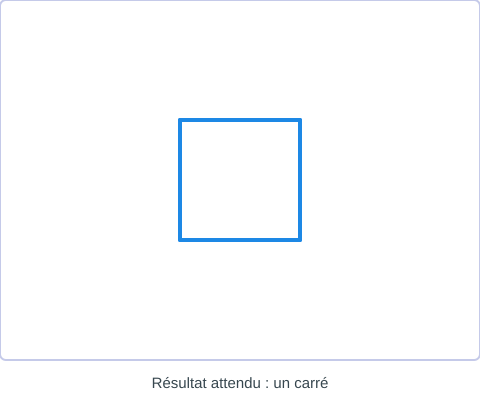{ .mission-resultat }

[:material-play-circle: Ouvrir l'exercice](https://turbowarp.org/editor?project_url=https://numerica-lfh.github.io/Techno/missions-scratch/exercices/mission-09.sb3){ .md-button .md-button--primary target=_blank rel=noopener } [:material-download: Télécharger le fichier .sb3](exercices/mission-09.sb3){ .md-button }

**Notions :** boucle répéter, angle droit, stylo.

**Pas à pas**

1. J'ajoute l'extension Stylo. Au début : effacer tout, relever le stylo, aller au coin de départ, s'orienter à 90.
2. Je choisis la taille et la couleur du stylo, puis je pose le stylo.
3. Un côté : avancer, tourner de 90 degrés, attendre un peu.
4. Un carré a quatre côtés : je place le côté dans « répéter 4 fois ».
5. À la fin, je relève le stylo.

??? question "Coup de pouce 1 : je réfléchis avant de coder"
    - Comment est la scène au départ : position, costume, taille de chaque lutin, visible ou caché ?
    - Qu'est-ce qui se répète dans la vidéo, et combien de fois ?
    - Où le crayon commence-t-il, et à quel moment le stylo doit-il être posé ou relevé ?
    - De combien de degrés tourner ? Je pense à la règle : 360 divisé par le nombre de côtés.

??? note "Coup de pouce 2 : les blocs que je vais utiliser"
    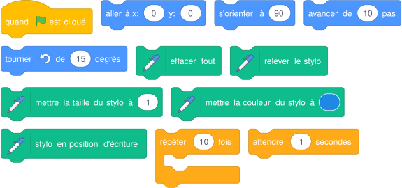{ .blocs }

    Les valeurs sont celles proposées par Scratch : à moi de choisir les bonnes et d'assembler les blocs.

??? abstract "Coup de pouce 3 : le squelette du script"
    Les blocs sont assemblés, les nombres sont à trouver (cases vides). Je l'ouvre seulement si les deux premiers coups de pouce ne suffisent pas.

    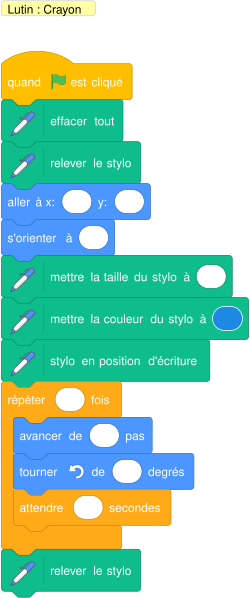{ .blocs }

??? warning "Si ça ne marche pas"
    - L'animation va trop vite pour être vue : j'ajoute « attendre » dans la boucle.
    - Un trait part du mauvais endroit : je relève le stylo avant « aller à », je le pose seulement après, et j'efface tout au début.

!!! tip "Mon défi"
    Je dessine un rectangle deux fois plus long que haut, toujours avec une boucle.

**Je vérifie avant de cocher**

- [ ] Mon résultat ressemble à l'image du résultat attendu.
- [ ] Je clique deux fois de suite sur le drapeau vert : tout repart comme au premier essai.
- [ ] J'ai enregistré mon projet sur l'ordinateur (Fichier, Enregistrer sur votre ordinateur).

<label class="mission-reussie"><input type="checkbox" data-mission="09"> J'ai réussi la mission 09</label>

## Mission 10 · L'escalier { #mission-10 }

<strong>Ce que je dois obtenir.</strong> Le crayon trace un escalier de six marches qui monte vers la droite.

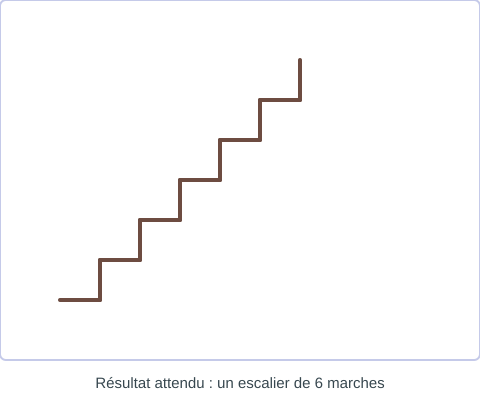{ .mission-resultat }

[:material-play-circle: Ouvrir l'exercice](https://turbowarp.org/editor?project_url=https://numerica-lfh.github.io/Techno/missions-scratch/exercices/mission-10.sb3){ .md-button .md-button--primary target=_blank rel=noopener } [:material-download: Télécharger le fichier .sb3](exercices/mission-10.sb3){ .md-button }

**Notions :** motif répété, tourner à gauche et à droite.

**Pas à pas**

1. Sur une feuille, je dessine une marche : avancer, tourner à gauche, monter, tourner à droite.
2. Je place le crayon en bas à gauche, orienté à 90, stylo posé.
3. Je programme une marche, puis je la répète 6 fois.
4. Je vérifie que le crayon finit en haut à droite de la scène.

??? question "Coup de pouce 1 : je réfléchis avant de coder"
    - Comment est la scène au départ : position, costume, taille de chaque lutin, visible ou caché ?
    - Qu'est-ce qui se répète dans la vidéo, et combien de fois ?
    - Où le crayon commence-t-il, et à quel moment le stylo doit-il être posé ou relevé ?
    - De combien de degrés tourner ? Je pense à la règle : 360 divisé par le nombre de côtés.

??? note "Coup de pouce 2 : les blocs que je vais utiliser"
    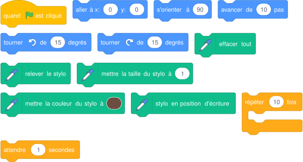{ .blocs }

    Les valeurs sont celles proposées par Scratch : à moi de choisir les bonnes et d'assembler les blocs.

??? abstract "Coup de pouce 3 : le squelette du script"
    Les blocs sont assemblés, les nombres sont à trouver (cases vides). Je l'ouvre seulement si les deux premiers coups de pouce ne suffisent pas.

    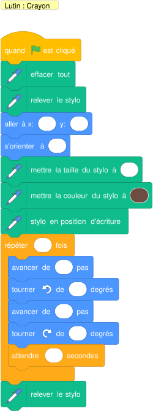{ .blocs }

??? warning "Si ça ne marche pas"
    - L'animation va trop vite pour être vue : j'ajoute « attendre » dans la boucle.
    - Un trait part du mauvais endroit : je relève le stylo avant « aller à », je le pose seulement après, et j'efface tout au début.

!!! tip "Mon défi"
    L'escalier redescend ensuite de l'autre côté, comme une pyramide.

**Je vérifie avant de cocher**

- [ ] Mon résultat ressemble à l'image du résultat attendu.
- [ ] Je clique deux fois de suite sur le drapeau vert : tout repart comme au premier essai.
- [ ] J'ai enregistré mon projet sur l'ordinateur (Fichier, Enregistrer sur votre ordinateur).

<label class="mission-reussie"><input type="checkbox" data-mission="10"> J'ai réussi la mission 10</label>

## Mission 11 · Le soleil { #mission-11 }

<strong>Ce que je dois obtenir.</strong> Le crayon trace douze rayons de soleil qui partent tous du centre de la scène.

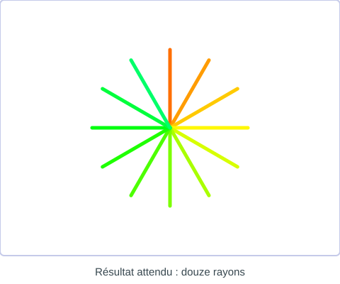{ .mission-resultat }

[:material-play-circle: Ouvrir l'exercice](https://turbowarp.org/editor?project_url=https://numerica-lfh.github.io/Techno/missions-scratch/exercices/mission-11.sb3){ .md-button .md-button--primary target=_blank rel=noopener } [:material-download: Télécharger le fichier .sb3](exercices/mission-11.sb3){ .md-button }

**Notions :** stylo posé et relevé, aller et revenir, angle 360 / 12.

**Pas à pas**

1. Le crayon part du centre (0 ; 0), orienté vers le haut.
2. Un rayon : poser le stylo, avancer, relever le stylo, reculer (avancer d'un nombre négatif) pour revenir au centre.
3. Entre deux rayons, le crayon tourne. Douze rayons font un tour complet : je calcule l'angle.
4. Je répète 12 fois et je change un peu la couleur à chaque rayon.

??? question "Coup de pouce 1 : je réfléchis avant de coder"
    - Comment est la scène au départ : position, costume, taille de chaque lutin, visible ou caché ?
    - Qu'est-ce qui se répète dans la vidéo, et combien de fois ?
    - Où le crayon commence-t-il, et à quel moment le stylo doit-il être posé ou relevé ?
    - De combien de degrés tourner ? Je pense à la règle : 360 divisé par le nombre de côtés.

??? note "Coup de pouce 2 : les blocs que je vais utiliser"
    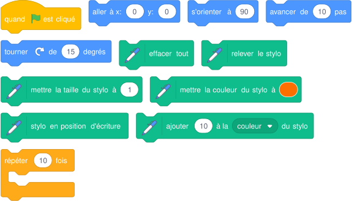{ .blocs }

    Les valeurs sont celles proposées par Scratch : à moi de choisir les bonnes et d'assembler les blocs.

??? abstract "Coup de pouce 3 : le squelette du script"
    Les blocs sont assemblés, les nombres sont à trouver (cases vides). Je l'ouvre seulement si les deux premiers coups de pouce ne suffisent pas.

    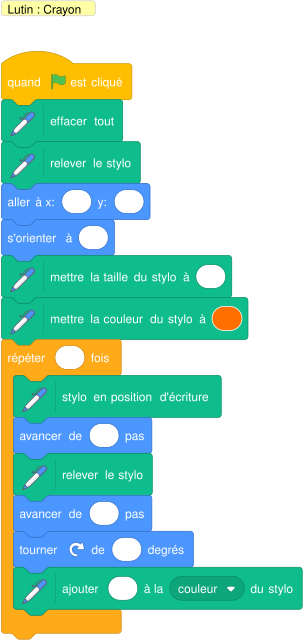{ .blocs }

??? warning "Si ça ne marche pas"
    - L'animation va trop vite pour être vue : j'ajoute « attendre » dans la boucle.
    - Un trait part du mauvais endroit : je relève le stylo avant « aller à », je le pose seulement après, et j'efface tout au début.

!!! tip "Mon défi"
    Les rayons sont alternativement longs et courts.

**Je vérifie avant de cocher**

- [ ] Mon résultat ressemble à l'image du résultat attendu.
- [ ] Je clique deux fois de suite sur le drapeau vert : tout repart comme au premier essai.
- [ ] J'ai enregistré mon projet sur l'ordinateur (Fichier, Enregistrer sur votre ordinateur).

<label class="mission-reussie"><input type="checkbox" data-mission="11"> J'ai réussi la mission 11</label>

## Mission 12 · Les cent pas { #mission-12 }

<strong>Ce que je dois obtenir.</strong> Le chat marche d'un bord à l'autre de la scène et fait demi-tour à chaque bord, sans jamais marcher la tête en bas. À la fin, il dit qu'il est fatigué.

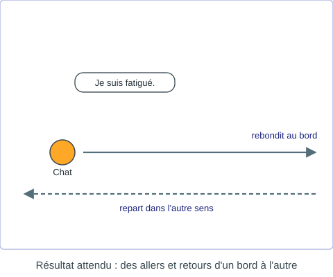{ .mission-resultat }

[:material-play-circle: Ouvrir l'exercice](https://turbowarp.org/editor?project_url=https://numerica-lfh.github.io/Techno/missions-scratch/exercices/mission-12.sb3){ .md-button .md-button--primary target=_blank rel=noopener } [:material-download: Télécharger le fichier .sb3](exercices/mission-12.sb3){ .md-button }

**Notions :** rebondir si le bord est atteint, sens de rotation.

**Pas à pas**

1. Je place le chat à gauche, orienté à 90.
2. Je règle « fixer le sens de rotation gauche-droite ».
3. Dans une boucle de 80 tours : avancer, costume suivant, « rebondir si le bord est atteint », attendre un peu.
4. Après la boucle, le chat parle.

??? question "Coup de pouce 1 : je réfléchis avant de coder"
    - Comment est la scène au départ : position, costume, taille de chaque lutin, visible ou caché ?
    - Qu'est-ce qui se répète dans la vidéo, et combien de fois ?

??? note "Coup de pouce 2 : les blocs que je vais utiliser"
    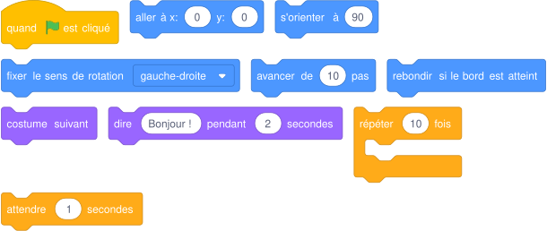{ .blocs }

    Les valeurs sont celles proposées par Scratch : à moi de choisir les bonnes et d'assembler les blocs.

??? abstract "Coup de pouce 3 : le squelette du script"
    Les blocs sont assemblés, les nombres sont à trouver (cases vides). Je l'ouvre seulement si les deux premiers coups de pouce ne suffisent pas.

    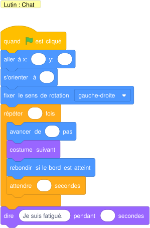{ .blocs }

??? warning "Si ça ne marche pas"
    - L'animation va trop vite pour être vue : j'ajoute « attendre » dans la boucle.

!!! tip "Mon défi"
    Le chat miaule à chaque fois qu'il fait demi-tour.

**Je vérifie avant de cocher**

- [ ] Mon résultat ressemble à l'image du résultat attendu.
- [ ] Je clique deux fois de suite sur le drapeau vert : tout repart comme au premier essai.
- [ ] J'ai enregistré mon projet sur l'ordinateur (Fichier, Enregistrer sur votre ordinateur).

<label class="mission-reussie"><input type="checkbox" data-mission="12"> J'ai réussi la mission 12</label>

## Mission 13 · Le chat téléporté { #mission-13 }

<strong>Ce que je dois obtenir.</strong> Le chat annonce qu'il se téléporte, apparaît à cinq endroits choisis au hasard en disant « Je suis ici ! », puis revient au centre.

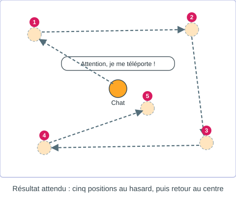{ .mission-resultat }

[:material-play-circle: Ouvrir l'exercice](https://turbowarp.org/editor?project_url=https://numerica-lfh.github.io/Techno/missions-scratch/exercices/mission-13.sb3){ .md-button .md-button--primary target=_blank rel=noopener } [:material-download: Télécharger le fichier .sb3](exercices/mission-13.sb3){ .md-button }

**Notions :** position aléatoire, boucle, retour au point de départ.

**Pas à pas**

1. Le chat commence au centre et prévient qu'il se téléporte.
2. Dans « répéter 5 fois » : « aller à position aléatoire », puis dire « Je suis ici ! » pendant 1 seconde.
3. Après la boucle, il retourne en (0 ; 0) et dit qu'il est rentré.

??? question "Coup de pouce 1 : je réfléchis avant de coder"
    - Comment est la scène au départ : position, costume, taille de chaque lutin, visible ou caché ?
    - Qu'est-ce qui se répète dans la vidéo, et combien de fois ?

??? note "Coup de pouce 2 : les blocs que je vais utiliser"
    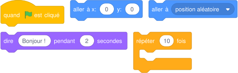{ .blocs }

    Les valeurs sont celles proposées par Scratch : à moi de choisir les bonnes et d'assembler les blocs.

??? abstract "Coup de pouce 3 : le squelette du script"
    Les blocs sont assemblés, les nombres sont à trouver (cases vides). Je l'ouvre seulement si les deux premiers coups de pouce ne suffisent pas.

    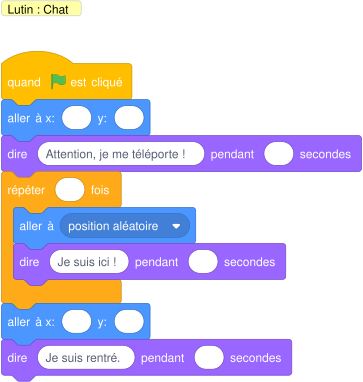{ .blocs }

??? warning "Si ça ne marche pas"
    - Je relis mon script dans l'ordre, bloc par bloc, en me demandant ce que fait le lutin à chaque ligne.

!!! tip "Mon défi"
    Le chat glisse vers chaque position au lieu de sauter.

**Je vérifie avant de cocher**

- [ ] Mon résultat ressemble à l'image du résultat attendu.
- [ ] Je clique deux fois de suite sur le drapeau vert : tout repart comme au premier essai.
- [ ] J'ai enregistré mon projet sur l'ordinateur (Fichier, Enregistrer sur votre ordinateur).

<label class="mission-reussie"><input type="checkbox" data-mission="13"> J'ai réussi la mission 13</label>

## Mission 14 · Les quatre coins { #mission-14 }

<strong>Ce que je dois obtenir.</strong> Sur le repère, le scarabée glisse vers les quatre coins de la scène dans l'ordre des aiguilles d'une montre et annonce les coordonnées de chaque coin.

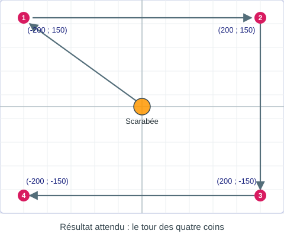{ .mission-resultat }

[:material-play-circle: Ouvrir l'exercice](https://turbowarp.org/editor?project_url=https://numerica-lfh.github.io/Techno/missions-scratch/exercices/mission-14.sb3){ .md-button .md-button--primary target=_blank rel=noopener } [:material-download: Télécharger le fichier .sb3](exercices/mission-14.sb3){ .md-button }

**Notions :** coordonnées x et y, glisser vers un point, repère de la scène.

**Pas à pas**

1. Je regarde l'arrière-plan Xy-grid : x va de -240 à 240, y de -180 à 180.
2. Je note les coordonnées des quatre coins visés : en haut à gauche (-200 ; 150), en haut à droite, en bas à droite, en bas à gauche.
3. Pour chaque coin : « glisser en 1 seconde à x: y: », puis dire les coordonnées.
4. Le scarabée revient au centre (0 ; 0).

??? question "Coup de pouce 1 : je réfléchis avant de coder"
    - Comment est la scène au départ : position, costume, taille de chaque lutin, visible ou caché ?

??? note "Coup de pouce 2 : les blocs que je vais utiliser"
    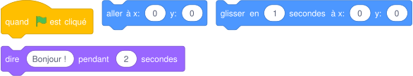{ .blocs }

    Les valeurs sont celles proposées par Scratch : à moi de choisir les bonnes et d'assembler les blocs.

??? abstract "Coup de pouce 3 : le squelette du script"
    Les blocs sont assemblés, les nombres sont à trouver (cases vides). Je l'ouvre seulement si les deux premiers coups de pouce ne suffisent pas.

    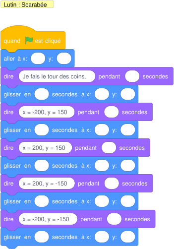{ .blocs }

??? warning "Si ça ne marche pas"
    - Je relis mon script dans l'ordre, bloc par bloc, en me demandant ce que fait le lutin à chaque ligne.

!!! tip "Mon défi"
    Le scarabée dessine un rectangle en passant par les coins (extension Stylo).

**Je vérifie avant de cocher**

- [ ] Mon résultat ressemble à l'image du résultat attendu.
- [ ] Je clique deux fois de suite sur le drapeau vert : tout repart comme au premier essai.
- [ ] J'ai enregistré mon projet sur l'ordinateur (Fichier, Enregistrer sur votre ordinateur).

<label class="mission-reussie"><input type="checkbox" data-mission="14"> J'ai réussi la mission 14</label>

## Mission 15 · Le pilote { #mission-15 }

<strong>Ce que je dois obtenir.</strong> Je dirige le chat avec les quatre flèches du clavier. La barre d'espace le fait miauler.

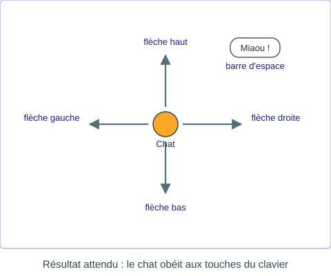{ .mission-resultat }

[:material-play-circle: Ouvrir l'exercice](https://turbowarp.org/editor?project_url=https://numerica-lfh.github.io/Techno/missions-scratch/exercices/mission-15.sb3){ .md-button .md-button--primary target=_blank rel=noopener } [:material-download: Télécharger le fichier .sb3](exercices/mission-15.sb3){ .md-button }

**Notions :** événement touche pressée, plusieurs scripts, déplacement en x et en y.

**Pas à pas**

1. Un script par touche : « quand la touche flèche droite est pressée ».
2. Flèche droite : s'orienter à 90 et avancer. Flèche gauche : s'orienter à -90 et avancer.
3. Flèche haut et flèche bas : « ajouter 10 à y » et « ajouter -10 à y ».
4. Barre d'espace : jouer le son Meow et dire « Miaou ! ».
5. Au drapeau vert, le chat revient au centre, sens de rotation gauche-droite.

??? question "Coup de pouce 1 : je réfléchis avant de coder"
    - Comment est la scène au départ : position, costume, taille de chaque lutin, visible ou caché ?
    - Quelle touche déclenche quelle action ?

??? note "Coup de pouce 2 : les blocs que je vais utiliser"
    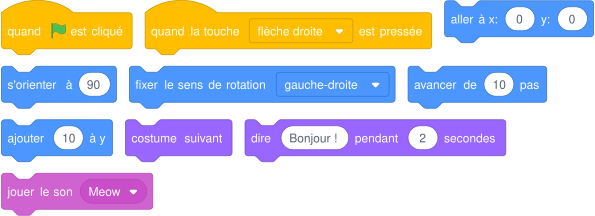{ .blocs }

    Les valeurs sont celles proposées par Scratch : à moi de choisir les bonnes et d'assembler les blocs.

??? abstract "Coup de pouce 3 : le squelette du script"
    Les blocs sont assemblés, les nombres sont à trouver (cases vides). Je l'ouvre seulement si les deux premiers coups de pouce ne suffisent pas.

    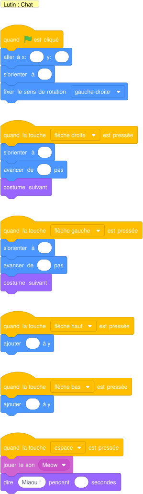{ .blocs }

??? warning "Si ça ne marche pas"
    - Le lutin avance la tête en bas : « fixer le sens de rotation gauche-droite ».

!!! tip "Mon défi"
    Le chat ne sort jamais de la scène (« rebondir si le bord est atteint »).

**Je vérifie avant de cocher**

- [ ] Mon résultat ressemble à l'image du résultat attendu.
- [ ] Je clique deux fois de suite sur le drapeau vert : tout repart comme au premier essai.
- [ ] J'ai testé toutes les touches, tous les clics ou plusieurs réponses différentes.
- [ ] J'ai enregistré mon projet sur l'ordinateur (Fichier, Enregistrer sur votre ordinateur).

<label class="mission-reussie"><input type="checkbox" data-mission="15"> J'ai réussi la mission 15</label>

## Mission 16 · Le ballon magique { #mission-16 }

<strong>Ce que je dois obtenir.</strong> À chaque clic, le ballon fait « pop », change de couleur et grossit. Quand il devient trop gros, il éclate puis réapparaît à sa taille de départ.

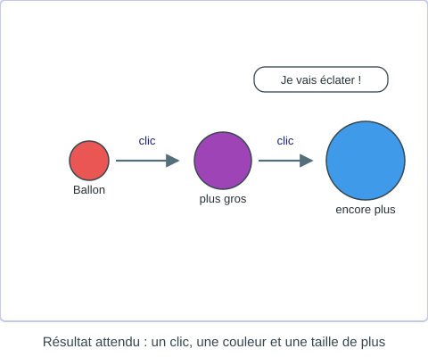{ .mission-resultat }

[:material-play-circle: Ouvrir l'exercice](https://turbowarp.org/editor?project_url=https://numerica-lfh.github.io/Techno/missions-scratch/exercices/mission-16.sb3){ .md-button .md-button--primary target=_blank rel=noopener } [:material-download: Télécharger le fichier .sb3](exercices/mission-16.sb3){ .md-button }

**Notions :** quand ce lutin est cliqué, taille, effet couleur, première condition.

**Pas à pas**

1. Au drapeau vert : annuler les effets, taille 60 %, ballon au centre.
2. Script « quand ce lutin est cliqué » : jouer Pop, ajouter 25 à l'effet couleur, ajouter 10 à la taille.
3. J'ajoute un test : si la taille dépasse 150, le ballon dit qu'il va éclater, se cache, puis revient à la taille 60 % et se montre.

??? question "Coup de pouce 1 : je réfléchis avant de coder"
    - Comment est la scène au départ : position, costume, taille de chaque lutin, visible ou caché ?
    - Que doit-il se passer quand je clique sur le lutin ?
    - Quelle condition dois-je tester, et que se passe-t-il quand elle est vraie ?

??? note "Coup de pouce 2 : les blocs que je vais utiliser"
    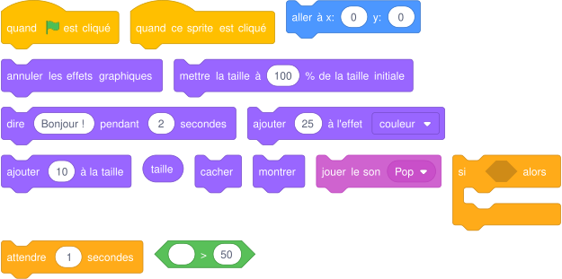{ .blocs }

    Les valeurs sont celles proposées par Scratch : à moi de choisir les bonnes et d'assembler les blocs.

??? abstract "Coup de pouce 3 : le squelette du script"
    Les blocs sont assemblés, les nombres sont à trouver (cases vides). Je l'ouvre seulement si les deux premiers coups de pouce ne suffisent pas.

    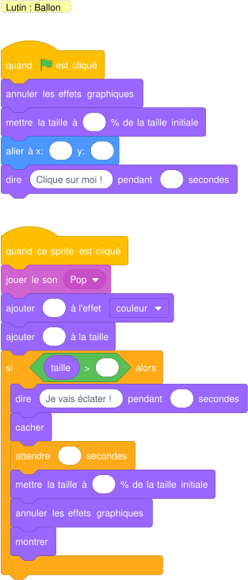{ .blocs }

??? warning "Si ça ne marche pas"
    - Le lutin reste invisible au lancement suivant : je mets « montrer » au début du script.
    - La taille ou la couleur change un peu plus à chaque essai : au début, je remets « mettre la taille à » et « annuler les effets graphiques ».
    - Mon test ne marche qu'une fois : le bloc « si » doit être à l'intérieur de la boucle.

!!! tip "Mon défi"
    Un compteur de clics s'affiche (variable).

**Je vérifie avant de cocher**

- [ ] Mon résultat ressemble à l'image du résultat attendu.
- [ ] Je clique deux fois de suite sur le drapeau vert : tout repart comme au premier essai.
- [ ] J'ai testé toutes les touches, tous les clics ou plusieurs réponses différentes.
- [ ] J'ai enregistré mon projet sur l'ordinateur (Fichier, Enregistrer sur votre ordinateur).

<label class="mission-reussie"><input type="checkbox" data-mission="16"> J'ai réussi la mission 16</label>

## Mission 17 · La balle rebondissante { #mission-17 }

<strong>Ce que je dois obtenir.</strong> La balle part en diagonale et rebondit sans fin sur les quatre bords de la scène, en changeant de couleur.

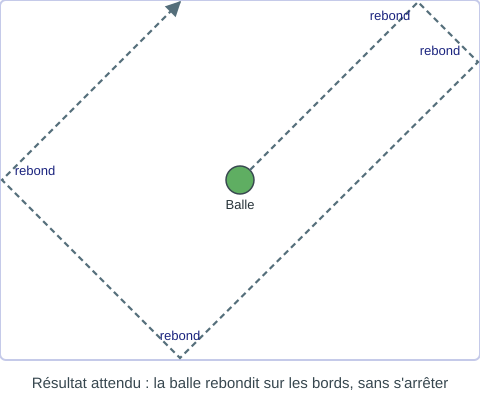{ .mission-resultat }

[:material-play-circle: Ouvrir l'exercice](https://turbowarp.org/editor?project_url=https://numerica-lfh.github.io/Techno/missions-scratch/exercices/mission-17.sb3){ .md-button .md-button--primary target=_blank rel=noopener } [:material-download: Télécharger le fichier .sb3](exercices/mission-17.sb3){ .md-button }

**Notions :** répéter indéfiniment, direction en diagonale, rebondir.

**Pas à pas**

1. Au drapeau vert, la balle va au centre et s'oriente à 45 (vers le haut à droite).
2. Dans « répéter indéfiniment » : avancer, rebondir si le bord est atteint, costume suivant (la balle a plusieurs couleurs).
3. J'arrête avec le bouton rouge.

??? question "Coup de pouce 1 : je réfléchis avant de coder"
    - Comment est la scène au départ : position, costume, taille de chaque lutin, visible ou caché ?
    - Qu'est-ce qui doit se répéter sans jamais s'arrêter ?

??? note "Coup de pouce 2 : les blocs que je vais utiliser"
    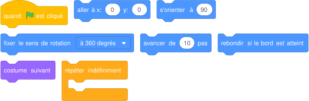{ .blocs }

    Les valeurs sont celles proposées par Scratch : à moi de choisir les bonnes et d'assembler les blocs.

??? abstract "Coup de pouce 3 : le squelette du script"
    Les blocs sont assemblés, les nombres sont à trouver (cases vides). Je l'ouvre seulement si les deux premiers coups de pouce ne suffisent pas.

    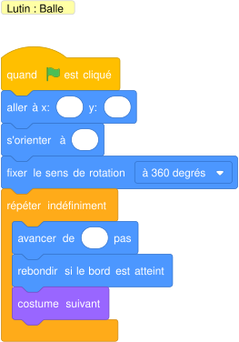{ .blocs }

??? warning "Si ça ne marche pas"
    - L'animation va trop vite pour être vue : j'ajoute « attendre » dans la boucle.

!!! tip "Mon défi"
    La balle accélère : elle avance de plus en plus vite (variable vitesse).

**Je vérifie avant de cocher**

- [ ] Mon résultat ressemble à l'image du résultat attendu.
- [ ] Je clique deux fois de suite sur le drapeau vert : tout repart comme au premier essai.
- [ ] J'ai enregistré mon projet sur l'ordinateur (Fichier, Enregistrer sur votre ordinateur).

<label class="mission-reussie"><input type="checkbox" data-mission="17"> J'ai réussi la mission 17</label>

## Mission 18 · La rosace { #mission-18 }

<strong>Ce que je dois obtenir.</strong> Le crayon dessine huit carrés qui tournent autour du centre et forment une rosace de plusieurs couleurs.

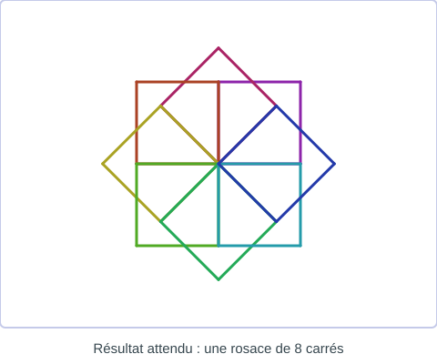{ .mission-resultat }

[:material-play-circle: Ouvrir l'exercice](https://turbowarp.org/editor?project_url=https://numerica-lfh.github.io/Techno/missions-scratch/exercices/mission-18.sb3){ .md-button .md-button--primary target=_blank rel=noopener } [:material-download: Télécharger le fichier .sb3](exercices/mission-18.sb3){ .md-button }

**Notions :** boucle dans une boucle, rotation, règle 360 / 8.

**Pas à pas**

1. Je reprends le carré de la mission 09 : « répéter 4 fois avancer, tourner de 90 ».
2. Après chaque carré, le crayon tourne un peu : huit carrés font un tour complet, je calcule l'angle.
3. Je place le carré et la rotation dans « répéter 8 fois ».
4. Je change la couleur du stylo à chaque carré.

??? question "Coup de pouce 1 : je réfléchis avant de coder"
    - Comment est la scène au départ : position, costume, taille de chaque lutin, visible ou caché ?
    - Qu'est-ce qui se répète dans la vidéo, et combien de fois ?
    - Où le crayon commence-t-il, et à quel moment le stylo doit-il être posé ou relevé ?
    - De combien de degrés tourner ? Je pense à la règle : 360 divisé par le nombre de côtés.

??? note "Coup de pouce 2 : les blocs que je vais utiliser"
    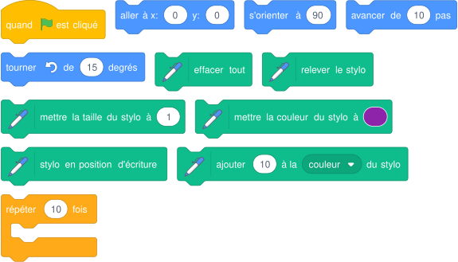{ .blocs }

    Les valeurs sont celles proposées par Scratch : à moi de choisir les bonnes et d'assembler les blocs.

??? abstract "Coup de pouce 3 : le squelette du script"
    Les blocs sont assemblés, les nombres sont à trouver (cases vides). Je l'ouvre seulement si les deux premiers coups de pouce ne suffisent pas.

    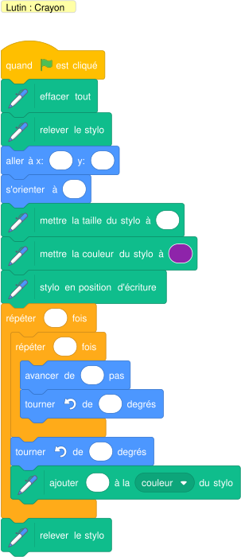{ .blocs }

??? warning "Si ça ne marche pas"
    - L'animation va trop vite pour être vue : j'ajoute « attendre » dans la boucle.
    - Un trait part du mauvais endroit : je relève le stylo avant « aller à », je le pose seulement après, et j'efface tout au début.

!!! tip "Mon défi"
    Je fais une rosace de 12 carrés, puis une rosace de triangles.

**Je vérifie avant de cocher**

- [ ] Mon résultat ressemble à l'image du résultat attendu.
- [ ] Je clique deux fois de suite sur le drapeau vert : tout repart comme au premier essai.
- [ ] J'ai enregistré mon projet sur l'ordinateur (Fichier, Enregistrer sur votre ordinateur).

<label class="mission-reussie"><input type="checkbox" data-mission="18"> J'ai réussi la mission 18</label>

## Mission 19 · La fusée { #mission-19 }

<strong>Ce que je dois obtenir.</strong> La fusée compte à rebours 3, 2, 1, annonce le décollage, puis monte en flammes jusqu'à disparaître en haut de l'écran.

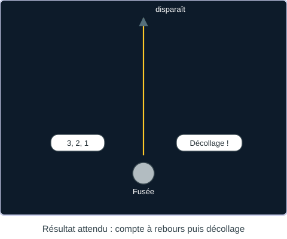{ .mission-resultat }

[:material-play-circle: Ouvrir l'exercice](https://turbowarp.org/editor?project_url=https://numerica-lfh.github.io/Techno/missions-scratch/exercices/mission-19.sb3){ .md-button .md-button--primary target=_blank rel=noopener } [:material-download: Télécharger le fichier .sb3](exercices/mission-19.sb3){ .md-button }

**Notions :** séquence, ajouter à y, animation par costumes.

**Pas à pas**

1. Au drapeau vert, la fusée est visible, en bas de la scène.
2. Elle dit 3, puis 2, puis 1, puis « Décollage ! », une seconde chacun.
3. Elle joue son son, puis monte : dans une boucle, ajouter 10 à y et costume suivant (les flammes).
4. Elle se cache à la fin.

??? question "Coup de pouce 1 : je réfléchis avant de coder"
    - Comment est la scène au départ : position, costume, taille de chaque lutin, visible ou caché ?
    - Qu'est-ce qui se répète dans la vidéo, et combien de fois ?

??? note "Coup de pouce 2 : les blocs que je vais utiliser"
    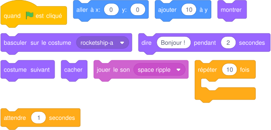{ .blocs }

    Les valeurs sont celles proposées par Scratch : à moi de choisir les bonnes et d'assembler les blocs.

??? abstract "Coup de pouce 3 : le squelette du script"
    Les blocs sont assemblés, les nombres sont à trouver (cases vides). Je l'ouvre seulement si les deux premiers coups de pouce ne suffisent pas.

    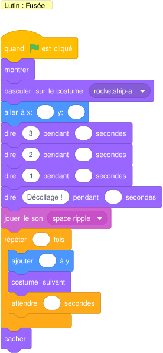{ .blocs }

??? warning "Si ça ne marche pas"
    - L'animation va trop vite pour être vue : j'ajoute « attendre » dans la boucle.
    - Le lutin reste invisible au lancement suivant : je mets « montrer » au début du script.

!!! tip "Mon défi"
    Le compte à rebours part de 10 avec une boucle et une variable.

**Je vérifie avant de cocher**

- [ ] Mon résultat ressemble à l'image du résultat attendu.
- [ ] Je clique deux fois de suite sur le drapeau vert : tout repart comme au premier essai.
- [ ] J'ai enregistré mon projet sur l'ordinateur (Fichier, Enregistrer sur votre ordinateur).

<label class="mission-reussie"><input type="checkbox" data-mission="19"> J'ai réussi la mission 19</label>

## Mission 20 · Le jardin de fleurs { #mission-20 }

<strong>Ce que je dois obtenir.</strong> La fleur laisse son empreinte six fois en avançant : une rangée de six fleurs de couleurs différentes apparaît, puis le lutin se cache.

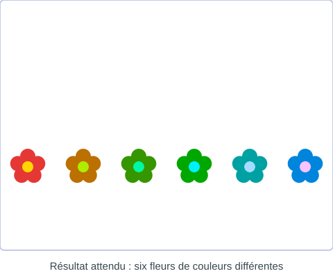{ .mission-resultat }

[:material-play-circle: Ouvrir l'exercice](https://turbowarp.org/editor?project_url=https://numerica-lfh.github.io/Techno/missions-scratch/exercices/mission-20.sb3){ .md-button .md-button--primary target=_blank rel=noopener } [:material-download: Télécharger le fichier .sb3](exercices/mission-20.sb3){ .md-button }

**Notions :** estampiller, effet couleur, boucle.

**Pas à pas**

1. J'ajoute l'extension Stylo : elle contient le bloc « estampiller ».
2. Au drapeau vert : effacer tout, annuler les effets, montrer, placer la fleur à gauche.
3. Dans « répéter 6 fois » : estampiller, avancer de 80, ajouter 25 à l'effet couleur.
4. À la fin, le lutin se cache : il ne reste que les empreintes.

??? question "Coup de pouce 1 : je réfléchis avant de coder"
    - Comment est la scène au départ : position, costume, taille de chaque lutin, visible ou caché ?
    - Qu'est-ce qui se répète dans la vidéo, et combien de fois ?

??? note "Coup de pouce 2 : les blocs que je vais utiliser"
    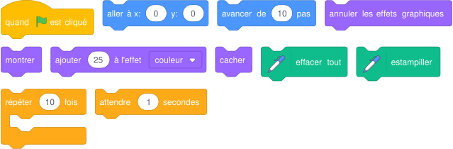{ .blocs }

    Les valeurs sont celles proposées par Scratch : à moi de choisir les bonnes et d'assembler les blocs.

??? abstract "Coup de pouce 3 : le squelette du script"
    Les blocs sont assemblés, les nombres sont à trouver (cases vides). Je l'ouvre seulement si les deux premiers coups de pouce ne suffisent pas.

    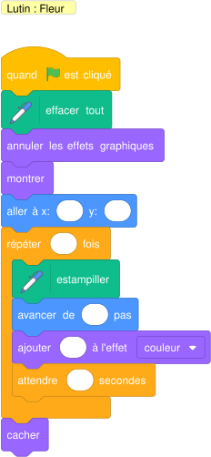{ .blocs }

??? warning "Si ça ne marche pas"
    - L'animation va trop vite pour être vue : j'ajoute « attendre » dans la boucle.
    - Le lutin reste invisible au lancement suivant : je mets « montrer » au début du script.
    - La taille ou la couleur change un peu plus à chaque essai : au début, je remets « mettre la taille à » et « annuler les effets graphiques ».

!!! tip "Mon défi"
    Je plante deux rangées de fleurs, la seconde décalée.

**Je vérifie avant de cocher**

- [ ] Mon résultat ressemble à l'image du résultat attendu.
- [ ] Je clique deux fois de suite sur le drapeau vert : tout repart comme au premier essai.
- [ ] J'ai enregistré mon projet sur l'ordinateur (Fichier, Enregistrer sur votre ordinateur).

<label class="mission-reussie"><input type="checkbox" data-mission="20"> J'ai réussi la mission 20</label>

## Je vérifie que j'ai compris

**Question 1.** Combien de côtés ce script trace-t-il au total ?

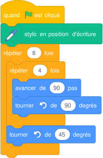{ .blocs }

**Question 2.** Le chat se retrouve la tête en bas quand il revient vers la gauche. Quel bloc manque ?

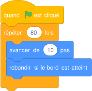{ .blocs }

**Question 3.** De combien de degrés le crayon doit-il tourner entre deux rayons pour en tracer 12 ?

**Question 4.** Où est le scarabée après ce bloc : à gauche ou à droite, en haut ou en bas ?

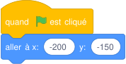{ .blocs }

## Où j'en suis

En fin de séance, j'indique la dernière mission terminée et j'ajoute une capture d'écran de mon programme. Le professeur la reçoit directement.

*Missions d'après les cartes « Missions Scratch » de Réseau Canopé (CC BY-NC-SA) et le livret « Bien commencer avec Scratch » (Inria). Détail des sources sur la [page d'accueil des missions](index.md#sources-et-licences).*
