# Palier 2 (bleu) : Messages, clones et blocs personnalisés

Les lutins communiquent par messages, se dupliquent avec les clones et les scripts s'organisent avec des blocs personnalisés.

Classe de départ : **4e**. Les élèves qui ont terminé le palier précédent continuent ici.

| Mission | Titre | Notions |
|---|---|---|
| [21](#mission-21) | Le magicien | message, clone, taille |
| [22](#mission-22) | Chauve-souris 1 | bloc personnalisé, taille, effet couleur |
| [23](#mission-23) | Chauve-souris 2 | boucle répéter jusqu'à, capteur souris |
| [24](#mission-24) | Créneaux 2 | boucles imbriquées, bloc personnalisé, variable |
| [25](#mission-25) | Carré 1 | bloc personnalisé, synchroniser son et mouvement |
| [26](#mission-26) | Cercle 1 | polygone à beaucoup de côtés, couleur du stylo, effet |
| [27](#mission-27) | Triangle équilatéral | boucle, angle extérieur, règle 360 / n |
| [28](#mission-28) | Océan 2 | répéter jusqu'à, capteur bord, perspective |
| [29](#mission-29) | Le chat 2 | boucles imbriquées, effet sonore |
| [30](#mission-30) | Sorcière 1 | boucles imbriquées, effet fantôme, son |
| [31](#mission-31) | Dinosaure 1 | clone, effet couleur |
| [32](#mission-32) | Dinosaure 2 | clone, test si, numéro de costume |
| [33](#mission-33) | Chien 1 | variable compteur, répéter jusqu'à, regrouper |
| [34](#mission-34) | Chiens 2 | nombre aléatoire, variable locale, message de départ |
| [35](#mission-35) | Danseuse 2 | deux lutins, message, aller à un lutin |
| [36](#mission-36) | Break 2 | boucles imbriquées, structure d'une chorégraphie |
| [A3](#mission-A3) | Une question d'image | règle de la rotation, bloc avec paramètres, opérateur division |
| [A4](#mission-A4) | Le labyrinthe | algorithme, si, touche pressée |

!!! info "Comment travailler"
    Je regarde la vidéo, j'ouvre l'exercice, je lis le pas à pas et je programme. Je compare mon résultat avec la vidéo. Si je suis bloqué, j'ouvre « Les blocs que je vais utiliser ». En fin de séance, j'envoie ma progression avec une capture d'écran (bas de la page).

## Mission 21 · Le magicien { #mission-21 }

<strong>Ce que je dois obtenir.</strong> Le magicien prononce une formule : des canards apparaissent, glissent et grandissent. À la seconde formule, ils disparaissent.

<iframe loading="lazy" title="Mission 21 : Le magicien" src="https://tube-numerique-educatif.apps.education.fr/videos/embed/kbR5SMFRbRshKe8HejRQZV" frameborder="0" allow="fullscreen" allowfullscreen></iframe>

Vidéo du résultat attendu : <a href="https://tube-numerique-educatif.apps.education.fr/w/kbR5SMFRbRshKe8HejRQZV" target="_blank" rel="noopener">ouvrir sur Tube Numérique éducatif</a>

[:material-play-circle: Ouvrir l'exercice](https://turbowarp.org/editor?project_url=https://numerica-lfh.github.io/Techno/missions-scratch/exercices/mission-21.sb3){ .md-button .md-button--primary target=_blank rel=noopener } [:material-download: Télécharger le fichier .sb3](exercices/mission-21.sb3){ .md-button }

**Notions :** message, clone, taille, effet fantôme.

**Pas à pas**

1. Le canard est caché au départ : il sert de modèle pour les clones.
2. Le magicien parle puis envoie le message « apparaître ».
3. Quand le canard reçoit « apparaître », il crée des clones de lui-même dans une boucle.
4. Avec « quand je commence comme un clone », chaque clone se montre, glisse vers une position aléatoire et grandit.
5. Au message « disparaître », chaque clone s'efface peu à peu (effet fantôme) puis est supprimé.

??? note "Les blocs que je vais utiliser"
    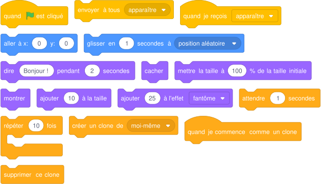{ .blocs }

    Les valeurs sont celles proposées par Scratch : à moi de choisir les bonnes et d'assembler les blocs.

!!! tip "Mon défi"
    Chaque canard apparaît avec une couleur différente.

<label class="mission-reussie"><input type="checkbox" data-mission="21"> J'ai réussi la mission 21</label>

## Mission 22 · Chauve-souris 1 { #mission-22 }

<strong>Ce que je dois obtenir.</strong> Une chauve-souris arrive du fond de la forêt : elle grossit en battant des ailes, change de couleur et de direction, puis surprise.

<iframe loading="lazy" title="Mission 22 : Chauve-souris 1" src="https://tube-numerique-educatif.apps.education.fr/videos/embed/99DYb5BnadRQaay4gkgx5s" frameborder="0" allow="fullscreen" allowfullscreen></iframe>

Vidéo du résultat attendu : <a href="https://tube-numerique-educatif.apps.education.fr/w/99DYb5BnadRQaay4gkgx5s" target="_blank" rel="noopener">ouvrir sur Tube Numérique éducatif</a>

[:material-play-circle: Ouvrir l'exercice](https://turbowarp.org/editor?project_url=https://numerica-lfh.github.io/Techno/missions-scratch/exercices/mission-22.sb3){ .md-button .md-button--primary target=_blank rel=noopener } [:material-download: Télécharger le fichier .sb3](exercices/mission-22.sb3){ .md-button }

**Notions :** bloc personnalisé, taille, effet couleur.

**Pas à pas**

1. Je crée un bloc personnalisé « battre des ailes » (catégorie Mes blocs) qui change deux fois de costume.
2. La chauve-souris démarre petite (taille 10) pour donner l'impression qu'elle est loin.
3. Dans une boucle, elle grossit et bat des ailes : elle s'approche.
4. Dans une seconde boucle, elle change de couleur et tourne.
5. Je termine par une surprise : un cri, une bulle, puis elle disparaît.

??? note "Les blocs que je vais utiliser"
    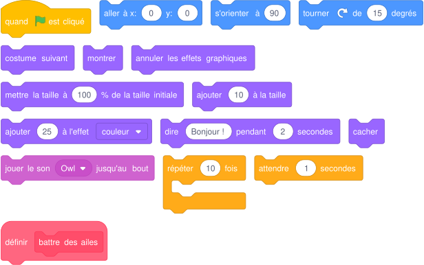{ .blocs }

    Les valeurs sont celles proposées par Scratch : à moi de choisir les bonnes et d'assembler les blocs.

!!! tip "Mon défi"
    J'ajoute un paramètre « vitesse » au bloc « battre des ailes ».

<label class="mission-reussie"><input type="checkbox" data-mission="22"> J'ai réussi la mission 22</label>

## Mission 23 · Chauve-souris 2 { #mission-23 }

<strong>Ce que je dois obtenir.</strong> La chauve-souris attend au centre. Quand je clique dessus, elle suit le pointeur de la souris jusqu'au clic suivant.

<iframe loading="lazy" title="Mission 23 : Chauve-souris 2" src="https://tube-numerique-educatif.apps.education.fr/videos/embed/hYviLzpWpH2ygV6uKMmxwi" frameborder="0" allow="fullscreen" allowfullscreen></iframe>

Vidéo du résultat attendu : <a href="https://tube-numerique-educatif.apps.education.fr/w/hYviLzpWpH2ygV6uKMmxwi" target="_blank" rel="noopener">ouvrir sur Tube Numérique éducatif</a>

[:material-play-circle: Ouvrir l'exercice](https://turbowarp.org/editor?project_url=https://numerica-lfh.github.io/Techno/missions-scratch/exercices/mission-23.sb3){ .md-button .md-button--primary target=_blank rel=noopener } [:material-download: Télécharger le fichier .sb3](exercices/mission-23.sb3){ .md-button }

**Notions :** boucle répéter jusqu'à, capteur souris.

**Pas à pas**

1. J'utilise le chapeau « quand ce lutin est cliqué ».
2. J'attends que le bouton de la souris soit relâché (« attendre jusqu'à » et « non souris pressée »).
3. Avec « répéter jusqu'à souris pressée », la chauve-souris va au pointeur de souris et bat des ailes.
4. Au clic suivant, la boucle s'arrête : elle se pose.

??? note "Les blocs que je vais utiliser"
    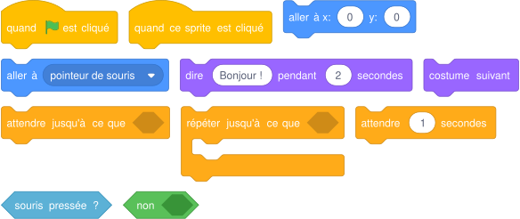{ .blocs }

    Les valeurs sont celles proposées par Scratch : à moi de choisir les bonnes et d'assembler les blocs.

!!! tip "Mon défi"
    La chauve-souris glisse vers la souris au lieu de sauter dessus.

<label class="mission-reussie"><input type="checkbox" data-mission="23"> J'ai réussi la mission 23</label>

## Mission 24 · Créneaux 2 { #mission-24 }

<strong>Ce que je dois obtenir.</strong> Le crayon trace huit lignes de dix créneaux de toutes les couleurs, puis il disparaît.

<iframe loading="lazy" title="Mission 24 : Créneaux 2" src="https://tube-numerique-educatif.apps.education.fr/videos/embed/77r6UtwiWEWp6RaKUJbbeg" frameborder="0" allow="fullscreen" allowfullscreen></iframe>

Vidéo du résultat attendu : <a href="https://tube-numerique-educatif.apps.education.fr/w/77r6UtwiWEWp6RaKUJbbeg" target="_blank" rel="noopener">ouvrir sur Tube Numérique éducatif</a>

[:material-play-circle: Ouvrir l'exercice](https://turbowarp.org/editor?project_url=https://numerica-lfh.github.io/Techno/missions-scratch/exercices/mission-24.sb3){ .md-button .md-button--primary target=_blank rel=noopener } [:material-download: Télécharger le fichier .sb3](exercices/mission-24.sb3){ .md-button }

**Notions :** boucles imbriquées, bloc personnalisé, variable.

**Pas à pas**

1. Je crée le bloc « créneau » : monter, avancer, descendre, avancer (avec « ajouter à x » et « ajouter à y »), puis changer la couleur.
2. Je crée le bloc « ligne de créneaux » qui répète 10 fois « créneau ».
3. Je crée une variable « hauteur » qui part de 140.
4. Dans « répéter 8 fois » : je relève le stylo, je vais au début de la ligne, je trace la ligne et je diminue la hauteur de 40.
5. À la fin, je relève le stylo et je cache le crayon.

??? note "Les blocs que je vais utiliser"
    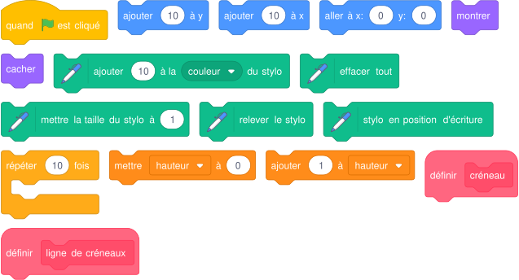{ .blocs }

    Les valeurs sont celles proposées par Scratch : à moi de choisir les bonnes et d'assembler les blocs.

!!! tip "Mon défi"
    Chaque ligne commence décalée d'un demi-créneau, comme un mur de briques.

<label class="mission-reussie"><input type="checkbox" data-mission="24"> J'ai réussi la mission 24</label>

## Mission 25 · Carré 1 { #mission-25 }

<strong>Ce que je dois obtenir.</strong> Le crayon dessine un carré de quatre couleurs. Un son est joué au début de chaque côté.

<iframe loading="lazy" title="Mission 25 : Carré 1" src="https://tube-numerique-educatif.apps.education.fr/videos/embed/f2XE1VBwaiiPgj46boj2dj" frameborder="0" allow="fullscreen" allowfullscreen></iframe>

Vidéo du résultat attendu : <a href="https://tube-numerique-educatif.apps.education.fr/w/f2XE1VBwaiiPgj46boj2dj" target="_blank" rel="noopener">ouvrir sur Tube Numérique éducatif</a>

[:material-play-circle: Ouvrir l'exercice](https://turbowarp.org/editor?project_url=https://numerica-lfh.github.io/Techno/missions-scratch/exercices/mission-25.sb3){ .md-button .md-button--primary target=_blank rel=noopener } [:material-download: Télécharger le fichier .sb3](exercices/mission-25.sb3){ .md-button }

**Notions :** bloc personnalisé, synchroniser son et mouvement.

**Pas à pas**

1. Je crée le bloc « côté » : changer la couleur, démarrer le son pop, puis avancer par petits pas pour voir le tracé se faire.
2. Dans le script principal, je prépare le crayon : effacer, position, orientation, taille et couleur du stylo.
3. Je répète 4 fois : « côté » puis tourner de 90 degrés.

??? note "Les blocs que je vais utiliser"
    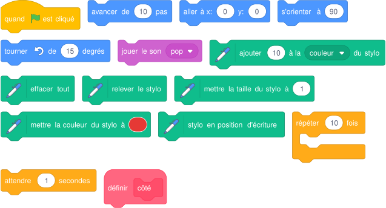{ .blocs }

    Les valeurs sont celles proposées par Scratch : à moi de choisir les bonnes et d'assembler les blocs.

!!! tip "Mon défi"
    Chaque côté joue une note différente (extension Musique).

<label class="mission-reussie"><input type="checkbox" data-mission="25"> J'ai réussi la mission 25</label>

## Mission 26 · Cercle 1 { #mission-26 }

<strong>Ce que je dois obtenir.</strong> Le chat apparaît, trace un cercle arc-en-ciel en changeant lui-même de couleur, puis il disparaît.

<iframe loading="lazy" title="Mission 26 : Cercle 1" src="https://tube-numerique-educatif.apps.education.fr/videos/embed/586p5mVrRNFiHxLoYT3M6a" frameborder="0" allow="fullscreen" allowfullscreen></iframe>

Vidéo du résultat attendu : <a href="https://tube-numerique-educatif.apps.education.fr/w/586p5mVrRNFiHxLoYT3M6a" target="_blank" rel="noopener">ouvrir sur Tube Numérique éducatif</a>

[:material-play-circle: Ouvrir l'exercice](https://turbowarp.org/editor?project_url=https://numerica-lfh.github.io/Techno/missions-scratch/exercices/mission-26.sb3){ .md-button .md-button--primary target=_blank rel=noopener } [:material-download: Télécharger le fichier .sb3](exercices/mission-26.sb3){ .md-button }

**Notions :** polygone à beaucoup de côtés, couleur du stylo, effet.

**Pas à pas**

1. Un cercle, pour Scratch, c'est un polygone avec beaucoup de petits côtés : par exemple 36 côtés et 10 degrés à chaque fois.
2. Je place le chat en bas du futur cercle, caché, puis je le montre.
3. Dans la boucle : avancer, tourner de 10 degrés, changer la couleur du stylo et l'effet couleur du chat.
4. À la fin, je relève le stylo et je cache le chat.

??? note "Les blocs que je vais utiliser"
    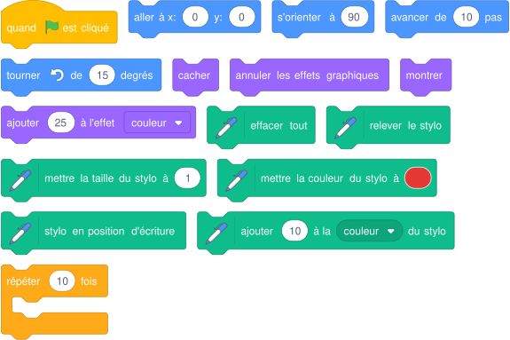{ .blocs }

    Les valeurs sont celles proposées par Scratch : à moi de choisir les bonnes et d'assembler les blocs.

!!! tip "Mon défi"
    Je trace trois cercles de tailles différentes.

<label class="mission-reussie"><input type="checkbox" data-mission="26"> J'ai réussi la mission 26</label>

## Mission 27 · Triangle équilatéral { #mission-27 }

<strong>Ce que je dois obtenir.</strong> Le crayon dessine un triangle équilatéral dont chaque côté a une couleur différente, cette fois avec une boucle.

<iframe loading="lazy" title="Mission 27 : Triangle équilatéral" src="https://tube-numerique-educatif.apps.education.fr/videos/embed/viTZY4D8BUA6iPPMGrLFHa" frameborder="0" allow="fullscreen" allowfullscreen></iframe>

Vidéo du résultat attendu : <a href="https://tube-numerique-educatif.apps.education.fr/w/viTZY4D8BUA6iPPMGrLFHa" target="_blank" rel="noopener">ouvrir sur Tube Numérique éducatif</a>

[:material-play-circle: Ouvrir l'exercice](https://turbowarp.org/editor?project_url=https://numerica-lfh.github.io/Techno/missions-scratch/exercices/mission-27.sb3){ .md-button .md-button--primary target=_blank rel=noopener } [:material-download: Télécharger le fichier .sb3](exercices/mission-27.sb3){ .md-button }

**Notions :** boucle, angle extérieur, règle 360 / n.

**Pas à pas**

1. Je reprends la mission 4 et je repère ce qui se répète.
2. Je place ces blocs dans « répéter 3 fois ».
3. Pour changer de couleur dans la boucle, j'utilise « ajouter à la couleur du stylo ».
4. Je vérifie l'angle : 360 divisé par 3.

??? note "Les blocs que je vais utiliser"
    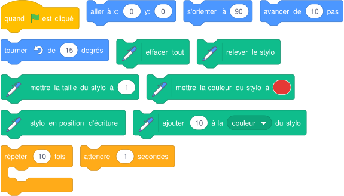{ .blocs }

    Les valeurs sont celles proposées par Scratch : à moi de choisir les bonnes et d'assembler les blocs.

!!! tip "Mon défi"
    Avec la même boucle, je dessine un hexagone (6 côtés).

<label class="mission-reussie"><input type="checkbox" data-mission="27"> J'ai réussi la mission 27</label>

## Mission 28 · Océan 2 { #mission-28 }

<strong>Ce que je dois obtenir.</strong> Deux poissons traversent l'écran en s'éloignant (ils rapetissent). Le plongeur pense, puis traverse en s'approchant (il grossit). Chacun disparaît au bord.

<iframe loading="lazy" title="Mission 28 : Océan 2" src="https://tube-numerique-educatif.apps.education.fr/videos/embed/exw9R7n8TeVe49ZrFeLPXn" frameborder="0" allow="fullscreen" allowfullscreen></iframe>

Vidéo du résultat attendu : <a href="https://tube-numerique-educatif.apps.education.fr/w/exw9R7n8TeVe49ZrFeLPXn" target="_blank" rel="noopener">ouvrir sur Tube Numérique éducatif</a>

[:material-play-circle: Ouvrir l'exercice](https://turbowarp.org/editor?project_url=https://numerica-lfh.github.io/Techno/missions-scratch/exercices/mission-28.sb3){ .md-button .md-button--primary target=_blank rel=noopener } [:material-download: Télécharger le fichier .sb3](exercices/mission-28.sb3){ .md-button }

**Notions :** répéter jusqu'à, capteur bord, perspective.

**Pas à pas**

1. Pour chaque poisson : je le place à gauche puis j'utilise « répéter jusqu'à touche le bord ».
2. Dans la boucle, il avance et rapetisse un peu : il s'éloigne.
3. Après la boucle, il se cache.
4. Le plongeur fait l'inverse : il part petit à droite et grossit en nageant vers la gauche.
5. Je n'oublie pas de tout remettre en place au départ (montrer, taille).

??? note "Les blocs que je vais utiliser"
    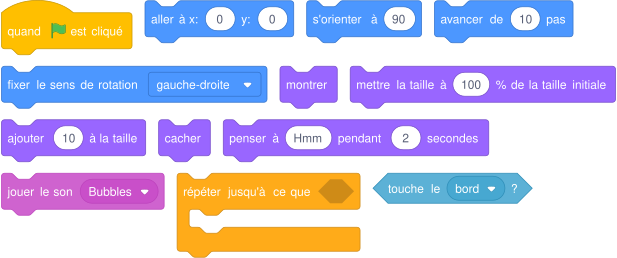{ .blocs }

    Les valeurs sont celles proposées par Scratch : à moi de choisir les bonnes et d'assembler les blocs.

!!! tip "Mon défi"
    Les poissons avancent à des vitesses choisies au hasard.

<label class="mission-reussie"><input type="checkbox" data-mission="28"> J'ai réussi la mission 28</label>

## Mission 29 · Le chat 2 { #mission-29 }

<strong>Ce que je dois obtenir.</strong> Le chat avance vers la droite en grandissant, fait quelques mouvements, soupire puis se couche, fatigué.

<iframe loading="lazy" title="Mission 29 : Le chat 2" src="https://tube-numerique-educatif.apps.education.fr/videos/embed/o9F6qwVkEUBSi438AuEPds" frameborder="0" allow="fullscreen" allowfullscreen></iframe>

Vidéo du résultat attendu : <a href="https://tube-numerique-educatif.apps.education.fr/w/o9F6qwVkEUBSi438AuEPds" target="_blank" rel="noopener">ouvrir sur Tube Numérique éducatif</a>

[:material-play-circle: Ouvrir l'exercice](https://turbowarp.org/editor?project_url=https://numerica-lfh.github.io/Techno/missions-scratch/exercices/mission-29.sb3){ .md-button .md-button--primary target=_blank rel=noopener } [:material-download: Télécharger le fichier .sb3](exercices/mission-29.sb3){ .md-button }

**Notions :** boucles imbriquées, effet sonore.

**Pas à pas**

1. Boucle intérieure : 5 pas de marche (avancer, costume suivant, attendre).
2. Boucle extérieure : je répète 4 fois la marche et j'agrandis le chat entre chaque.
3. Le chat se dandine : tourner à droite, à gauche, revenir.
4. Il soupire : je baisse la hauteur du son (effet hauteur) avant le miaulement.
5. Il se couche : il tourne de 90 degrés.

??? note "Les blocs que je vais utiliser"
    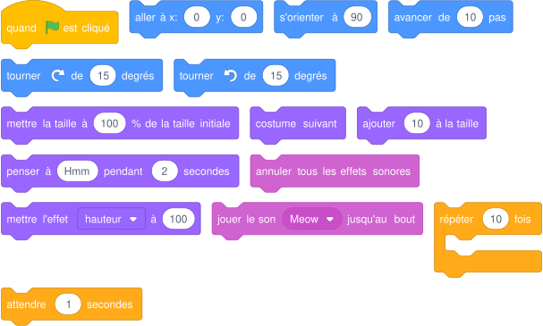{ .blocs }

    Les valeurs sont celles proposées par Scratch : à moi de choisir les bonnes et d'assembler les blocs.

!!! tip "Mon défi"
    Le chat se relève quand on clique dessus.

<label class="mission-reussie"><input type="checkbox" data-mission="29"> J'ai réussi la mission 29</label>

## Mission 30 · Sorcière 1 { #mission-30 }

<strong>Ce que je dois obtenir.</strong> La sorcière clignote comme un moteur qui a du mal à démarrer, klaxonne, puis part à toute vitesse.

<iframe loading="lazy" title="Mission 30 : Sorcière 1" src="https://tube-numerique-educatif.apps.education.fr/videos/embed/rhGwH3adHYfpDYCHQyXwPm" frameborder="0" allow="fullscreen" allowfullscreen></iframe>

Vidéo du résultat attendu : <a href="https://tube-numerique-educatif.apps.education.fr/w/rhGwH3adHYfpDYCHQyXwPm" target="_blank" rel="noopener">ouvrir sur Tube Numérique éducatif</a>

[:material-play-circle: Ouvrir l'exercice](https://turbowarp.org/editor?project_url=https://numerica-lfh.github.io/Techno/missions-scratch/exercices/mission-30.sb3){ .md-button .md-button--primary target=_blank rel=noopener } [:material-download: Télécharger le fichier .sb3](exercices/mission-30.sb3){ .md-button }

**Notions :** boucles imbriquées, effet fantôme, son.

**Pas à pas**

1. Clignoter : effet fantôme à 70, attendre, effet fantôme à 0, attendre.
2. Le moteur tousse trois fois : je place le clignotement dans une boucle, avec une pause entre chaque essai.
3. J'ajoute le son Car Horn depuis la bibliothèque et je le joue jusqu'au bout.
4. Elle part : elle avance de grands pas en changeant de costume, puis elle se cache.

??? note "Les blocs que je vais utiliser"
    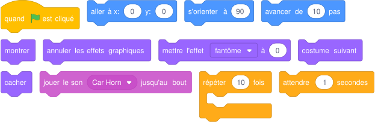{ .blocs }

    Les valeurs sont celles proposées par Scratch : à moi de choisir les bonnes et d'assembler les blocs.

!!! tip "Mon défi"
    La sorcière accélère : chaque pas est plus grand que le précédent.

<label class="mission-reussie"><input type="checkbox" data-mission="30"> J'ai réussi la mission 30</label>

## Mission 31 · Dinosaure 1 { #mission-31 }

<strong>Ce que je dois obtenir.</strong> Le dinosaure se duplique de gauche à droite, chaque copie ayant une couleur différente.

<iframe loading="lazy" title="Mission 31 : Dinosaure 1" src="https://tube-numerique-educatif.apps.education.fr/videos/embed/6t3XhsbTzjsF3ZQfAt9YQL" frameborder="0" allow="fullscreen" allowfullscreen></iframe>

Vidéo du résultat attendu : <a href="https://tube-numerique-educatif.apps.education.fr/w/6t3XhsbTzjsF3ZQfAt9YQL" target="_blank" rel="noopener">ouvrir sur Tube Numérique éducatif</a>

[:material-play-circle: Ouvrir l'exercice](https://turbowarp.org/editor?project_url=https://numerica-lfh.github.io/Techno/missions-scratch/exercices/mission-31.sb3){ .md-button .md-button--primary target=_blank rel=noopener } [:material-download: Télécharger le fichier .sb3](exercices/mission-31.sb3){ .md-button }

**Notions :** clone, effet couleur.

**Pas à pas**

1. Je place le dinosaure à gauche, sans effet de couleur.
2. Dans une boucle : je crée un clone de moi-même, puis le dinosaure d'origine se décale à droite et change de couleur.
3. Le clone reste à l'ancienne place avec l'ancienne couleur.

??? note "Les blocs que je vais utiliser"
    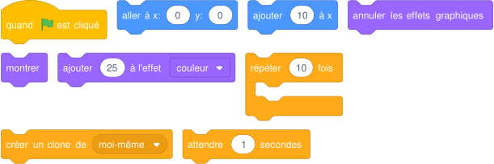{ .blocs }

    Les valeurs sont celles proposées par Scratch : à moi de choisir les bonnes et d'assembler les blocs.

!!! tip "Mon défi"
    Les dinosaures sont posés sur deux lignes.

<label class="mission-reussie"><input type="checkbox" data-mission="31"> J'ai réussi la mission 31</label>

## Mission 32 · Dinosaure 2 { #mission-32 }

<strong>Ce que je dois obtenir.</strong> Le dinosaure arrive du fond : il grandit en se dupliquant vers l'avant, puis il marche vers la droite et rugit chaque fois qu'il ouvre la gueule.

<iframe loading="lazy" title="Mission 32 : Dinosaure 2" src="https://tube-numerique-educatif.apps.education.fr/videos/embed/5RcqfjgaYwim46kk2voz8A" frameborder="0" allow="fullscreen" allowfullscreen></iframe>

Vidéo du résultat attendu : <a href="https://tube-numerique-educatif.apps.education.fr/w/5RcqfjgaYwim46kk2voz8A" target="_blank" rel="noopener">ouvrir sur Tube Numérique éducatif</a>

[:material-play-circle: Ouvrir l'exercice](https://turbowarp.org/editor?project_url=https://numerica-lfh.github.io/Techno/missions-scratch/exercices/mission-32.sb3){ .md-button .md-button--primary target=_blank rel=noopener } [:material-download: Télécharger le fichier .sb3](exercices/mission-32.sb3){ .md-button }

**Notions :** clone, test si, numéro de costume.

**Pas à pas**

1. Il part petit et en haut : il est loin.
2. Dans une boucle, il laisse un clone, grandit et descend : il s'approche.
3. Ensuite il marche en changeant de costume.
4. Je teste le numéro du costume : si c'est le costume gueule ouverte, il rugit (son Growl).

??? note "Les blocs que je vais utiliser"
    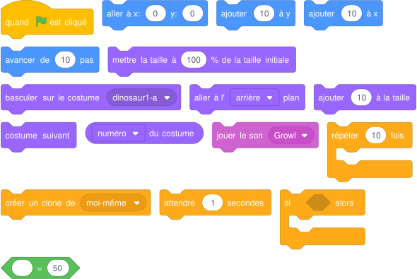{ .blocs }

    Les valeurs sont celles proposées par Scratch : à moi de choisir les bonnes et d'assembler les blocs.

!!! tip "Mon défi"
    Les clones disparaissent un par un après le passage du dinosaure.

<label class="mission-reussie"><input type="checkbox" data-mission="32"> J'ai réussi la mission 32</label>

## Mission 33 · Chien 1 { #mission-33 }

<strong>Ce que je dois obtenir.</strong> Le chien traverse la scène en aboyant sans toucher le bord. Un compteur affiche le nombre d'aboiements et le chien y pense à la fin.

<iframe loading="lazy" title="Mission 33 : Chien 1" src="https://tube-numerique-educatif.apps.education.fr/videos/embed/1WJkvmF2MQC5FYjQ8HhVyR" frameborder="0" allow="fullscreen" allowfullscreen></iframe>

Vidéo du résultat attendu : <a href="https://tube-numerique-educatif.apps.education.fr/w/1WJkvmF2MQC5FYjQ8HhVyR" target="_blank" rel="noopener">ouvrir sur Tube Numérique éducatif</a>

[:material-play-circle: Ouvrir l'exercice](https://turbowarp.org/editor?project_url=https://numerica-lfh.github.io/Techno/missions-scratch/exercices/mission-33.sb3){ .md-button .md-button--primary target=_blank rel=noopener } [:material-download: Télécharger le fichier .sb3](exercices/mission-33.sb3){ .md-button }

**Notions :** variable compteur, répéter jusqu'à, regrouper.

**Pas à pas**

1. Je crée la variable « aboiements » et je la mets à 0 au départ.
2. Dans « répéter jusqu'à abscisse x > 150 » : le chien avance, aboie et ajoute 1 au compteur.
3. Après la boucle, il pense une phrase construite avec « regrouper » : texte, variable, texte.
4. Je termine par « stop tout ».

??? note "Les blocs que je vais utiliser"
    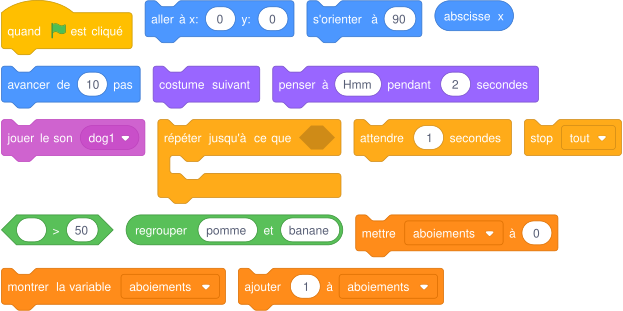{ .blocs }

    Les valeurs sont celles proposées par Scratch : à moi de choisir les bonnes et d'assembler les blocs.

!!! tip "Mon défi"
    Le chien aboie seulement un pas sur deux.

<label class="mission-reussie"><input type="checkbox" data-mission="33"> J'ai réussi la mission 33</label>

## Mission 34 · Chiens 2 { #mission-34 }

<strong>Ce que je dois obtenir.</strong> Deux chiens font la course. À chaque bond, ils avancent d'une longueur tirée au hasard entre 5 et 20. Le premier qui touche le bord crie victoire.

<iframe loading="lazy" title="Mission 34 : Chiens 2" src="https://tube-numerique-educatif.apps.education.fr/videos/embed/jTfaStHxZaRot27Tzv8AWW" frameborder="0" allow="fullscreen" allowfullscreen></iframe>

Vidéo du résultat attendu : <a href="https://tube-numerique-educatif.apps.education.fr/w/jTfaStHxZaRot27Tzv8AWW" target="_blank" rel="noopener">ouvrir sur Tube Numérique éducatif</a>

[:material-play-circle: Ouvrir l'exercice](https://turbowarp.org/editor?project_url=https://numerica-lfh.github.io/Techno/missions-scratch/exercices/mission-34.sb3){ .md-button .md-button--primary target=_blank rel=noopener } [:material-download: Télécharger le fichier .sb3](exercices/mission-34.sb3){ .md-button }

**Notions :** nombre aléatoire, variable locale, message de départ.

**Pas à pas**

1. La scène donne le départ : elle attend 1 seconde puis envoie le message « partez ».
2. Pour chaque chien, je crée une variable « saut » pour ce lutin uniquement.
3. À la réception de « partez », dans « répéter jusqu'à touche le bord » : saut prend un nombre aléatoire entre 5 et 20, puis le chien avance de saut.
4. Le gagnant dit « J'ai gagné ! » puis arrête tout.

??? note "Les blocs que je vais utiliser"
    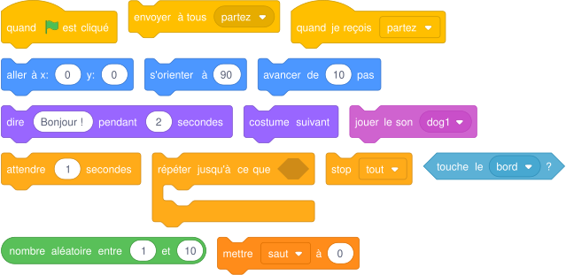{ .blocs }

    Les valeurs sont celles proposées par Scratch : à moi de choisir les bonnes et d'assembler les blocs.

!!! tip "Mon défi"
    J'ajoute un troisième chien et un compte à rebours 3, 2, 1.

<label class="mission-reussie"><input type="checkbox" data-mission="34"> J'ai réussi la mission 34</label>

## Mission 35 · Danseuse 2 { #mission-35 }

<strong>Ce que je dois obtenir.</strong> La danseuse fait des pas chassés et lance un ballon au milieu de sa danse.

<iframe loading="lazy" title="Mission 35 : Danseuse 2" src="https://tube-numerique-educatif.apps.education.fr/videos/embed/6JfBsRPu3PV21NePi4zrb7" frameborder="0" allow="fullscreen" allowfullscreen></iframe>

Vidéo du résultat attendu : <a href="https://tube-numerique-educatif.apps.education.fr/w/6JfBsRPu3PV21NePi4zrb7" target="_blank" rel="noopener">ouvrir sur Tube Numérique éducatif</a>

[:material-play-circle: Ouvrir l'exercice](https://turbowarp.org/editor?project_url=https://numerica-lfh.github.io/Techno/missions-scratch/exercices/mission-35.sb3){ .md-button .md-button--primary target=_blank rel=noopener } [:material-download: Télécharger le fichier .sb3](exercices/mission-35.sb3){ .md-button }

**Notions :** deux lutins, message, aller à un lutin.

**Pas à pas**

1. Je crée le bloc « pas chassé » à partir de la mission 7.
2. La danseuse fait 3 pas chassés, prend la pose du lancer et envoie le message « lancer ».
3. Le ballon est caché au départ. Quand il reçoit « lancer », il va à la danseuse, se montre et glisse vers le coin de la scène.
4. La danseuse termine sa danse.

??? note "Les blocs que je vais utiliser"
    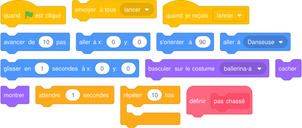{ .blocs }

    Les valeurs sont celles proposées par Scratch : à moi de choisir les bonnes et d'assembler les blocs.

!!! tip "Mon défi"
    Le ballon tourne sur lui-même pendant son vol.

<label class="mission-reussie"><input type="checkbox" data-mission="35"> J'ai réussi la mission 35</label>

## Mission 36 · Break 2 { #mission-36 }

<strong>Ce que je dois obtenir.</strong> Le danseur enchaîne trois figures différentes, chacune répétée plusieurs fois, sur la musique.

<iframe loading="lazy" title="Mission 36 : Break 2" src="https://tube-numerique-educatif.apps.education.fr/videos/embed/9jk4WVt632GyoxBX8q6MnS" frameborder="0" allow="fullscreen" allowfullscreen></iframe>

Vidéo du résultat attendu : <a href="https://tube-numerique-educatif.apps.education.fr/w/9jk4WVt632GyoxBX8q6MnS" target="_blank" rel="noopener">ouvrir sur Tube Numérique éducatif</a>

[:material-play-circle: Ouvrir l'exercice](https://turbowarp.org/editor?project_url=https://numerica-lfh.github.io/Techno/missions-scratch/exercices/mission-36.sb3){ .md-button .md-button--primary target=_blank rel=noopener } [:material-download: Télécharger le fichier .sb3](exercices/mission-36.sb3){ .md-button }

**Notions :** boucles imbriquées, structure d'une chorégraphie.

**Pas à pas**

1. J'écris la chorégraphie : figure 1 (4 fois), figure 2 (2 fois), figure 3 (3 fois).
2. Chaque figure est une boucle de deux costumes.
3. Je place les trois boucles dans une grande boucle « répéter 2 fois ».
4. Je démarre la musique au début et je l'arrête à la fin.

??? note "Les blocs que je vais utiliser"
    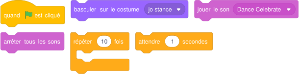{ .blocs }

    Les valeurs sont celles proposées par Scratch : à moi de choisir les bonnes et d'assembler les blocs.

!!! tip "Mon défi"
    Chaque figure devient un bloc personnalisé.

<label class="mission-reussie"><input type="checkbox" data-mission="36"> J'ai réussi la mission 36</label>

## Mission A3 · Une question d'image { #mission-A3 }

<strong>Ce que je dois obtenir.</strong> Le crayon dessine un triangle, un carré, un pentagone, un hexagone puis une étoile à cinq branches.

[:material-play-circle: Ouvrir l'exercice](https://turbowarp.org/editor?project_url=https://numerica-lfh.github.io/Techno/missions-scratch/exercices/mission-A3.sb3){ .md-button .md-button--primary target=_blank rel=noopener } [:material-download: Télécharger le fichier .sb3](exercices/mission-A3.sb3){ .md-button }

**Notions :** règle de la rotation, bloc avec paramètres, opérateur division.

**Pas à pas**

1. Je complète le tableau : carré 4 côtés, 90 degrés ; pentagone 5 côtés, 72 degrés ; hexagone, heptagone, triangle.
2. Règle : je divise 360 par le nombre de côtés.
3. Je crée le bloc « polygone » avec deux paramètres : côtés et longueur.
4. Dans le bloc : répéter « côtés » fois, avancer de « longueur », tourner de 360 / côtés.
5. Pour l'étoile, le crayon fait deux tours complets en 5 branches : il tourne de 720 / 5 = 144 degrés.

??? note "Les blocs que je vais utiliser"
    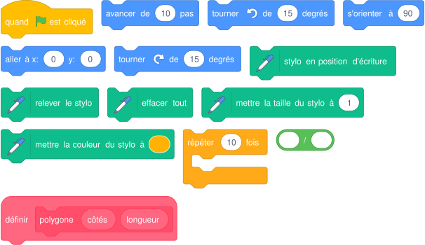{ .blocs }

    Les valeurs sont celles proposées par Scratch : à moi de choisir les bonnes et d'assembler les blocs.

!!! tip "Mon défi"
    Je dessine les anneaux olympiques avec un bloc « cercle ».

<label class="mission-reussie"><input type="checkbox" data-mission="A3"> J'ai réussi la mission A3</label>

## Mission A4 · Le labyrinthe { #mission-A4 }

<strong>Ce que je dois obtenir.</strong> Je guide l'explorateur avec les flèches du clavier jusqu'à son ami, piégé au centre du labyrinthe. S'il touche un mur bleu, il revient au départ.

[:material-play-circle: Ouvrir l'exercice](https://turbowarp.org/editor?project_url=https://numerica-lfh.github.io/Techno/missions-scratch/exercices/mission-A4.sb3){ .md-button .md-button--primary target=_blank rel=noopener } [:material-download: Télécharger le fichier .sb3](exercices/mission-A4.sb3){ .md-button }

**Notions :** algorithme, si, touche pressée, couleur touchée.

**Pas à pas**

1. Avant de coder, je lis l'algorithme : « répéter indéfiniment, si la flèche droite est pressée, s'orienter à 90 et avancer ».
2. Je code les quatre directions avec quatre blocs « si ».
3. J'ajoute : si l'explorateur touche la couleur bleue, il retourne au départ.
4. Pour l'ami : répéter indéfiniment, si l'explorateur le touche, il dit merci, se cache et tout s'arrête.

??? note "Les blocs que je vais utiliser"
    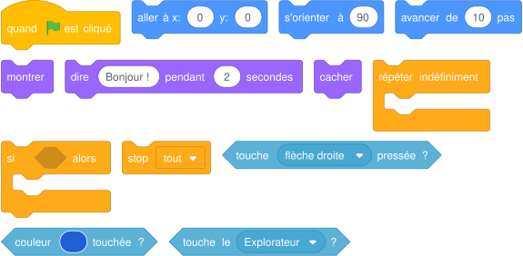{ .blocs }

    Les valeurs sont celles proposées par Scratch : à moi de choisir les bonnes et d'assembler les blocs.

!!! tip "Mon défi"
    Un ennemi se déplace de gauche à droite (rebondir si le bord est atteint) et renvoie l'explorateur au départ.

<label class="mission-reussie"><input type="checkbox" data-mission="A4"> J'ai réussi la mission A4</label>

## Je vérifie que j'ai compris

**Question 1.** Ce script doit renvoyer l'explorateur au départ quand il touche le mur. Pourquoi cela ne marche-t-il jamais ?

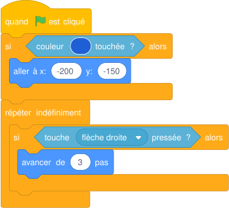{ .blocs }

**Question 2.** Combien de canards sont visibles à la fin ?

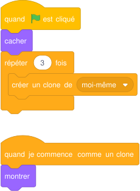{ .blocs }

**Question 3.** De combien de degrés le crayon doit-il tourner pour un octogone (8 côtés) ?

**Question 4.** Pourquoi le second chien ne crie-t-il pas victoire lui aussi ?

## Où j'en suis

En fin de séance, j'indique la dernière mission terminée et j'ajoute une capture d'écran de mon programme. Le professeur la reçoit directement.

*Missions d'après les cartes « Missions Scratch » de Réseau Canopé (CC BY-NC-SA) et le livret « Bien commencer avec Scratch » (Inria). Détail des sources sur la [page d'accueil des missions](index.md#sources-et-licences).*
