# Palier 3 (orange) : Variables, capteurs et jeux

Les programmes deviennent interactifs : questions, réponses, scores, chronomètres, fonctions affines et premiers jeux complets.

Classe de départ : **3e**. Les élèves qui ont terminé le palier précédent continuent ici.

| Mission | Titre | Notions |
|---|---|---|
| [41](#mission-41) | Chauve-souris 3 | nombre aléatoire, rebondir, test |
| [42](#mission-42) | Océan 3 | script de la scène, capteur « abscisse de », attendre jusqu'à |
| [43](#mission-43) | Chat et insecte | jeu, score, bloc avec paramètre |
| [44](#mission-44) | Ghost | chaîne d'événements, messages, apparition progressive |
| [45](#mission-45) | Tables de multiplication 1 | demander et réponse, variables, opérateur multiplication |
| [46](#mission-46) | Carré 2 | bloc avec deux paramètres, variable, coordonnées |
| [47](#mission-47) | Carré 3 | demander, bloc avec paramètre, calcul de coordonnées |
| [48](#mission-48) | Cercle 2 | bloc sans rafraîchissement d'écran, extension Musique, variable drapeau |
| [49](#mission-49) | Cercle 3 | formule dans un programme, variable calculée, bloc à deux paramètres |
| [50](#mission-50) | Chat 3 | s'orienter vers, stop autres scripts du lutin, capteur |
| [51](#mission-51) | Labyrinthe | événement touche pressée, bloc personnalisé, deux compteurs |
| [52](#mission-52) | Sorcière 2 | changer de scène, quand l'arrière-plan bascule, effets |
| [53](#mission-53) | Fonction affine 1 | fonction affine, coordonnées, variables |
| [54](#mission-54) | Fonction affine 2 | listes, paramètres a et b, message de mise à jour |
| [55](#mission-55) | Graphique fonction affine 1 | représentation graphique, si sinon, capteur bord |
| [56](#mission-56) | Batterie | variable partagée, boucle infinie, stop ce script |
| [A5](#mission-A5) | Tir à l'arc en forêt | si sinon imbriqués, nombre aléatoire, chronomètre |
| [A6](#mission-A6) | Premier jeu : le poulpe | programmer un jeu complet, vies, couleur touchée |

!!! info "Comment travailler"
    Je regarde la vidéo, j'ouvre l'exercice, je lis le pas à pas et je programme. Je compare mon résultat avec la vidéo. Si je suis bloqué, j'ouvre les coups de pouce dans l'ordre : 1, je réfléchis ; 2, les blocs à utiliser ; 3, le squelette du script. « Si ça ne marche pas » liste les erreurs les plus courantes. En fin de séance, j'envoie ma progression avec une capture d'écran (bas de la page).

## Mission 41 · Chauve-souris 3 { #mission-41 }

<strong>Ce que je dois obtenir.</strong> La chauve-souris vole au hasard et rebondit sur les bords en criant, jusqu'à ce que je clique n'importe où.

<iframe loading="lazy" title="Mission 41 : Chauve-souris 3" src="https://tube-numerique-educatif.apps.education.fr/videos/embed/nKWKrKfNNh4VrQtHX7rNqZ" frameborder="0" allow="fullscreen" allowfullscreen></iframe>

Vidéo du résultat attendu : <a href="https://tube-numerique-educatif.apps.education.fr/w/nKWKrKfNNh4VrQtHX7rNqZ" target="_blank" rel="noopener">ouvrir sur Tube Numérique éducatif</a>

[:material-play-circle: Ouvrir l'exercice](https://turbowarp.org/editor?project_url=https://numerica-lfh.github.io/Techno/missions-scratch/exercices/mission-41.sb3){ .md-button .md-button--primary target=_blank rel=noopener } [:material-download: Télécharger le fichier .sb3](exercices/mission-41.sb3){ .md-button }

**Notions :** nombre aléatoire, rebondir, test, bloc personnalisé.

**Pas à pas**

1. Je crée le bloc « voler » : costume suivant, avancer, crier si le bord est touché, rebondir si le bord est atteint.
2. Au départ, la chauve-souris prend une direction au hasard.
3. Dans « répéter jusqu'à souris pressée » : « voler », et de temps en temps (une chance sur 15) elle tourne d'un angle au hasard.
4. Après la boucle, elle annonce qu'elle est attrapée.

??? question "Coup de pouce 1 : je réfléchis avant de coder"
    - Comment est la scène au départ : position, costume, taille de chaque lutin, visible ou caché ?
    - Jusqu'à quand le lutin répète-t-il son action ? Quelle condition arrête la boucle ?
    - Quelle condition dois-je tester, et que se passe-t-il quand elle est vraie ?
    - Quelle suite de blocs revient plusieurs fois et mérite de devenir un bloc personnalisé ?
    - Quelle valeur doit changer à chaque fois ? (nombre aléatoire)

??? note "Coup de pouce 2 : les blocs que je vais utiliser"
    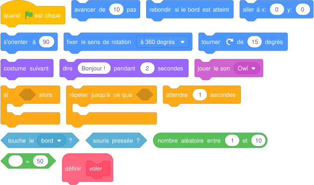{ .blocs }

    Les valeurs sont celles proposées par Scratch : à moi de choisir les bonnes et d'assembler les blocs.

??? abstract "Coup de pouce 3 : le squelette du script"
    Les blocs sont assemblés, les nombres sont à trouver (cases vides). Je l'ouvre seulement si les deux premiers coups de pouce ne suffisent pas.

    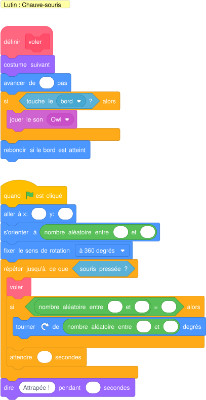{ .blocs }

??? warning "Si ça ne marche pas"
    - Mon test ne marche qu'une fois : le bloc « si » doit être à l'intérieur de la boucle.
    - La boucle s'arrête tout de suite : au départ, le lutin touche déjà le bord. Je le place un peu plus loin.

!!! tip "Mon défi"
    Un compteur affiche le nombre de rebonds.

**Je vérifie avant de cocher**

- [ ] Mon résultat ressemble à la vidéo.
- [ ] Je clique deux fois de suite sur le drapeau vert : tout repart comme au premier essai.
- [ ] J'ai créé et utilisé au moins un bloc personnalisé.
- [ ] J'ai enregistré mon projet sur l'ordinateur (Fichier, Enregistrer sur votre ordinateur).

<label class="mission-reussie"><input type="checkbox" data-mission="41"> J'ai réussi la mission 41</label>

## Mission 42 · Océan 3 { #mission-42 }

<strong>Ce que je dois obtenir.</strong> Le plongeur et deux poissons nagent en sens opposés. Quand le plongeur arrive au bord, le décor change et il continue à nager. La scène pilote l'histoire.

<iframe loading="lazy" title="Mission 42 : Océan 3" src="https://tube-numerique-educatif.apps.education.fr/videos/embed/6MZyqkeUnXW8Y6rNhabwcb" frameborder="0" allow="fullscreen" allowfullscreen></iframe>

Vidéo du résultat attendu : <a href="https://tube-numerique-educatif.apps.education.fr/w/6MZyqkeUnXW8Y6rNhabwcb" target="_blank" rel="noopener">ouvrir sur Tube Numérique éducatif</a>

[:material-play-circle: Ouvrir l'exercice](https://turbowarp.org/editor?project_url=https://numerica-lfh.github.io/Techno/missions-scratch/exercices/mission-42.sb3){ .md-button .md-button--primary target=_blank rel=noopener } [:material-download: Télécharger le fichier .sb3](exercices/mission-42.sb3){ .md-button }

**Notions :** script de la scène, capteur « abscisse de », attendre jusqu'à.

**Pas à pas**

1. Plongeur et poissons nagent sans fin (« répéter indéfiniment »). Un poisson qui sort à gauche revient à droite.
2. Le script principal est dans la scène : elle attend que l'abscisse x du plongeur dépasse 170 (bloc « abscisse x de Plongeur » dans Capteurs).
3. Elle change d'arrière-plan et envoie « nouveau décor » : le plongeur repart du bord gauche.
4. Au second passage, la scène arrête tout.

??? question "Coup de pouce 1 : je réfléchis avant de coder"
    - Comment est la scène au départ : position, costume, taille de chaque lutin, visible ou caché ?
    - Quel lutin envoie le message, et quel lutin le reçoit ?
    - Qu'est-ce qui doit se répéter sans jamais s'arrêter ?
    - Quelle condition dois-je tester, et que se passe-t-il quand elle est vraie ?

??? note "Coup de pouce 2 : les blocs que je vais utiliser"
    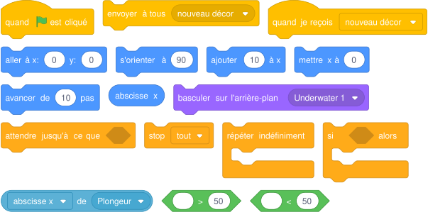{ .blocs }

    Les valeurs sont celles proposées par Scratch : à moi de choisir les bonnes et d'assembler les blocs.

??? abstract "Coup de pouce 3 : le squelette du script"
    Les blocs sont assemblés, les nombres sont à trouver (cases vides). Je l'ouvre seulement si les deux premiers coups de pouce ne suffisent pas.

    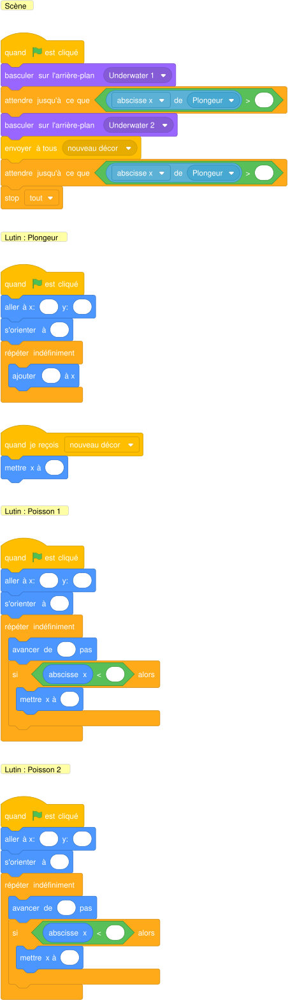{ .blocs }

??? warning "Si ça ne marche pas"
    - L'animation va trop vite pour être vue : j'ajoute « attendre » dans la boucle.
    - Mon test ne marche qu'une fois : le bloc « si » doit être à l'intérieur de la boucle.
    - Rien ne se passe à la réception : le message envoyé et le message reçu doivent porter exactement le même nom.
    - Le lutin avance la tête en bas : « fixer le sens de rotation gauche-droite ».

!!! tip "Mon défi"
    Trois décors au lieu de deux, avec « arrière-plan suivant ».

**Je vérifie avant de cocher**

- [ ] Mon résultat ressemble à la vidéo.
- [ ] Je clique deux fois de suite sur le drapeau vert : tout repart comme au premier essai.
- [ ] J'ai enregistré mon projet sur l'ordinateur (Fichier, Enregistrer sur votre ordinateur).

<label class="mission-reussie"><input type="checkbox" data-mission="42"> J'ai réussi la mission 42</label>

## Mission 43 · Chat et insecte { #mission-43 }

<strong>Ce que je dois obtenir.</strong> Une coccinelle vole au hasard. Je dirige le chat avec les flèches pour l'attraper en contournant le rocher. Chaque prise rapporte 1 point. Si la coccinelle se pose sur le rocher, elle se cache derrière et la partie s'arrête.

<iframe loading="lazy" title="Mission 43 : Chat et insecte" src="https://tube-numerique-educatif.apps.education.fr/videos/embed/xcx3gjPES7ykBVUJWpbokN" frameborder="0" allow="fullscreen" allowfullscreen></iframe>

Vidéo du résultat attendu : <a href="https://tube-numerique-educatif.apps.education.fr/w/xcx3gjPES7ykBVUJWpbokN" target="_blank" rel="noopener">ouvrir sur Tube Numérique éducatif</a>

[:material-play-circle: Ouvrir l'exercice](https://turbowarp.org/editor?project_url=https://numerica-lfh.github.io/Techno/missions-scratch/exercices/mission-43.sb3){ .md-button .md-button--primary target=_blank rel=noopener } [:material-download: Télécharger le fichier .sb3](exercices/mission-43.sb3){ .md-button }

**Notions :** jeu, score, bloc avec paramètre, couches d'affichage.

**Pas à pas**

1. Je crée le bloc « aller (direction) » : s'orienter, avancer, et reculer si le chat touche le rocher.
2. Le chat se dirige avec les quatre flèches dans une boucle infinie.
3. La coccinelle glisse vers des positions aléatoires jusqu'à toucher le rocher.
4. Un second script de la coccinelle compte les points quand le chat la touche, puis elle repart ailleurs.
5. Quand elle touche le rocher, elle passe à l'arrière-plan (« aller à l'arrière-plan ») et tout s'arrête.

??? question "Coup de pouce 1 : je réfléchis avant de coder"
    - Comment est la scène au départ : position, costume, taille de chaque lutin, visible ou caché ?
    - Jusqu'à quand le lutin répète-t-il son action ? Quelle condition arrête la boucle ?
    - Qu'est-ce qui doit se répéter sans jamais s'arrêter ?
    - Quelle condition dois-je tester, et que se passe-t-il quand elle est vraie ?
    - Quelle information dois-je garder dans une variable, et quelle est sa valeur au départ ?

??? note "Coup de pouce 2 : les blocs que je vais utiliser"
    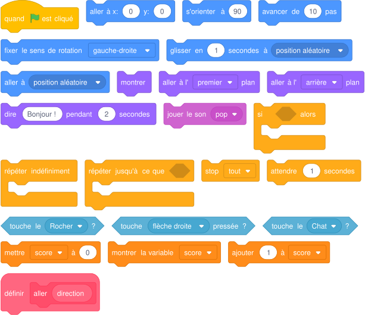{ .blocs }

    Les valeurs sont celles proposées par Scratch : à moi de choisir les bonnes et d'assembler les blocs.

??? abstract "Coup de pouce 3 : le squelette du script"
    Les blocs sont assemblés, les nombres sont à trouver (cases vides). Je l'ouvre seulement si les deux premiers coups de pouce ne suffisent pas.

    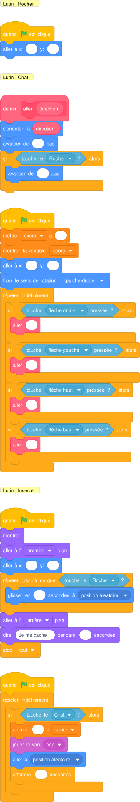{ .blocs }

??? warning "Si ça ne marche pas"
    - Mon test ne marche qu'une fois : le bloc « si » doit être à l'intérieur de la boucle.
    - La variable garde l'ancienne valeur : je la remets à sa valeur de départ au drapeau vert.

!!! tip "Mon défi"
    La partie dure 30 secondes (variable temps).

**Je vérifie avant de cocher**

- [ ] Mon résultat ressemble à la vidéo.
- [ ] Je clique deux fois de suite sur le drapeau vert : tout repart comme au premier essai.
- [ ] J'ai créé et utilisé au moins un bloc personnalisé.
- [ ] La variable affiche la bonne valeur pendant et à la fin du programme.
- [ ] J'ai enregistré mon projet sur l'ordinateur (Fichier, Enregistrer sur votre ordinateur).

<label class="mission-reussie"><input type="checkbox" data-mission="43"> J'ai réussi la mission 43</label>

## Mission 44 · Ghost { #mission-44 }

<strong>Ce que je dois obtenir.</strong> Quand je clique sur le fantôme, un second fantôme apparaît, rit très fort et fait peur au premier, qui s'enfuit en pleurant.

<iframe loading="lazy" title="Mission 44 : Ghost" src="https://tube-numerique-educatif.apps.education.fr/videos/embed/4eoV426b1bRf7CRdDyxw3W" frameborder="0" allow="fullscreen" allowfullscreen></iframe>

Vidéo du résultat attendu : <a href="https://tube-numerique-educatif.apps.education.fr/w/4eoV426b1bRf7CRdDyxw3W" target="_blank" rel="noopener">ouvrir sur Tube Numérique éducatif</a>

[:material-play-circle: Ouvrir l'exercice](https://turbowarp.org/editor?project_url=https://numerica-lfh.github.io/Techno/missions-scratch/exercices/mission-44.sb3){ .md-button .md-button--primary target=_blank rel=noopener } [:material-download: Télécharger le fichier .sb3](exercices/mission-44.sb3){ .md-button }

**Notions :** chaîne d'événements, messages, apparition progressive.

**Pas à pas**

1. Fantôme 1 : quand il est cliqué, il envoie « surprise ».
2. Fantôme 2 (caché) : à « surprise », il apparaît progressivement (effet fantôme de 100 vers 0), change de costume, rit puis envoie « peur ».
3. Fantôme 1 : à « peur », il change de costume, crie et glisse hors de la scène.
4. J'ajoute les sons Crazy Laugh et Scream2 depuis la bibliothèque.

??? question "Coup de pouce 1 : je réfléchis avant de coder"
    - Comment est la scène au départ : position, costume, taille de chaque lutin, visible ou caché ?
    - Que doit-il se passer quand je clique sur le lutin ?
    - Quel lutin envoie le message, et quel lutin le reçoit ?
    - Qu'est-ce qui se répète dans la vidéo, et combien de fois ?

??? note "Coup de pouce 2 : les blocs que je vais utiliser"
    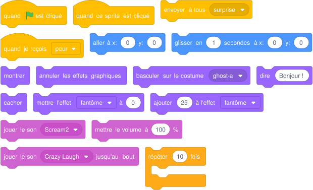{ .blocs }

    Les valeurs sont celles proposées par Scratch : à moi de choisir les bonnes et d'assembler les blocs.

??? abstract "Coup de pouce 3 : le squelette du script"
    Les blocs sont assemblés, les nombres sont à trouver (cases vides). Je l'ouvre seulement si les deux premiers coups de pouce ne suffisent pas.

    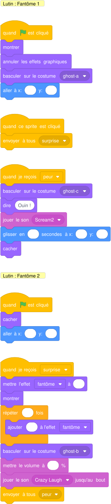{ .blocs }

??? warning "Si ça ne marche pas"
    - Le lutin reste invisible au lancement suivant : je mets « montrer » au début du script.
    - La taille ou la couleur change un peu plus à chaque essai : au début, je remets « mettre la taille à » et « annuler les effets graphiques ».
    - Rien ne se passe à la réception : le message envoyé et le message reçu doivent porter exactement le même nom.

!!! tip "Mon défi"
    Le fantôme 1 revient quelques secondes plus tard, en tremblant.

**Je vérifie avant de cocher**

- [ ] Mon résultat ressemble à la vidéo.
- [ ] Je clique deux fois de suite sur le drapeau vert : tout repart comme au premier essai.
- [ ] J'ai testé toutes les touches, tous les clics ou plusieurs réponses différentes.
- [ ] J'ai enregistré mon projet sur l'ordinateur (Fichier, Enregistrer sur votre ordinateur).

<label class="mission-reussie"><input type="checkbox" data-mission="44"> J'ai réussi la mission 44</label>

## Mission 45 · Tables de multiplication 1 { #mission-45 }

<strong>Ce que je dois obtenir.</strong> Le grand pingouin demande une table et un nombre de 1 à 10. Le petit pingouin donne le bon résultat, puis le grand le félicite.

<iframe loading="lazy" title="Mission 45 : Tables de multiplication 1" src="https://tube-numerique-educatif.apps.education.fr/videos/embed/9JPdAjWiAZ18fQkXH3pZys" frameborder="0" allow="fullscreen" allowfullscreen></iframe>

Vidéo du résultat attendu : <a href="https://tube-numerique-educatif.apps.education.fr/w/9JPdAjWiAZ18fQkXH3pZys" target="_blank" rel="noopener">ouvrir sur Tube Numérique éducatif</a>

[:material-play-circle: Ouvrir l'exercice](https://turbowarp.org/editor?project_url=https://numerica-lfh.github.io/Techno/missions-scratch/exercices/mission-45.sb3){ .md-button .md-button--primary target=_blank rel=noopener } [:material-download: Télécharger le fichier .sb3](exercices/mission-45.sb3){ .md-button }

**Notions :** demander et réponse, variables, opérateur multiplication.

**Pas à pas**

1. Le grand pingouin pose deux questions avec « demander et attendre » ; je range chaque « réponse » dans une variable (table, nombre).
2. Il annonce le calcul avec « regrouper ».
3. Il envoie « réponds » et attend.
4. Le petit pingouin calcule table × nombre (Opérateurs) et dit le résultat.
5. Le grand pingouin le félicite.

??? question "Coup de pouce 1 : je réfléchis avant de coder"
    - Comment est la scène au départ : position, costume, taille de chaque lutin, visible ou caché ?
    - Quel lutin envoie le message, et quel lutin le reçoit ?
    - Quelle question pose le programme, et où je range la réponse ?
    - Quelle information dois-je garder dans une variable, et quelle est sa valeur au départ ?

??? note "Coup de pouce 2 : les blocs que je vais utiliser"
    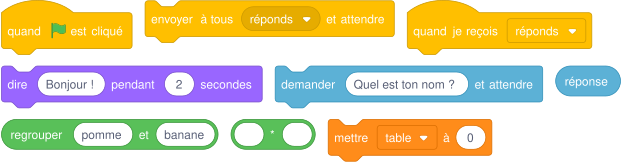{ .blocs }

    Les valeurs sont celles proposées par Scratch : à moi de choisir les bonnes et d'assembler les blocs.

??? abstract "Coup de pouce 3 : le squelette du script"
    Les blocs sont assemblés, les nombres sont à trouver (cases vides). Je l'ouvre seulement si les deux premiers coups de pouce ne suffisent pas.

    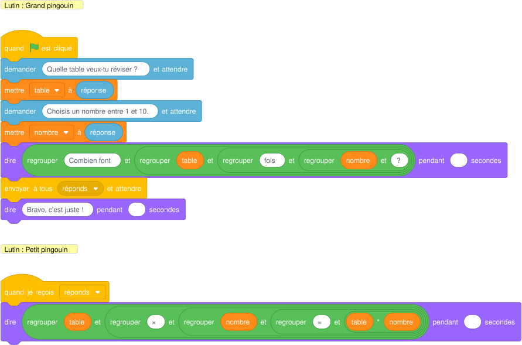{ .blocs }

??? warning "Si ça ne marche pas"
    - Rien ne se passe à la réception : le message envoyé et le message reçu doivent porter exactement le même nom.
    - La variable garde l'ancienne valeur : je la remets à sa valeur de départ au drapeau vert.
    - Un nombre décimal ne marche pas : j'écris 3.5 avec un point, pas 3,5.

!!! tip "Mon défi"
    Le grand pingouin choisit lui-même la table au hasard.

**Je vérifie avant de cocher**

- [ ] Mon résultat ressemble à la vidéo.
- [ ] Je clique deux fois de suite sur le drapeau vert : tout repart comme au premier essai.
- [ ] La variable affiche la bonne valeur pendant et à la fin du programme.
- [ ] J'ai testé toutes les touches, tous les clics ou plusieurs réponses différentes.
- [ ] J'ai enregistré mon projet sur l'ordinateur (Fichier, Enregistrer sur votre ordinateur).

<label class="mission-reussie"><input type="checkbox" data-mission="45"> J'ai réussi la mission 45</label>

## Mission 46 · Carré 2 { #mission-46 }

<strong>Ce que je dois obtenir.</strong> Le crayon dessine quatre carrés en croix. Ils font apparaître un cinquième carré au centre. Entre deux carrés, le crayon disparaît et réapparaît au bon endroit.

<iframe loading="lazy" title="Mission 46 : Carré 2" src="https://tube-numerique-educatif.apps.education.fr/videos/embed/1kfSnhAfgcXuaaNaigbhLG" frameborder="0" allow="fullscreen" allowfullscreen></iframe>

Vidéo du résultat attendu : <a href="https://tube-numerique-educatif.apps.education.fr/w/1kfSnhAfgcXuaaNaigbhLG" target="_blank" rel="noopener">ouvrir sur Tube Numérique éducatif</a>

[:material-play-circle: Ouvrir l'exercice](https://turbowarp.org/editor?project_url=https://numerica-lfh.github.io/Techno/missions-scratch/exercices/mission-46.sb3){ .md-button .md-button--primary target=_blank rel=noopener } [:material-download: Télécharger le fichier .sb3](exercices/mission-46.sb3){ .md-button }

**Notions :** bloc avec deux paramètres, variable, coordonnées.

**Pas à pas**

1. Je crée la variable « côté » (60).
2. Je crée le bloc « carré à (x) (y) » : relever le stylo, se cacher, aller à x y, se montrer, tracer le carré.
3. Sur papier, je cherche le coin de départ de chaque carré autour du carré central de -30 à 30.
4. J'appelle quatre fois mon bloc avec les bonnes coordonnées.

??? question "Coup de pouce 1 : je réfléchis avant de coder"
    - Comment est la scène au départ : position, costume, taille de chaque lutin, visible ou caché ?
    - Qu'est-ce qui se répète dans la vidéo, et combien de fois ?
    - Quelle information dois-je garder dans une variable, et quelle est sa valeur au départ ?
    - Quelle suite de blocs revient plusieurs fois et mérite de devenir un bloc personnalisé ?
    - Où le crayon commence-t-il, et à quel moment le stylo doit-il être posé ou relevé ?

??? note "Coup de pouce 2 : les blocs que je vais utiliser"
    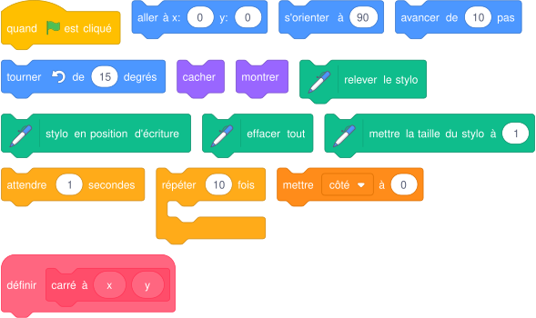{ .blocs }

    Les valeurs sont celles proposées par Scratch : à moi de choisir les bonnes et d'assembler les blocs.

??? abstract "Coup de pouce 3 : le squelette du script"
    Les blocs sont assemblés, les nombres sont à trouver (cases vides). Je l'ouvre seulement si les deux premiers coups de pouce ne suffisent pas.

    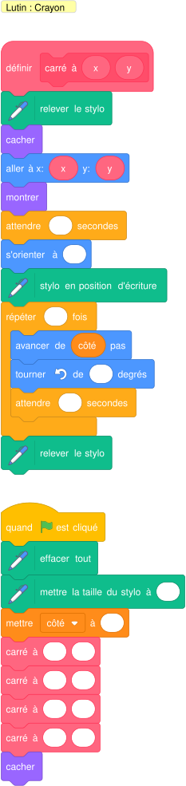{ .blocs }

??? warning "Si ça ne marche pas"
    - L'animation va trop vite pour être vue : j'ajoute « attendre » dans la boucle.
    - Le lutin reste invisible au lancement suivant : je mets « montrer » au début du script.
    - Un trait part du mauvais endroit : je relève le stylo avant « aller à », je le pose seulement après, et j'efface tout au début.
    - La variable garde l'ancienne valeur : je la remets à sa valeur de départ au drapeau vert.

!!! tip "Mon défi"
    Le côté est demandé à l'utilisateur et les carrés restent en croix.

**Je vérifie avant de cocher**

- [ ] Mon résultat ressemble à la vidéo.
- [ ] Je clique deux fois de suite sur le drapeau vert : tout repart comme au premier essai.
- [ ] J'ai créé et utilisé au moins un bloc personnalisé.
- [ ] La variable affiche la bonne valeur pendant et à la fin du programme.
- [ ] J'ai enregistré mon projet sur l'ordinateur (Fichier, Enregistrer sur votre ordinateur).

<label class="mission-reussie"><input type="checkbox" data-mission="46"> J'ai réussi la mission 46</label>

## Mission 47 · Carré 3 { #mission-47 }

<strong>Ce que je dois obtenir.</strong> Le programme demande la longueur du côté puis trace un carré centré sur la scène, puis trois carrés de plus en plus grands autour.

<iframe loading="lazy" title="Mission 47 : Carré 3" src="https://tube-numerique-educatif.apps.education.fr/videos/embed/72tCSEbSHGgcgxCPxS4YK9" frameborder="0" allow="fullscreen" allowfullscreen></iframe>

Vidéo du résultat attendu : <a href="https://tube-numerique-educatif.apps.education.fr/w/72tCSEbSHGgcgxCPxS4YK9" target="_blank" rel="noopener">ouvrir sur Tube Numérique éducatif</a>

[:material-play-circle: Ouvrir l'exercice](https://turbowarp.org/editor?project_url=https://numerica-lfh.github.io/Techno/missions-scratch/exercices/mission-47.sb3){ .md-button .md-button--primary target=_blank rel=noopener } [:material-download: Télécharger le fichier .sb3](exercices/mission-47.sb3){ .md-button }

**Notions :** demander, bloc avec paramètre, calcul de coordonnées.

**Pas à pas**

1. Je demande la longueur et je la range dans la variable « côté ».
2. Je crée le bloc « carré centré (c) ». Pour que le centre soit en (0 ; 0), le coin de départ est en x = -c/2 et y = -c/2.
3. Dans « répéter 4 fois » : j'appelle mon bloc puis j'ajoute 30 au côté.

??? question "Coup de pouce 1 : je réfléchis avant de coder"
    - Comment est la scène au départ : position, costume, taille de chaque lutin, visible ou caché ?
    - Qu'est-ce qui se répète dans la vidéo, et combien de fois ?
    - Quelle question pose le programme, et où je range la réponse ?
    - Quelle information dois-je garder dans une variable, et quelle est sa valeur au départ ?
    - Quelle suite de blocs revient plusieurs fois et mérite de devenir un bloc personnalisé ?

??? note "Coup de pouce 2 : les blocs que je vais utiliser"
    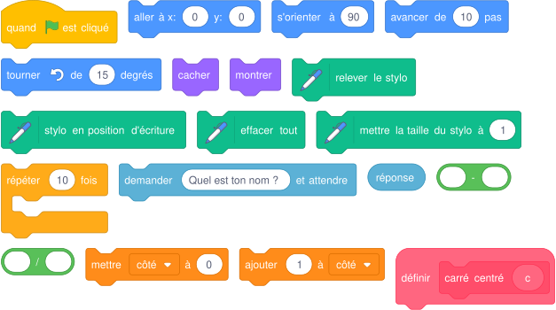{ .blocs }

    Les valeurs sont celles proposées par Scratch : à moi de choisir les bonnes et d'assembler les blocs.

??? abstract "Coup de pouce 3 : le squelette du script"
    Les blocs sont assemblés, les nombres sont à trouver (cases vides). Je l'ouvre seulement si les deux premiers coups de pouce ne suffisent pas.

    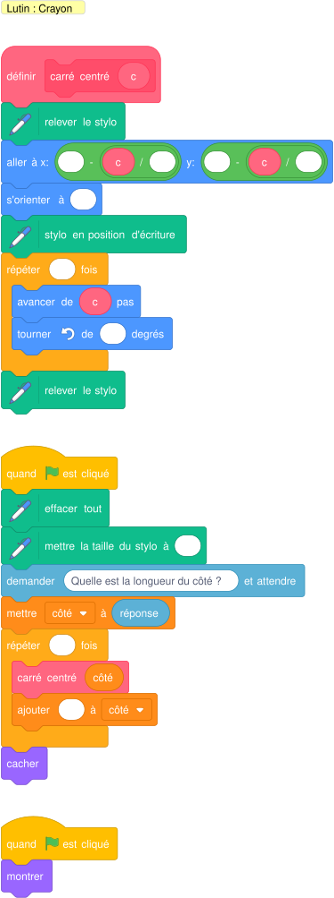{ .blocs }

??? warning "Si ça ne marche pas"
    - L'animation va trop vite pour être vue : j'ajoute « attendre » dans la boucle.
    - Le lutin reste invisible au lancement suivant : je mets « montrer » au début du script.
    - Un trait part du mauvais endroit : je relève le stylo avant « aller à », je le pose seulement après, et j'efface tout au début.
    - La variable garde l'ancienne valeur : je la remets à sa valeur de départ au drapeau vert.

!!! tip "Mon défi"
    Les carrés changent de couleur et le plus grand ne sort pas de la scène.

**Je vérifie avant de cocher**

- [ ] Mon résultat ressemble à la vidéo.
- [ ] Je clique deux fois de suite sur le drapeau vert : tout repart comme au premier essai.
- [ ] J'ai créé et utilisé au moins un bloc personnalisé.
- [ ] La variable affiche la bonne valeur pendant et à la fin du programme.
- [ ] J'ai testé toutes les touches, tous les clics ou plusieurs réponses différentes.
- [ ] J'ai enregistré mon projet sur l'ordinateur (Fichier, Enregistrer sur votre ordinateur).

<label class="mission-reussie"><input type="checkbox" data-mission="47"> J'ai réussi la mission 47</label>

## Mission 48 · Cercle 2 { #mission-48 }

<strong>Ce que je dois obtenir.</strong> Le bonhomme de neige joue un air de Noël quatre fois, en changeant de couleur et en tournant à chaque fois. Un crayon invisible trace très vite des guirlandes de cercles qui clignotent autour de lui.

<iframe loading="lazy" title="Mission 48 : Cercle 2" src="https://tube-numerique-educatif.apps.education.fr/videos/embed/od3zHh8AWjfxry9zVADb1G" frameborder="0" allow="fullscreen" allowfullscreen></iframe>

Vidéo du résultat attendu : <a href="https://tube-numerique-educatif.apps.education.fr/w/od3zHh8AWjfxry9zVADb1G" target="_blank" rel="noopener">ouvrir sur Tube Numérique éducatif</a>

[:material-play-circle: Ouvrir l'exercice](https://turbowarp.org/editor?project_url=https://numerica-lfh.github.io/Techno/missions-scratch/exercices/mission-48.sb3){ .md-button .md-button--primary target=_blank rel=noopener } [:material-download: Télécharger le fichier .sb3](exercices/mission-48.sb3){ .md-button }

**Notions :** bloc sans rafraîchissement d'écran, extension Musique, variable drapeau.

**Pas à pas**

1. Bonhomme : je crée le bloc « refrain » avec les notes de « Vive le vent » (mi mi mi, mi mi mi, mi sol do ré mi).
2. Je le répète 4 fois en changeant l'effet couleur et en tournant de 90 degrés.
3. Guirlande : je crée le bloc « cercle (rayon) » et je coche « Exécuter sans rafraîchir l'écran » : le cercle apparaît d'un coup.
4. Dans une boucle : effacer, couleur au hasard, deux cercles, petite attente. L'effet clignotant vient de là.
5. Une variable « fini » arrête la guirlande quand la musique se termine.

??? question "Coup de pouce 1 : je réfléchis avant de coder"
    - Comment est la scène au départ : position, costume, taille de chaque lutin, visible ou caché ?
    - Quel lutin envoie le message, et quel lutin le reçoit ?
    - Jusqu'à quand le lutin répète-t-il son action ? Quelle condition arrête la boucle ?
    - Quelle information dois-je garder dans une variable, et quelle est sa valeur au départ ?
    - Quelle suite de blocs revient plusieurs fois et mérite de devenir un bloc personnalisé ?

??? note "Coup de pouce 2 : les blocs que je vais utiliser"
    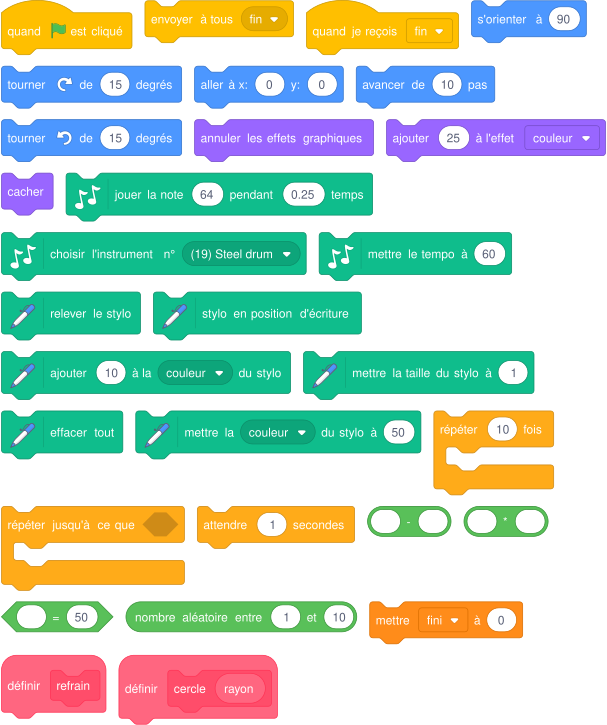{ .blocs }

    Les valeurs sont celles proposées par Scratch : à moi de choisir les bonnes et d'assembler les blocs.

??? abstract "Coup de pouce 3 : le squelette du script"
    Les blocs sont assemblés, les nombres sont à trouver (cases vides). Je l'ouvre seulement si les deux premiers coups de pouce ne suffisent pas.

    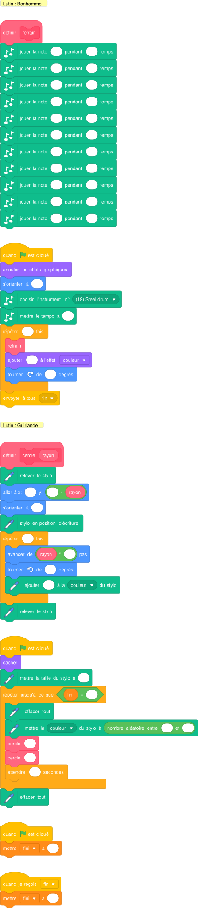{ .blocs }

??? warning "Si ça ne marche pas"
    - L'animation va trop vite pour être vue : j'ajoute « attendre » dans la boucle.
    - Le lutin reste invisible au lancement suivant : je mets « montrer » au début du script.
    - La taille ou la couleur change un peu plus à chaque essai : au début, je remets « mettre la taille à » et « annuler les effets graphiques ».
    - Un trait part du mauvais endroit : je relève le stylo avant « aller à », je le pose seulement après, et j'efface tout au début.

!!! tip "Mon défi"
    Les guirlandes tournent autour du bonhomme.

**Je vérifie avant de cocher**

- [ ] Mon résultat ressemble à la vidéo.
- [ ] Je clique deux fois de suite sur le drapeau vert : tout repart comme au premier essai.
- [ ] J'ai créé et utilisé au moins un bloc personnalisé.
- [ ] La variable affiche la bonne valeur pendant et à la fin du programme.
- [ ] J'ai enregistré mon projet sur l'ordinateur (Fichier, Enregistrer sur votre ordinateur).

<label class="mission-reussie"><input type="checkbox" data-mission="48"> J'ai réussi la mission 48</label>

## Mission 49 · Cercle 3 { #mission-49 }

<strong>Ce que je dois obtenir.</strong> Le crayon trace deux demi-cercles et leurs diamètres, à partir de formules de géométrie.

<iframe loading="lazy" title="Mission 49 : Cercle 3" src="https://tube-numerique-educatif.apps.education.fr/videos/embed/nSe5jiTXzYn3kYn9WYdz7W" frameborder="0" allow="fullscreen" allowfullscreen></iframe>

Vidéo du résultat attendu : <a href="https://tube-numerique-educatif.apps.education.fr/w/nSe5jiTXzYn3kYn9WYdz7W" target="_blank" rel="noopener">ouvrir sur Tube Numérique éducatif</a>

[:material-play-circle: Ouvrir l'exercice](https://turbowarp.org/editor?project_url=https://numerica-lfh.github.io/Techno/missions-scratch/exercices/mission-49.sb3){ .md-button .md-button--primary target=_blank rel=noopener } [:material-download: Télécharger le fichier .sb3](exercices/mission-49.sb3){ .md-button }

**Notions :** formule dans un programme, variable calculée, bloc à deux paramètres.

**Pas à pas**

1. Rappel : le périmètre d'un cercle vaut 2 × π × rayon, celui d'un demi-cercle vaut π × rayon.
2. En 180 petits pas d'un degré, chaque pas mesure π × rayon / 180. Je calcule ce « pas » dans une variable.
3. Bloc « demi-cercle (rayon) (centre) » : aller à l'extrémité gauche (centre - rayon ; 0), s'orienter vers le haut, répéter 180 fois avancer du pas et tourner de 1 degré.
4. Le crayon est alors à l'autre extrémité : il s'oriente vers la gauche et trace le diamètre (2 × rayon).

??? question "Coup de pouce 1 : je réfléchis avant de coder"
    - Comment est la scène au départ : position, costume, taille de chaque lutin, visible ou caché ?
    - Qu'est-ce qui se répète dans la vidéo, et combien de fois ?
    - Quelle information dois-je garder dans une variable, et quelle est sa valeur au départ ?
    - Quelle suite de blocs revient plusieurs fois et mérite de devenir un bloc personnalisé ?
    - Où le crayon commence-t-il, et à quel moment le stylo doit-il être posé ou relevé ?

??? note "Coup de pouce 2 : les blocs que je vais utiliser"
    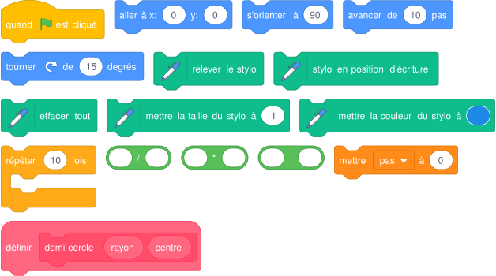{ .blocs }

    Les valeurs sont celles proposées par Scratch : à moi de choisir les bonnes et d'assembler les blocs.

??? abstract "Coup de pouce 3 : le squelette du script"
    Les blocs sont assemblés, les nombres sont à trouver (cases vides). Je l'ouvre seulement si les deux premiers coups de pouce ne suffisent pas.

    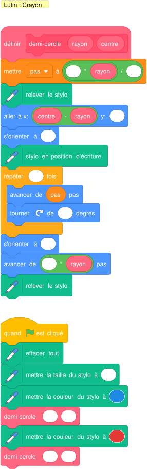{ .blocs }

??? warning "Si ça ne marche pas"
    - L'animation va trop vite pour être vue : j'ajoute « attendre » dans la boucle.
    - Un trait part du mauvais endroit : je relève le stylo avant « aller à », je le pose seulement après, et j'efface tout au début.
    - La variable garde l'ancienne valeur : je la remets à sa valeur de départ au drapeau vert.
    - Le lutin avance la tête en bas : « fixer le sens de rotation gauche-droite ».

!!! tip "Mon défi"
    Je trace un cercle complet en assemblant deux demi-cercles.

**Je vérifie avant de cocher**

- [ ] Mon résultat ressemble à la vidéo.
- [ ] Je clique deux fois de suite sur le drapeau vert : tout repart comme au premier essai.
- [ ] J'ai créé et utilisé au moins un bloc personnalisé.
- [ ] La variable affiche la bonne valeur pendant et à la fin du programme.
- [ ] J'ai enregistré mon projet sur l'ordinateur (Fichier, Enregistrer sur votre ordinateur).

<label class="mission-reussie"><input type="checkbox" data-mission="49"> J'ai réussi la mission 49</label>

## Mission 50 · Chat 3 { #mission-50 }

<strong>Ce que je dois obtenir.</strong> Le chat avance vers un ballon qui se gonfle en jouant de la musique. Quand le chat touche le ballon, la musique s'arrête, on entend des applaudissements et le ballon disparaît.

<iframe loading="lazy" title="Mission 50 : Chat 3" src="https://tube-numerique-educatif.apps.education.fr/videos/embed/7URaDg4ruBvHQyrEAUzKjr" frameborder="0" allow="fullscreen" allowfullscreen></iframe>

Vidéo du résultat attendu : <a href="https://tube-numerique-educatif.apps.education.fr/w/7URaDg4ruBvHQyrEAUzKjr" target="_blank" rel="noopener">ouvrir sur Tube Numérique éducatif</a>

[:material-play-circle: Ouvrir l'exercice](https://turbowarp.org/editor?project_url=https://numerica-lfh.github.io/Techno/missions-scratch/exercices/mission-50.sb3){ .md-button .md-button--primary target=_blank rel=noopener } [:material-download: Télécharger le fichier .sb3](exercices/mission-50.sb3){ .md-button }

**Notions :** s'orienter vers, stop autres scripts du lutin, capteur.

**Pas à pas**

1. Le chat s'oriente vers le ballon puis avance jusqu'à le toucher.
2. Il envoie le message « touché ».
3. Le ballon joue sa musique dans une boucle infinie et grossit un peu à chaque tour.
4. À « touché », le ballon arrête ses autres scripts (la musique), joue Clapping et se cache.

??? question "Coup de pouce 1 : je réfléchis avant de coder"
    - Comment est la scène au départ : position, costume, taille de chaque lutin, visible ou caché ?
    - Quel lutin envoie le message, et quel lutin le reçoit ?
    - Jusqu'à quand le lutin répète-t-il son action ? Quelle condition arrête la boucle ?
    - Qu'est-ce qui doit se répéter sans jamais s'arrêter ?

??? note "Coup de pouce 2 : les blocs que je vais utiliser"
    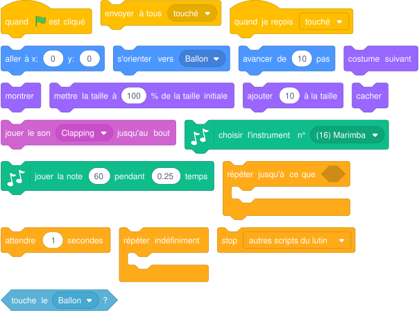{ .blocs }

    Les valeurs sont celles proposées par Scratch : à moi de choisir les bonnes et d'assembler les blocs.

??? abstract "Coup de pouce 3 : le squelette du script"
    Les blocs sont assemblés, les nombres sont à trouver (cases vides). Je l'ouvre seulement si les deux premiers coups de pouce ne suffisent pas.

    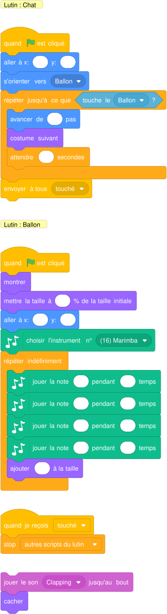{ .blocs }

??? warning "Si ça ne marche pas"
    - L'animation va trop vite pour être vue : j'ajoute « attendre » dans la boucle.
    - Le lutin reste invisible au lancement suivant : je mets « montrer » au début du script.
    - La taille ou la couleur change un peu plus à chaque essai : au début, je remets « mettre la taille à » et « annuler les effets graphiques ».
    - Rien ne se passe à la réception : le message envoyé et le message reçu doivent porter exactement le même nom.

!!! tip "Mon défi"
    Le ballon se déplace et le chat doit le poursuivre.

**Je vérifie avant de cocher**

- [ ] Mon résultat ressemble à la vidéo.
- [ ] Je clique deux fois de suite sur le drapeau vert : tout repart comme au premier essai.
- [ ] J'ai enregistré mon projet sur l'ordinateur (Fichier, Enregistrer sur votre ordinateur).

<label class="mission-reussie"><input type="checkbox" data-mission="50"> J'ai réussi la mission 50</label>

## Mission 51 · Labyrinthe { #mission-51 }

<strong>Ce que je dois obtenir.</strong> Je guide la souris avec les flèches jusqu'au disque rouge. Si elle touche un mur bleu, elle revient au départ. Deux compteurs affichent le nombre de déplacements et d'erreurs.

<iframe loading="lazy" title="Mission 51 : Labyrinthe" src="https://tube-numerique-educatif.apps.education.fr/videos/embed/fRCAVrHiKe4HwF5dw57nPu" frameborder="0" allow="fullscreen" allowfullscreen></iframe>

Vidéo du résultat attendu : <a href="https://tube-numerique-educatif.apps.education.fr/w/fRCAVrHiKe4HwF5dw57nPu" target="_blank" rel="noopener">ouvrir sur Tube Numérique éducatif</a>

[:material-play-circle: Ouvrir l'exercice](https://turbowarp.org/editor?project_url=https://numerica-lfh.github.io/Techno/missions-scratch/exercices/mission-51.sb3){ .md-button .md-button--primary target=_blank rel=noopener } [:material-download: Télécharger le fichier .sb3](exercices/mission-51.sb3){ .md-button }

**Notions :** événement touche pressée, bloc personnalisé, deux compteurs.

**Pas à pas**

1. Je crée les variables « actions » et « erreurs », mises à 0 au drapeau vert.
2. Je crée le bloc « déplacer (direction) » : s'orienter, avancer, ajouter 1 à actions.
3. Dans ce bloc : si la souris touche le bleu, ajouter 1 à erreurs et retourner au départ ; si elle touche le rouge, elle a gagné.
4. Quatre chapeaux « quand la touche flèche droite est pressée » (et les trois autres flèches) appellent « déplacer » avec 90, -90, 0 ou 180.

??? question "Coup de pouce 1 : je réfléchis avant de coder"
    - Comment est la scène au départ : position, costume, taille de chaque lutin, visible ou caché ?
    - Quelle touche déclenche quelle action ?
    - Quelle condition dois-je tester, et que se passe-t-il quand elle est vraie ?
    - Quelle information dois-je garder dans une variable, et quelle est sa valeur au départ ?
    - Quelle suite de blocs revient plusieurs fois et mérite de devenir un bloc personnalisé ?

??? note "Coup de pouce 2 : les blocs que je vais utiliser"
    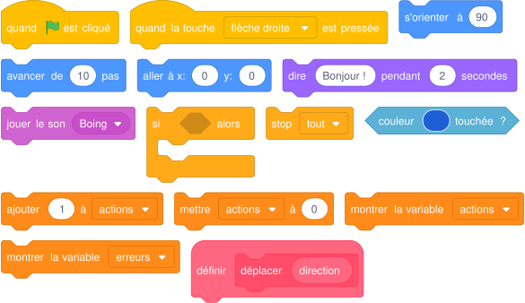{ .blocs }

    Les valeurs sont celles proposées par Scratch : à moi de choisir les bonnes et d'assembler les blocs.

??? abstract "Coup de pouce 3 : le squelette du script"
    Les blocs sont assemblés, les nombres sont à trouver (cases vides). Je l'ouvre seulement si les deux premiers coups de pouce ne suffisent pas.

    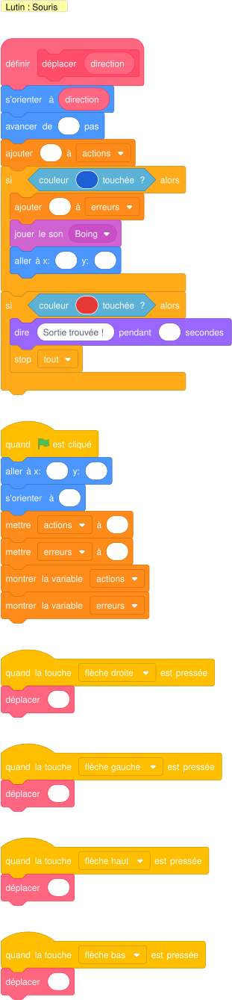{ .blocs }

??? warning "Si ça ne marche pas"
    - Mon test ne marche qu'une fois : le bloc « si » doit être à l'intérieur de la boucle.
    - « couleur touchée » ne réagit pas : je prends la couleur avec la pipette, directement sur la scène.
    - La variable garde l'ancienne valeur : je la remets à sa valeur de départ au drapeau vert.

!!! tip "Mon défi"
    Un chronomètre s'affiche et un message donne le score final.

**Je vérifie avant de cocher**

- [ ] Mon résultat ressemble à la vidéo.
- [ ] Je clique deux fois de suite sur le drapeau vert : tout repart comme au premier essai.
- [ ] J'ai créé et utilisé au moins un bloc personnalisé.
- [ ] La variable affiche la bonne valeur pendant et à la fin du programme.
- [ ] J'ai testé toutes les touches, tous les clics ou plusieurs réponses différentes.
- [ ] J'ai enregistré mon projet sur l'ordinateur (Fichier, Enregistrer sur votre ordinateur).

<label class="mission-reussie"><input type="checkbox" data-mission="51"> J'ai réussi la mission 51</label>

## Mission 52 · Sorcière 2 { #mission-52 }

<strong>Ce que je dois obtenir.</strong> La sorcière vole et entre dans le château. À l'intérieur, le magicien avance dans le couloir, l'arrête et lui lance un sort : elle disparaît en pixels en criant.

<iframe loading="lazy" title="Mission 52 : Sorcière 2" src="https://tube-numerique-educatif.apps.education.fr/videos/embed/qcxaVVBPj5pmcAtoSKYRLv" frameborder="0" allow="fullscreen" allowfullscreen></iframe>

Vidéo du résultat attendu : <a href="https://tube-numerique-educatif.apps.education.fr/w/qcxaVVBPj5pmcAtoSKYRLv" target="_blank" rel="noopener">ouvrir sur Tube Numérique éducatif</a>

[:material-play-circle: Ouvrir l'exercice](https://turbowarp.org/editor?project_url=https://numerica-lfh.github.io/Techno/missions-scratch/exercices/mission-52.sb3){ .md-button .md-button--primary target=_blank rel=noopener } [:material-download: Télécharger le fichier .sb3](exercices/mission-52.sb3){ .md-button }

**Notions :** changer de scène, quand l'arrière-plan bascule, effets.

**Pas à pas**

1. Scène 1 (Castle 1) : la sorcière glisse vers la porte en rapetissant, se cache et bascule sur l'arrière-plan Hall.
2. Sorcière et magicien utilisent le chapeau « quand l'arrière-plan bascule sur Hall ».
3. Le magicien entre par la droite, glisse vers la sorcière, dit « Sortilège ! » et envoie le message « sortilège ».
4. La sorcière crie et disparaît avec les effets pixeliser et fantôme.

??? question "Coup de pouce 1 : je réfléchis avant de coder"
    - Comment est la scène au départ : position, costume, taille de chaque lutin, visible ou caché ?
    - Quel lutin envoie le message, et quel lutin le reçoit ?
    - Quel décor déclenche la suite de l'histoire ?
    - Qu'est-ce qui se répète dans la vidéo, et combien de fois ?

??? note "Coup de pouce 2 : les blocs que je vais utiliser"
    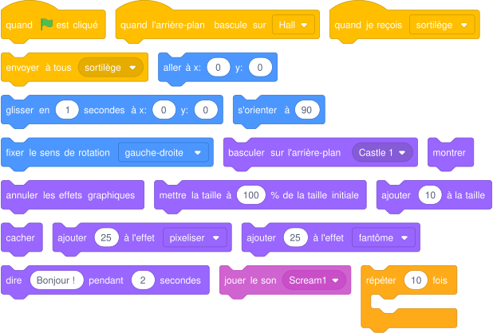{ .blocs }

    Les valeurs sont celles proposées par Scratch : à moi de choisir les bonnes et d'assembler les blocs.

??? abstract "Coup de pouce 3 : le squelette du script"
    Les blocs sont assemblés, les nombres sont à trouver (cases vides). Je l'ouvre seulement si les deux premiers coups de pouce ne suffisent pas.

    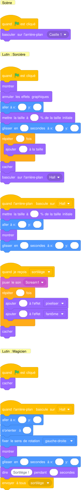{ .blocs }

??? warning "Si ça ne marche pas"
    - Le lutin reste invisible au lancement suivant : je mets « montrer » au début du script.
    - La taille ou la couleur change un peu plus à chaque essai : au début, je remets « mettre la taille à » et « annuler les effets graphiques ».
    - Rien ne se passe à la réception : le message envoyé et le message reçu doivent porter exactement le même nom.
    - Le lutin avance la tête en bas : « fixer le sens de rotation gauche-droite ».

!!! tip "Mon défi"
    J'ajoute une troisième scène : le magicien sort du château.

**Je vérifie avant de cocher**

- [ ] Mon résultat ressemble à la vidéo.
- [ ] Je clique deux fois de suite sur le drapeau vert : tout repart comme au premier essai.
- [ ] J'ai enregistré mon projet sur l'ordinateur (Fichier, Enregistrer sur votre ordinateur).

<label class="mission-reussie"><input type="checkbox" data-mission="52"> J'ai réussi la mission 52</label>

## Mission 53 · Fonction affine 1 { #mission-53 }

<strong>Ce que je dois obtenir.</strong> Le singe connaît une fonction affine. Quand je clique dessus, il demande un nombre, donne son image et envoie une croix au point de coordonnées (x ; f(x)).

<iframe loading="lazy" title="Mission 53 : Fonction affine 1" src="https://tube-numerique-educatif.apps.education.fr/videos/embed/rkSQkTL6yP5xcRSe41x9Xb" frameborder="0" allow="fullscreen" allowfullscreen></iframe>

Vidéo du résultat attendu : <a href="https://tube-numerique-educatif.apps.education.fr/w/rkSQkTL6yP5xcRSe41x9Xb" target="_blank" rel="noopener">ouvrir sur Tube Numérique éducatif</a>

[:material-play-circle: Ouvrir l'exercice](https://turbowarp.org/editor?project_url=https://numerica-lfh.github.io/Techno/missions-scratch/exercices/mission-53.sb3){ .md-button .md-button--primary target=_blank rel=noopener } [:material-download: Télécharger le fichier .sb3](exercices/mission-53.sb3){ .md-button }

**Notions :** fonction affine, coordonnées, variables.

**Pas à pas**

1. Je choisis la fonction : f(x) = 2x - 40.
2. Quand le singe est cliqué, il demande un nombre et le range dans la variable x.
3. Il calcule l'image avec les opérateurs (2 × x - 40) et la range dans la variable « image ».
4. Il dit le résultat avec « regrouper » puis envoie « placer ».
5. La croix glisse vers x: x, y: image.

??? question "Coup de pouce 1 : je réfléchis avant de coder"
    - Comment est la scène au départ : position, costume, taille de chaque lutin, visible ou caché ?
    - Que doit-il se passer quand je clique sur le lutin ?
    - Quel lutin envoie le message, et quel lutin le reçoit ?
    - Quelle question pose le programme, et où je range la réponse ?
    - Quelle information dois-je garder dans une variable, et quelle est sa valeur au départ ?

??? note "Coup de pouce 2 : les blocs que je vais utiliser"
    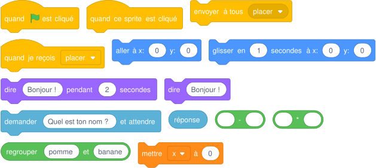{ .blocs }

    Les valeurs sont celles proposées par Scratch : à moi de choisir les bonnes et d'assembler les blocs.

??? abstract "Coup de pouce 3 : le squelette du script"
    Les blocs sont assemblés, les nombres sont à trouver (cases vides). Je l'ouvre seulement si les deux premiers coups de pouce ne suffisent pas.

    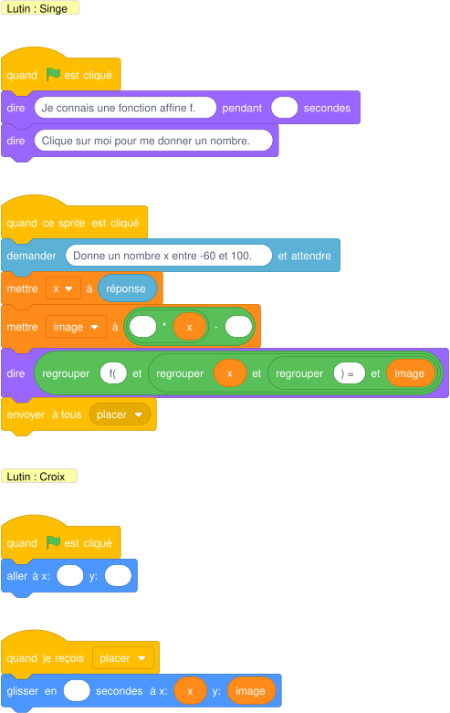{ .blocs }

??? warning "Si ça ne marche pas"
    - Rien ne se passe à la réception : le message envoyé et le message reçu doivent porter exactement le même nom.
    - La variable garde l'ancienne valeur : je la remets à sa valeur de départ au drapeau vert.
    - Un nombre décimal ne marche pas : j'écris 3.5 avec un point, pas 3,5.

!!! tip "Mon défi"
    La croix laisse une trace (bloc « estampiller ») : je vérifie que les points sont alignés.

**Je vérifie avant de cocher**

- [ ] Mon résultat ressemble à la vidéo.
- [ ] Je clique deux fois de suite sur le drapeau vert : tout repart comme au premier essai.
- [ ] La variable affiche la bonne valeur pendant et à la fin du programme.
- [ ] J'ai testé toutes les touches, tous les clics ou plusieurs réponses différentes.
- [ ] J'ai enregistré mon projet sur l'ordinateur (Fichier, Enregistrer sur votre ordinateur).

<label class="mission-reussie"><input type="checkbox" data-mission="53"> J'ai réussi la mission 53</label>

## Mission 54 · Fonction affine 2 { #mission-54 }

<strong>Ce que je dois obtenir.</strong> Le singe annonce f(x) = ax + b (au départ a = 0 et b = 0). Quand je clique sur lui, il demande x et ajoute x et f(x) dans un tableau. Les boutons a et b changent les paramètres : le texte se met à jour et le tableau se vide.

<iframe loading="lazy" title="Mission 54 : Fonction affine 2" src="https://tube-numerique-educatif.apps.education.fr/videos/embed/tp6oLXTmtNaPBECZJ3yqyZ" frameborder="0" allow="fullscreen" allowfullscreen></iframe>

Vidéo du résultat attendu : <a href="https://tube-numerique-educatif.apps.education.fr/w/tp6oLXTmtNaPBECZJ3yqyZ" target="_blank" rel="noopener">ouvrir sur Tube Numérique éducatif</a>

[:material-play-circle: Ouvrir l'exercice](https://turbowarp.org/editor?project_url=https://numerica-lfh.github.io/Techno/missions-scratch/exercices/mission-54.sb3){ .md-button .md-button--primary target=_blank rel=noopener } [:material-download: Télécharger le fichier .sb3](exercices/mission-54.sb3){ .md-button }

**Notions :** listes, paramètres a et b, message de mise à jour.

**Pas à pas**

1. Je crée les variables a et b et deux listes : « valeurs de x » et « images ». Les deux listes côte à côte forment un tableau de valeurs.
2. Je crée le bloc « annoncer » qui fait dire au singe f(x) = a x + b.
3. Clic sur le singe : demander x, ajouter la réponse à « valeurs de x », ajouter a × réponse + b à « images ».
4. Clic sur un bouton : demander la nouvelle valeur, la ranger dans a (ou b) et envoyer « mise à jour ».
5. À « mise à jour », le singe vide les listes et annonce la nouvelle fonction.

??? question "Coup de pouce 1 : je réfléchis avant de coder"
    - Comment est la scène au départ : position, costume, taille de chaque lutin, visible ou caché ?
    - Que doit-il se passer quand je clique sur le lutin ?
    - Quel lutin envoie le message, et quel lutin le reçoit ?
    - Quelle question pose le programme, et où je range la réponse ?
    - Quelle information dois-je garder dans une variable, et quelle est sa valeur au départ ?

??? note "Coup de pouce 2 : les blocs que je vais utiliser"
    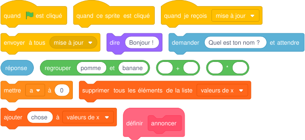{ .blocs }

    Les valeurs sont celles proposées par Scratch : à moi de choisir les bonnes et d'assembler les blocs.

??? abstract "Coup de pouce 3 : le squelette du script"
    Les blocs sont assemblés, les nombres sont à trouver (cases vides). Je l'ouvre seulement si les deux premiers coups de pouce ne suffisent pas.

    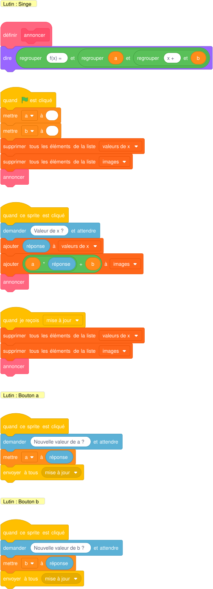{ .blocs }

??? warning "Si ça ne marche pas"
    - Rien ne se passe à la réception : le message envoyé et le message reçu doivent porter exactement le même nom.
    - La variable garde l'ancienne valeur : je la remets à sa valeur de départ au drapeau vert.
    - Un nombre décimal ne marche pas : j'écris 3.5 avec un point, pas 3,5.

!!! tip "Mon défi"
    Le singe refuse une valeur de x qui n'est pas un nombre.

**Je vérifie avant de cocher**

- [ ] Mon résultat ressemble à la vidéo.
- [ ] Je clique deux fois de suite sur le drapeau vert : tout repart comme au premier essai.
- [ ] J'ai créé et utilisé au moins un bloc personnalisé.
- [ ] La variable affiche la bonne valeur pendant et à la fin du programme.
- [ ] J'ai testé toutes les touches, tous les clics ou plusieurs réponses différentes.
- [ ] J'ai enregistré mon projet sur l'ordinateur (Fichier, Enregistrer sur votre ordinateur).

<label class="mission-reussie"><input type="checkbox" data-mission="54"> J'ai réussi la mission 54</label>

## Mission 55 · Graphique fonction affine 1 { #mission-55 }

<strong>Ce que je dois obtenir.</strong> Un point trace la droite de f(x) = -2x + 50 sur le repère. Il part caché à gauche, apparaît quand il ne touche plus le bord, suit la droite et s'arrête au bord.

<iframe loading="lazy" title="Mission 55 : Graphique fonction affine 1" src="https://tube-numerique-educatif.apps.education.fr/videos/embed/1NDhdE71JBXvSu4rBDcAdm" frameborder="0" allow="fullscreen" allowfullscreen></iframe>

Vidéo du résultat attendu : <a href="https://tube-numerique-educatif.apps.education.fr/w/1NDhdE71JBXvSu4rBDcAdm" target="_blank" rel="noopener">ouvrir sur Tube Numérique éducatif</a>

[:material-play-circle: Ouvrir l'exercice](https://turbowarp.org/editor?project_url=https://numerica-lfh.github.io/Techno/missions-scratch/exercices/mission-55.sb3){ .md-button .md-button--primary target=_blank rel=noopener } [:material-download: Télécharger le fichier .sb3](exercices/mission-55.sb3){ .md-button }

**Notions :** représentation graphique, si sinon, capteur bord.

**Pas à pas**

1. Je crée la variable « abscisse », qui part de -240 (bord gauche).
2. Je crée le bloc « placer le point » : aller à x: abscisse, y: -2 × abscisse + 50.
3. Dans « répéter jusqu'à abscisse > 240 » : placer le point ; si le point touche le bord, stylo relevé et caché, sinon montré et stylo posé ; ajouter 2 à l'abscisse.

??? question "Coup de pouce 1 : je réfléchis avant de coder"
    - Comment est la scène au départ : position, costume, taille de chaque lutin, visible ou caché ?
    - Jusqu'à quand le lutin répète-t-il son action ? Quelle condition arrête la boucle ?
    - Quelle condition dois-je tester, et que se passe-t-il quand elle est vraie et quand elle est fausse ?
    - Quelle information dois-je garder dans une variable, et quelle est sa valeur au départ ?
    - Quelle suite de blocs revient plusieurs fois et mérite de devenir un bloc personnalisé ?

??? note "Coup de pouce 2 : les blocs que je vais utiliser"
    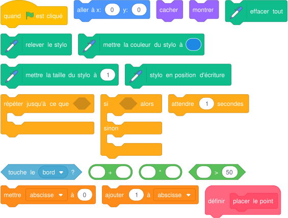{ .blocs }

    Les valeurs sont celles proposées par Scratch : à moi de choisir les bonnes et d'assembler les blocs.

??? abstract "Coup de pouce 3 : le squelette du script"
    Les blocs sont assemblés, les nombres sont à trouver (cases vides). Je l'ouvre seulement si les deux premiers coups de pouce ne suffisent pas.

    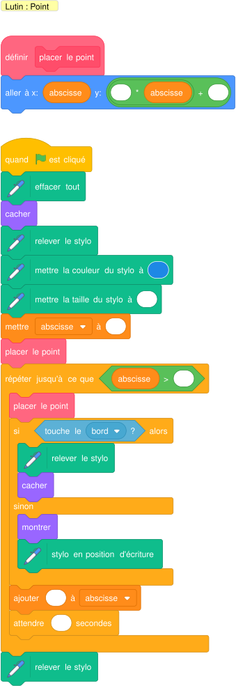{ .blocs }

??? warning "Si ça ne marche pas"
    - Le lutin reste invisible au lancement suivant : je mets « montrer » au début du script.
    - Un trait part du mauvais endroit : je relève le stylo avant « aller à », je le pose seulement après, et j'efface tout au début.
    - Mon test ne marche qu'une fois : le bloc « si » doit être à l'intérieur de la boucle.
    - La variable garde l'ancienne valeur : je la remets à sa valeur de départ au drapeau vert.

!!! tip "Mon défi"
    Je trace aussi la droite de g(x) = x - 30 dans une autre couleur.

**Je vérifie avant de cocher**

- [ ] Mon résultat ressemble à la vidéo.
- [ ] Je clique deux fois de suite sur le drapeau vert : tout repart comme au premier essai.
- [ ] J'ai créé et utilisé au moins un bloc personnalisé.
- [ ] La variable affiche la bonne valeur pendant et à la fin du programme.
- [ ] J'ai enregistré mon projet sur l'ordinateur (Fichier, Enregistrer sur votre ordinateur).

<label class="mission-reussie"><input type="checkbox" data-mission="55"> J'ai réussi la mission 55</label>

## Mission 56 · Batterie { #mission-56 }

<strong>Ce que je dois obtenir.</strong> Quand je clique sur un instrument, il joue en boucle. Si je clique sur un autre instrument, le premier s'arrête et le nouveau joue.

<iframe loading="lazy" title="Mission 56 : Batterie" src="https://tube-numerique-educatif.apps.education.fr/videos/embed/7gWC54F59KFDR6eFwT7Hkd" frameborder="0" allow="fullscreen" allowfullscreen></iframe>

Vidéo du résultat attendu : <a href="https://tube-numerique-educatif.apps.education.fr/w/7gWC54F59KFDR6eFwT7Hkd" target="_blank" rel="noopener">ouvrir sur Tube Numérique éducatif</a>

[:material-play-circle: Ouvrir l'exercice](https://turbowarp.org/editor?project_url=https://numerica-lfh.github.io/Techno/missions-scratch/exercices/mission-56.sb3){ .md-button .md-button--primary target=_blank rel=noopener } [:material-download: Télécharger le fichier .sb3](exercices/mission-56.sb3){ .md-button }

**Notions :** variable partagée, boucle infinie, stop ce script.

**Pas à pas**

1. Je crée la variable « actif » qui contient le nom de l'instrument qui joue.
2. Quand un instrument est cliqué, il met son nom dans « actif ».
3. Puis, dans « répéter indéfiniment » : si actif = mon nom, je joue mon son en changeant de costume ; sinon, j'arrête ce script.
4. Je fais la même chose pour chaque instrument (glisser le script sur l'autre lutin pour le copier).

??? question "Coup de pouce 1 : je réfléchis avant de coder"
    - Comment est la scène au départ : position, costume, taille de chaque lutin, visible ou caché ?
    - Que doit-il se passer quand je clique sur le lutin ?
    - Qu'est-ce qui doit se répéter sans jamais s'arrêter ?
    - Quelle condition dois-je tester, et que se passe-t-il quand elle est vraie et quand elle est fausse ?
    - Quelle information dois-je garder dans une variable, et quelle est sa valeur au départ ?

??? note "Coup de pouce 2 : les blocs que je vais utiliser"
    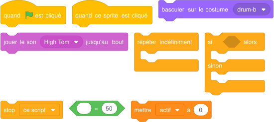{ .blocs }

    Les valeurs sont celles proposées par Scratch : à moi de choisir les bonnes et d'assembler les blocs.

??? abstract "Coup de pouce 3 : le squelette du script"
    Les blocs sont assemblés, les nombres sont à trouver (cases vides). Je l'ouvre seulement si les deux premiers coups de pouce ne suffisent pas.

    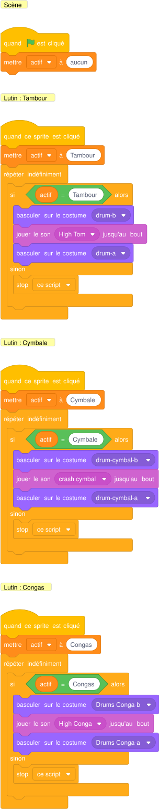{ .blocs }

??? warning "Si ça ne marche pas"
    - Mon test ne marche qu'une fois : le bloc « si » doit être à l'intérieur de la boucle.
    - La variable garde l'ancienne valeur : je la remets à sa valeur de départ au drapeau vert.
    - La suite attend la fin du son : « jouer le son jusqu'au bout » bloque le script, « démarrer le son » non.

!!! tip "Mon défi"
    Un bouton « silence » arrête tous les instruments.

**Je vérifie avant de cocher**

- [ ] Mon résultat ressemble à la vidéo.
- [ ] Je clique deux fois de suite sur le drapeau vert : tout repart comme au premier essai.
- [ ] La variable affiche la bonne valeur pendant et à la fin du programme.
- [ ] J'ai testé toutes les touches, tous les clics ou plusieurs réponses différentes.
- [ ] J'ai enregistré mon projet sur l'ordinateur (Fichier, Enregistrer sur votre ordinateur).

<label class="mission-reussie"><input type="checkbox" data-mission="56"> J'ai réussi la mission 56</label>

## Mission A5 · Tir à l'arc en forêt { #mission-A5 }

<strong>Ce que je dois obtenir.</strong> Une cible se déplace au hasard. Je vise avec la souris et je clique pour tirer. Le score dépend de la zone touchée. La partie dure 30 secondes.

[:material-play-circle: Ouvrir l'exercice](https://turbowarp.org/editor?project_url=https://numerica-lfh.github.io/Techno/missions-scratch/exercices/mission-A5.sb3){ .md-button .md-button--primary target=_blank rel=noopener } [:material-download: Télécharger le fichier .sb3](exercices/mission-A5.sb3){ .md-button }

**Notions :** si sinon imbriqués, nombre aléatoire, chronomètre, score jamais négatif.

**Pas à pas**

1. La cible glisse en 1 seconde vers x et y aléatoires (déjà programmée dans l'exercice).
2. Le viseur suit la souris. Si la souris est pressée et que le viseur touche la cible, il ajoute des points, sinon il en retire un.
3. Les zones : or 5 points (« Dans le mille ! »), rouge 4, bleu 3, noir 2, blanc 1. Je teste la zone centrale en premier.
4. Le score ne doit jamais devenir négatif : je retire un point seulement si le score est supérieur à 0.
5. La scène gère le temps : 30, puis 1 de moins chaque seconde, et stop tout à 0.

??? question "Coup de pouce 1 : je réfléchis avant de coder"
    - Comment est la scène au départ : position, costume, taille de chaque lutin, visible ou caché ?
    - Jusqu'à quand le lutin répète-t-il son action ? Quelle condition arrête la boucle ?
    - Qu'est-ce qui doit se répéter sans jamais s'arrêter ?
    - Quelle condition dois-je tester, et que se passe-t-il quand elle est vraie et quand elle est fausse ?
    - Quelle information dois-je garder dans une variable, et quelle est sa valeur au départ ?

??? note "Coup de pouce 2 : les blocs que je vais utiliser"
    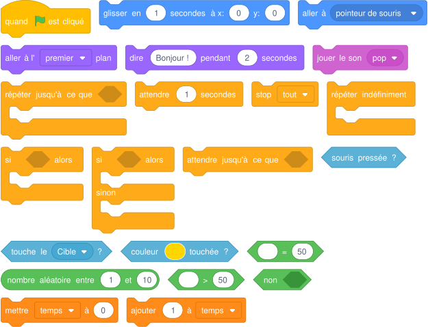{ .blocs }

    Les valeurs sont celles proposées par Scratch : à moi de choisir les bonnes et d'assembler les blocs.

??? abstract "Coup de pouce 3 : le squelette du script"
    Les blocs sont assemblés, les nombres sont à trouver (cases vides). Je l'ouvre seulement si les deux premiers coups de pouce ne suffisent pas.

    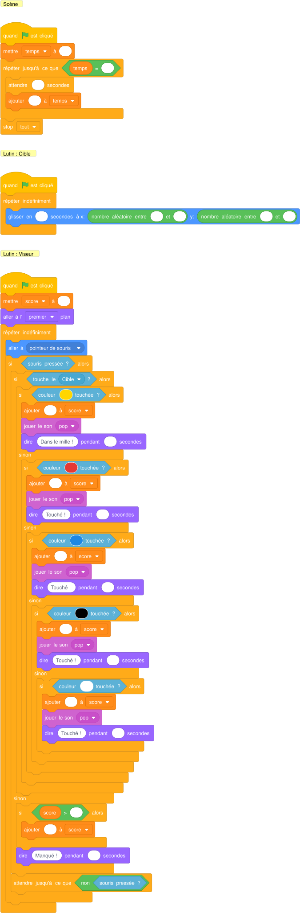{ .blocs }

??? warning "Si ça ne marche pas"
    - Mon test ne marche qu'une fois : le bloc « si » doit être à l'intérieur de la boucle.
    - « couleur touchée » ne réagit pas : je prends la couleur avec la pipette, directement sur la scène.
    - La variable garde l'ancienne valeur : je la remets à sa valeur de départ au drapeau vert.

!!! tip "Mon défi"
    La cible accélère quand le score dépasse 20.

**Je vérifie avant de cocher**

- [ ] Mon résultat correspond à la consigne « Ce que je dois obtenir ».
- [ ] Je clique deux fois de suite sur le drapeau vert : tout repart comme au premier essai.
- [ ] La variable affiche la bonne valeur pendant et à la fin du programme.
- [ ] J'ai enregistré mon projet sur l'ordinateur (Fichier, Enregistrer sur votre ordinateur).

<label class="mission-reussie"><input type="checkbox" data-mission="A5"> J'ai réussi la mission A5</label>

## Mission A6 · Premier jeu : le poulpe { #mission-A6 }

<strong>Ce que je dois obtenir.</strong> Je dirige le poulpe avec les flèches pour traverser la mer jusqu'aux coraux rouges, sans toucher les obstacles violets qui montent et descendent. J'ai trois vies.

[:material-play-circle: Ouvrir l'exercice](https://turbowarp.org/editor?project_url=https://numerica-lfh.github.io/Techno/missions-scratch/exercices/mission-A6.sb3){ .md-button .md-button--primary target=_blank rel=noopener } [:material-download: Télécharger le fichier .sb3](exercices/mission-A6.sb3){ .md-button }

**Notions :** programmer un jeu complet, vies, couleur touchée.

**Pas à pas**

1. Les obstacles et les coraux sont déjà programmés dans l'exercice : je lis leurs scripts.
2. Je programme les déplacements du poulpe avec les quatre flèches (« ajouter à x », « ajouter à y »).
3. Je crée la variable « vies » (3 au départ).
4. Si le poulpe touche le violet : il perd une vie et revient au départ ; à 0 vie, la partie est perdue.
5. S'il touche les coraux : la partie est gagnée.
6. J'améliore le jeu à mon idée : troisième obstacle, bonus, chronomètre, niveaux.

??? question "Coup de pouce 1 : je réfléchis avant de coder"
    - Comment est la scène au départ : position, costume, taille de chaque lutin, visible ou caché ?
    - Qu'est-ce qui doit se répéter sans jamais s'arrêter ?
    - Quelle condition dois-je tester, et que se passe-t-il quand elle est vraie ?
    - Quelle information dois-je garder dans une variable, et quelle est sa valeur au départ ?

??? note "Coup de pouce 2 : les blocs que je vais utiliser"
    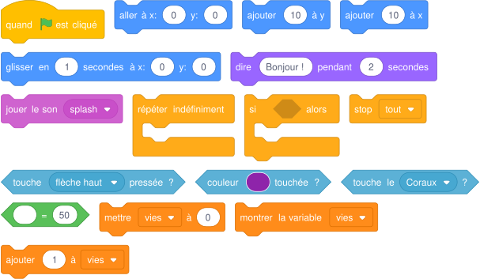{ .blocs }

    Les valeurs sont celles proposées par Scratch : à moi de choisir les bonnes et d'assembler les blocs.

??? abstract "Coup de pouce 3 : le squelette du script"
    Les blocs sont assemblés, les nombres sont à trouver (cases vides). Je l'ouvre seulement si les deux premiers coups de pouce ne suffisent pas.

    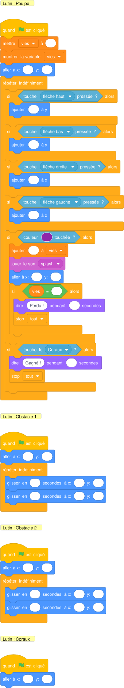{ .blocs }

??? warning "Si ça ne marche pas"
    - Mon test ne marche qu'une fois : le bloc « si » doit être à l'intérieur de la boucle.
    - « couleur touchée » ne réagit pas : je prends la couleur avec la pipette, directement sur la scène.
    - La variable garde l'ancienne valeur : je la remets à sa valeur de départ au drapeau vert.

!!! tip "Mon défi"
    Un niveau 2 : les obstacles vont plus vite après une victoire.

**Je vérifie avant de cocher**

- [ ] Mon résultat correspond à la consigne « Ce que je dois obtenir ».
- [ ] Je clique deux fois de suite sur le drapeau vert : tout repart comme au premier essai.
- [ ] La variable affiche la bonne valeur pendant et à la fin du programme.
- [ ] J'ai enregistré mon projet sur l'ordinateur (Fichier, Enregistrer sur votre ordinateur).

<label class="mission-reussie"><input type="checkbox" data-mission="A6"> J'ai réussi la mission A6</label>

## Je vérifie que j'ai compris

**Question 1.** Ce script doit compter à rebours de 30 à 0. Va-t-il fonctionner ?

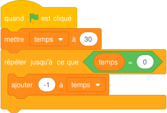{ .blocs }

**Question 2.** Que dit le lutin si je réponds 7 ?

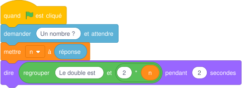{ .blocs }

**Question 3.** Pourquoi la souris du labyrinthe compte-t-elle parfois deux erreurs pour un seul choc ?

**Question 4.** À quoi sert « Exécuter sans rafraîchir l'écran » dans un bloc personnalisé ?

## Où j'en suis

En fin de séance, j'indique la dernière mission terminée et j'ajoute une capture d'écran de mon programme. Le professeur la reçoit directement.

*Missions d'après les cartes « Missions Scratch » de Réseau Canopé (CC BY-NC-SA) et le livret « Bien commencer avec Scratch » (Inria). Détail des sources sur la [page d'accueil des missions](index.md#sources-et-licences).*
