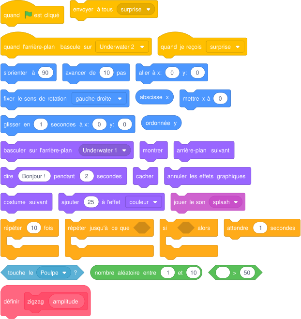
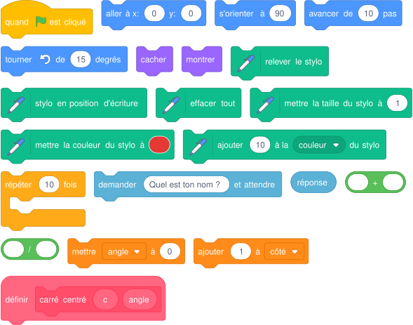
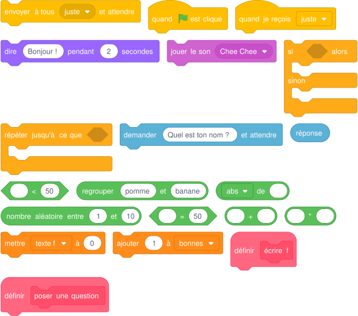
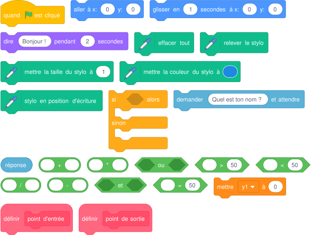
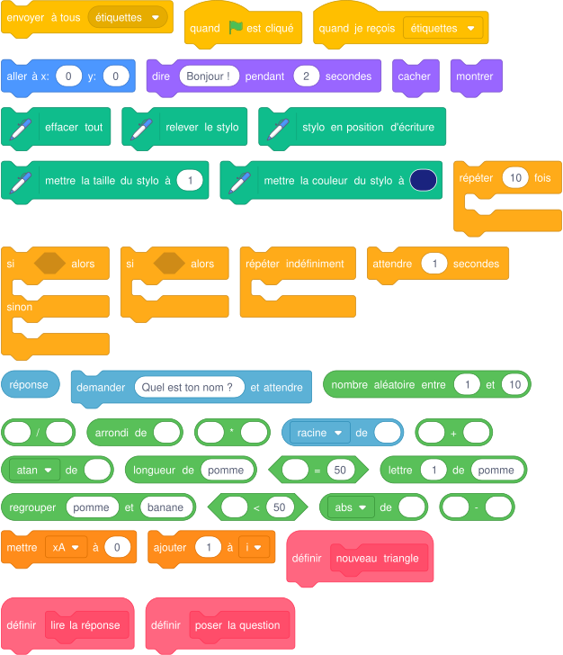
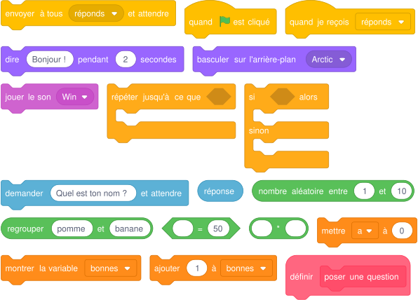
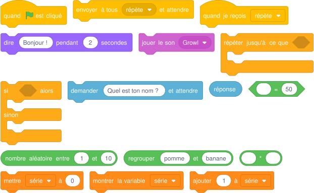
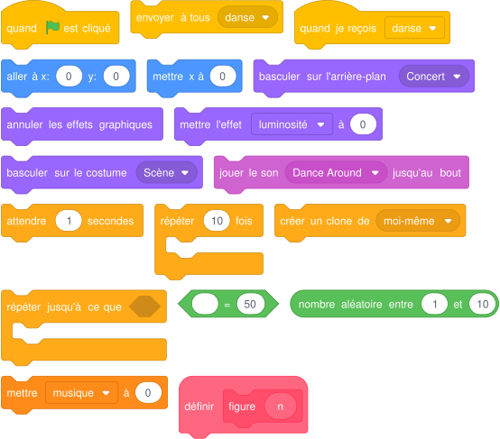
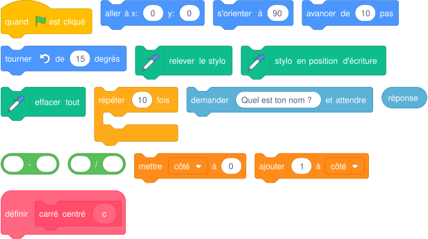
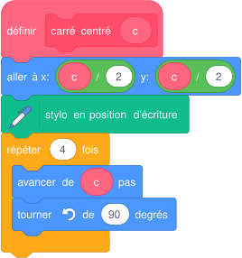

# Palier 4 (violet) : Procédures, algorithmes et passage à Python

Des problèmes de mathématiques résolus par programme, des procédures à paramètres, puis la traduction en Python et un projet personnel.

Classe de départ : **2de**. Les élèves qui ont terminé le palier précédent continuent ici.

| Mission | Titre | Notions |
|---|---|---|
| [61](#mission-61) | Océan 4 | procédure avec paramètre, aléatoire, deux décors |
| [62](#mission-62) | Carré 4 | procédure à deux paramètres, boucles imbriquées, rotation autour du centre |
| [63](#mission-63) | Fonction affine 3 | procédures, aléatoire, test d'égalité |
| [64](#mission-64) | Graphique fonction affine 2 | intersection avec les bords, tests imbriqués, procédures de calcul |
| [65](#mission-65) | Triangle trigonométrique | racine carrée, arc tangente, arrondi |
| [66](#mission-66) | Tables de multiplication 2 | procédure, envoyer et attendre, compteur |
| [67](#mission-67) | Tables de multiplication 3 | compteur remis à zéro, condition d'arrêt, aléatoire |
| [68](#mission-68) | Danseuses 3 | clones, procédure, variable de contrôle |
| [A7](#mission-A7) | De Scratch à Python | boucle for, fonction def, variable |
| [A8](#mission-A8) | Mon projet Scratch | démarche de projet, algorithme, tests |

!!! info "Comment travailler"
    Je regarde la vidéo, j'ouvre l'exercice, je lis le pas à pas et je programme. Je compare mon résultat avec la vidéo. Si je suis bloqué, j'ouvre « Les blocs que je vais utiliser ». En fin de séance, j'envoie ma progression avec une capture d'écran (bas de la page).

## Mission 61 · Océan 4 { #mission-61 }

<strong>Ce que je dois obtenir.</strong> Un poisson nage en zigzag. Quand il atteint le bord, le décor change. Dans le second décor, il rencontre une pieuvre qui lui réserve une surprise.

<iframe loading="lazy" title="Mission 61 : Océan 4" src="https://tube-numerique-educatif.apps.education.fr/videos/embed/83EtL443VdKqxorwFgSCfZ" frameborder="0" allow="fullscreen" allowfullscreen></iframe>

Vidéo du résultat attendu : <a href="https://tube-numerique-educatif.apps.education.fr/w/83EtL443VdKqxorwFgSCfZ" target="_blank" rel="noopener">ouvrir sur Tube Numérique éducatif</a>

[:material-play-circle: Ouvrir l'exercice](https://turbowarp.org/editor?project_url=https://numerica-lfh.github.io/Techno/missions-scratch/exercices/mission-61.sb3){ .md-button .md-button--primary target=_blank rel=noopener } [:material-download: Télécharger le fichier .sb3](exercices/mission-61.sb3){ .md-button }

**Notions :** procédure avec paramètre, aléatoire, deux décors, événement décor.

**Pas à pas**

1. Procédure « zigzag (amplitude) » : monter en diagonale (45) puis descendre (135), « amplitude » fois chacun.
2. Boucle principale du poisson : zigzag d'amplitude aléatoire, et s'il dépasse x = 200, il revient à gauche avec l'arrière-plan suivant.
3. La pieuvre est cachée. Elle apparaît quand l'arrière-plan bascule sur Underwater 2.
4. Quand le poisson la touche : message « surprise », la pieuvre change de costume et de couleur, le poisson s'enfuit.

??? note "Les blocs que je vais utiliser"
    { .blocs }

    Les valeurs sont celles proposées par Scratch : à moi de choisir les bonnes et d'assembler les blocs.

!!! tip "Mon défi"
    La surprise est tirée au hasard parmi trois possibilités.

<label class="mission-reussie"><input type="checkbox" data-mission="61"> J'ai réussi la mission 61</label>

## Mission 62 · Carré 4 { #mission-62 }

<strong>Ce que je dois obtenir.</strong> Le crayon demande le côté du plus petit carré, puis trace trois séries de carrés de plus en plus grands autour du centre de la scène. La couleur change à chaque carré.

<iframe loading="lazy" title="Mission 62 : Carré 4" src="https://tube-numerique-educatif.apps.education.fr/videos/embed/xm7oaqNPqKZ9voiiVPG54A" frameborder="0" allow="fullscreen" allowfullscreen></iframe>

Vidéo du résultat attendu : <a href="https://tube-numerique-educatif.apps.education.fr/w/xm7oaqNPqKZ9voiiVPG54A" target="_blank" rel="noopener">ouvrir sur Tube Numérique éducatif</a>

[:material-play-circle: Ouvrir l'exercice](https://turbowarp.org/editor?project_url=https://numerica-lfh.github.io/Techno/missions-scratch/exercices/mission-62.sb3){ .md-button .md-button--primary target=_blank rel=noopener } [:material-download: Télécharger le fichier .sb3](exercices/mission-62.sb3){ .md-button }

**Notions :** procédure à deux paramètres, boucles imbriquées, rotation autour du centre.

**Pas à pas**

1. Procédure « carré centré (c) (angle) » : partir du centre, reculer de c/2, se décaler de c/2 sur le côté, puis tracer le carré dans la direction « angle ».
2. Boucle intérieure : 5 carrés, le côté augmente de 20 à chaque fois.
3. Boucle extérieure : 3 séries, l'angle augmente de 30 degrés.
4. Le côté repart de la réponse au début de chaque série.

??? note "Les blocs que je vais utiliser"
    { .blocs }

    Les valeurs sont celles proposées par Scratch : à moi de choisir les bonnes et d'assembler les blocs.

!!! tip "Mon défi"
    Le nombre de séries est demandé et les séries font un tour complet.

<label class="mission-reussie"><input type="checkbox" data-mission="62"> J'ai réussi la mission 62</label>

## Mission 63 · Fonction affine 3 { #mission-63 }

<strong>Ce que je dois obtenir.</strong> Le singe choisit une fonction affine au hasard et m'interroge sur des images. Un perroquet arbitre. Après quatre bonnes réponses, la partie s'arrête.

<iframe loading="lazy" title="Mission 63 : Fonction affine 3" src="https://tube-numerique-educatif.apps.education.fr/videos/embed/mG2LodaUWVd2hK5aGiywCu" frameborder="0" allow="fullscreen" allowfullscreen></iframe>

Vidéo du résultat attendu : <a href="https://tube-numerique-educatif.apps.education.fr/w/mG2LodaUWVd2hK5aGiywCu" target="_blank" rel="noopener">ouvrir sur Tube Numérique éducatif</a>

[:material-play-circle: Ouvrir l'exercice](https://turbowarp.org/editor?project_url=https://numerica-lfh.github.io/Techno/missions-scratch/exercices/mission-63.sb3){ .md-button .md-button--primary target=_blank rel=noopener } [:material-download: Télécharger le fichier .sb3](exercices/mission-63.sb3){ .md-button }

**Notions :** procédures, aléatoire, test d'égalité, affichage d'un nombre négatif.

**Pas à pas**

1. a et b sont tirés au hasard (a entre -5 et 5, b entre -10 et 10).
2. Procédure « écrire f » : si b est négatif, j'écris « ax - |b| », sinon « ax + b » (opérateur « abs »).
3. Procédure « poser une question » : x au hasard, je demande f(x) et je compare la réponse à a × x + b.
4. Selon le cas, j'envoie « juste » ou « faux » et le perroquet réagit.
5. Je répète jusqu'à 4 bonnes réponses.

??? note "Les blocs que je vais utiliser"
    { .blocs }

    Les valeurs sont celles proposées par Scratch : à moi de choisir les bonnes et d'assembler les blocs.

!!! tip "Mon défi"
    Le singe pose aussi la question inverse : quel nombre x a pour image une valeur donnée ?

<label class="mission-reussie"><input type="checkbox" data-mission="63"> J'ai réussi la mission 63</label>

## Mission 64 · Graphique fonction affine 2 { #mission-64 }

<strong>Ce que je dois obtenir.</strong> Je donne a et b. Le point glisse sans tracer jusqu'au point où la droite y = ax + b entre sur la scène, puis glisse en traçant jusqu'au point où elle en sort.

<iframe loading="lazy" title="Mission 64 : Graphique fonction affine 2" src="https://tube-numerique-educatif.apps.education.fr/videos/embed/6xdthTrEENRM4GDqZh8B5H" frameborder="0" allow="fullscreen" allowfullscreen></iframe>

Vidéo du résultat attendu : <a href="https://tube-numerique-educatif.apps.education.fr/w/6xdthTrEENRM4GDqZh8B5H" target="_blank" rel="noopener">ouvrir sur Tube Numérique éducatif</a>

[:material-play-circle: Ouvrir l'exercice](https://turbowarp.org/editor?project_url=https://numerica-lfh.github.io/Techno/missions-scratch/exercices/mission-64.sb3){ .md-button .md-button--primary target=_blank rel=noopener } [:material-download: Télécharger le fichier .sb3](exercices/mission-64.sb3){ .md-button }

**Notions :** intersection avec les bords, tests imbriqués, procédures de calcul.

**Pas à pas**

1. Point d'entrée : je calcule y1 = a × (-240) + b, l'ordonnée sur le bord gauche.
2. Si y1 est entre -180 et 180, la droite entre par le bord gauche : x1 = -240.
3. Sinon elle entre par le bas (si a > 0) ou par le haut (si a < 0) : je résous a × x1 + b = -180 (ou 180), donc x1 = (-180 - b) / a.
4. Je fais le même raisonnement pour le point de sortie, sur le bord droit.
5. Je glisse stylo relevé vers (x1 ; y1), puis stylo posé vers (x2 ; y2).

??? note "Les blocs que je vais utiliser"
    { .blocs }

    Les valeurs sont celles proposées par Scratch : à moi de choisir les bonnes et d'assembler les blocs.

!!! tip "Mon défi"
    Le programme trace plusieurs droites de couleurs différentes sans effacer.

<label class="mission-reussie"><input type="checkbox" data-mission="64"> J'ai réussi la mission 64</label>

## Mission 65 · Triangle trigonométrique { #mission-65 }

<strong>Ce que je dois obtenir.</strong> Le programme place un triangle ABC rectangle en A tiré au hasard, donne deux mesures et demande l'hypoténuse BC. J'utilise Pythagore ou la trigonométrie selon les données. La réponse est validée au dixième près, puis un nouveau triangle apparaît.

<iframe loading="lazy" title="Mission 65 : Triangle trigonométrique" src="https://tube-numerique-educatif.apps.education.fr/videos/embed/gCY1EZPGJhQQrUoTarzpxo" frameborder="0" allow="fullscreen" allowfullscreen></iframe>

Vidéo du résultat attendu : <a href="https://tube-numerique-educatif.apps.education.fr/w/gCY1EZPGJhQQrUoTarzpxo" target="_blank" rel="noopener">ouvrir sur Tube Numérique éducatif</a>

[:material-play-circle: Ouvrir l'exercice](https://turbowarp.org/editor?project_url=https://numerica-lfh.github.io/Techno/missions-scratch/exercices/mission-65.sb3){ .md-button .md-button--primary target=_blank rel=noopener } [:material-download: Télécharger le fichier .sb3](exercices/mission-65.sb3){ .md-button }

**Notions :** racine carrée, arc tangente, arrondi, traitement d'une chaîne de caractères.

**Pas à pas**

1. Procédure « nouveau triangle » : A au hasard, C au-dessus de A (longueur AC), B à droite de A (longueur AB). Je trace ABC.
2. Je calcule BC = racine(AB² + AC²) et l'angle B = atan(AC / AB), arrondis au dixième : arrondi(valeur × 10) / 10.
3. Procédure « poser la question » : méthode au hasard. 1 : AB et AC (Pythagore). 2 : AB et l'angle B (cosinus). 3 : AC et l'angle B (sinus).
4. Procédure « lire la réponse » : je parcours la réponse lettre par lettre et je remplace la virgule par un point.
5. Je compare : si l'écart avec BC est inférieur à 1, c'est juste.

??? note "Les blocs que je vais utiliser"
    { .blocs }

    Les valeurs sont celles proposées par Scratch : à moi de choisir les bonnes et d'assembler les blocs.

!!! tip "Mon défi"
    Le programme demande aussi la mesure de l'angle C.

<label class="mission-reussie"><input type="checkbox" data-mission="65"> J'ai réussi la mission 65</label>

## Mission 66 · Tables de multiplication 2 { #mission-66 }

<strong>Ce que je dois obtenir.</strong> Le grand pingouin pose des multiplications tirées au hasard. Je réponds par le petit pingouin. Après quatre bonnes réponses, le décor change et le grand pingouin me félicite.

<iframe loading="lazy" title="Mission 66 : Tables de multiplication 2" src="https://tube-numerique-educatif.apps.education.fr/videos/embed/n3jTJnMHkDbAxLvZ49TVBC" frameborder="0" allow="fullscreen" allowfullscreen></iframe>

Vidéo du résultat attendu : <a href="https://tube-numerique-educatif.apps.education.fr/w/n3jTJnMHkDbAxLvZ49TVBC" target="_blank" rel="noopener">ouvrir sur Tube Numérique éducatif</a>

[:material-play-circle: Ouvrir l'exercice](https://turbowarp.org/editor?project_url=https://numerica-lfh.github.io/Techno/missions-scratch/exercices/mission-66.sb3){ .md-button .md-button--primary target=_blank rel=noopener } [:material-download: Télécharger le fichier .sb3](exercices/mission-66.sb3){ .md-button }

**Notions :** procédure, envoyer et attendre, compteur, deux décors.

**Pas à pas**

1. Procédure « poser une question » du grand pingouin : deux nombres au hasard, la question, puis « envoyer à tous réponds et attendre ».
2. Le petit pingouin demande la réponse au joueur, la compare au produit et compte les bonnes réponses.
3. Le grand pingouin répète jusqu'à 4 bonnes réponses.
4. Il bascule sur le décor de fête et félicite.

??? note "Les blocs que je vais utiliser"
    { .blocs }

    Les valeurs sont celles proposées par Scratch : à moi de choisir les bonnes et d'assembler les blocs.

!!! tip "Mon défi"
    Un chronomètre mesure le temps mis pour les quatre bonnes réponses.

<label class="mission-reussie"><input type="checkbox" data-mission="66"> J'ai réussi la mission 66</label>

## Mission 67 · Tables de multiplication 3 { #mission-67 }

<strong>Ce que je dois obtenir.</strong> Le grand dinosaure pose des multiplications, le petit répète ma réponse. Une bonne réponse augmente la série de 1, une erreur la remet à 0. Il faut 4 bonnes réponses d'affilée.

<iframe loading="lazy" title="Mission 67 : Tables de multiplication 3" src="https://tube-numerique-educatif.apps.education.fr/videos/embed/msxBkPNKveEyCSdyeqrift" frameborder="0" allow="fullscreen" allowfullscreen></iframe>

Vidéo du résultat attendu : <a href="https://tube-numerique-educatif.apps.education.fr/w/msxBkPNKveEyCSdyeqrift" target="_blank" rel="noopener">ouvrir sur Tube Numérique éducatif</a>

[:material-play-circle: Ouvrir l'exercice](https://turbowarp.org/editor?project_url=https://numerica-lfh.github.io/Techno/missions-scratch/exercices/mission-67.sb3){ .md-button .md-button--primary target=_blank rel=noopener } [:material-download: Télécharger le fichier .sb3](exercices/mission-67.sb3){ .md-button }

**Notions :** compteur remis à zéro, condition d'arrêt, aléatoire.

**Pas à pas**

1. Je crée la variable « série », mise à 0 au départ.
2. Dans « répéter jusqu'à série = 4 » : deux nombres au hasard, la question, puis le petit dinosaure répète la réponse.
3. Si la réponse est juste, série augmente de 1. Sinon série revient à 0 et le grand dinosaure grogne.
4. Après la boucle, la victoire est annoncée.

??? note "Les blocs que je vais utiliser"
    { .blocs }

    Les valeurs sont celles proposées par Scratch : à moi de choisir les bonnes et d'assembler les blocs.

!!! tip "Mon défi"
    Le niveau monte : après 4 réussites, les nombres vont jusqu'à 15.

<label class="mission-reussie"><input type="checkbox" data-mission="67"> J'ai réussi la mission 67</label>

## Mission 68 · Danseuses 3 { #mission-68 }

<strong>Ce que je dois obtenir.</strong> Trois danseuses dansent en rythme mais chacune choisit ses figures au hasard. À la fin de la musique, elles prennent la pose, la lumière clignote et le public applaudit.

<iframe loading="lazy" title="Mission 68 : Danseuses 3" src="https://tube-numerique-educatif.apps.education.fr/videos/embed/2NwJUw71Zx4JpoT1mAqz38" frameborder="0" allow="fullscreen" allowfullscreen></iframe>

Vidéo du résultat attendu : <a href="https://tube-numerique-educatif.apps.education.fr/w/2NwJUw71Zx4JpoT1mAqz38" target="_blank" rel="noopener">ouvrir sur Tube Numérique éducatif</a>

[:material-play-circle: Ouvrir l'exercice](https://turbowarp.org/editor?project_url=https://numerica-lfh.github.io/Techno/missions-scratch/exercices/mission-68.sb3){ .md-button .md-button--primary target=_blank rel=noopener } [:material-download: Télécharger le fichier .sb3](exercices/mission-68.sb3){ .md-button }

**Notions :** clones, procédure, variable de contrôle, script de la scène.

**Pas à pas**

1. Une seule danseuse dans la liste des lutins : elle se duplique en trois avec deux clones.
2. Procédure « figure (n) » : basculer sur le costume numéro n, attendre.
3. À « danse », chaque danseuse répète une figure au hasard tant que la variable musique vaut 1.
4. La scène lance la musique, la met à 0 à la fin, envoie « fin » et fait clignoter la lumière (effet luminosité).

??? note "Les blocs que je vais utiliser"
    { .blocs }

    Les valeurs sont celles proposées par Scratch : à moi de choisir les bonnes et d'assembler les blocs.

!!! tip "Mon défi"
    Une danseuse sur trois fait toujours la même figure que la scène impose.

<label class="mission-reussie"><input type="checkbox" data-mission="68"> J'ai réussi la mission 68</label>

## Mission A7 · De Scratch à Python { #mission-A7 }

<strong>Ce que je dois obtenir.</strong> Je traduis en Python (module turtle) les scripts de deux missions déjà réussies : le carré centré et le polygone.

[:material-play-circle: Ouvrir l'exercice](https://turbowarp.org/editor?project_url=https://numerica-lfh.github.io/Techno/missions-scratch/exercices/mission-A7.sb3){ .md-button .md-button--primary target=_blank rel=noopener } [:material-download: Télécharger le fichier .sb3](exercices/mission-A7.sb3){ .md-button }

[:material-language-python: Ouvrir en Python (Basthon)](https://console.basthon.fr/?from=https://numerica-lfh.github.io/Techno/missions-scratch/exercices/mission-A7.py){ .md-button .md-button--primary target=_blank rel=noopener } [:material-download: Télécharger le fichier .py](exercices/mission-A7.py){ .md-button }

**Notions :** boucle for, fonction def, variable, input.

**Pas à pas**

1. J'ouvre l'exercice Scratch : il contient le script de la mission 47 que je vais traduire.
2. J'ouvre le fichier Python dans Basthon (bouton « Ouvrir en Python »).
3. Je m'aide du tableau de correspondance : « répéter 4 fois » devient « for i in range(4): », un bloc personnalisé devient une fonction « def ».
4. Je complète les trois parties du fichier et j'exécute après chaque partie.

??? note "Les blocs que je vais utiliser"
    { .blocs }

    Les valeurs sont celles proposées par Scratch : à moi de choisir les bonnes et d'assembler les blocs.

!!! tip "Mon défi"
    Je traduis la mission 49 (demi-cercles) en Python.

<label class="mission-reussie"><input type="checkbox" data-mission="A7"> J'ai réussi la mission A7</label>

## Mission A8 · Mon projet Scratch { #mission-A8 }

<strong>Ce que je dois obtenir.</strong> En binôme, je conçois et je réalise mon propre programme : jeu, histoire, animation ou outil pour une autre matière.

[:material-play-circle: Ouvrir l'exercice](https://turbowarp.org/editor?project_url=https://numerica-lfh.github.io/Techno/missions-scratch/exercices/mission-A8.sb3){ .md-button .md-button--primary target=_blank rel=noopener } [:material-download: Télécharger le fichier .sb3](exercices/mission-A8.sb3){ .md-button }

**Notions :** démarche de projet, algorithme, tests, documentation.

**Pas à pas**

1. Analyse : je propose trois idées, j'en retiens une avec le professeur et je décris ce que fera le programme.
2. Conception de l'interface : je dessine un croquis annoté de chaque scène.
3. Conception du code : j'écris l'algorithme de chaque lutin en français et la liste des variables (nom, information rangée).
4. Mise en œuvre puis tests : deux camarades testent, je note les erreurs trouvées et la façon dont je les ai corrigées.
5. Documentation et évaluation : je rédige la description (50 mots) et je note ce que j'améliorerais.

!!! tip "Mon défi"
    Je publie mon projet dans le studio de la classe.

<label class="mission-reussie"><input type="checkbox" data-mission="A8"> J'ai réussi la mission A8</label>

## Je vérifie que j'ai compris

**Question 1.** Ce bloc doit tracer un carré dont le centre est (0 ; 0). Où est l'erreur ?

{ .blocs }

**Question 2.** Que vaut la variable série après les réponses : juste, juste, faux, juste ?

**Question 3.** Écris en Python : répéter 5 fois avancer de 50 et tourner à gauche de 72.

**Question 4.** Pourquoi la réponse « 12,5 » pose-t-elle problème à Scratch ?

## Où j'en suis

En fin de séance, j'indique la dernière mission terminée et j'ajoute une capture d'écran de mon programme. Le professeur la reçoit directement.

*Missions d'après les cartes « Missions Scratch » de Réseau Canopé (CC BY-NC-SA) et le livret « Bien commencer avec Scratch » (Inria). Détail des sources sur la [page d'accueil des missions](index.md#sources-et-licences).*
