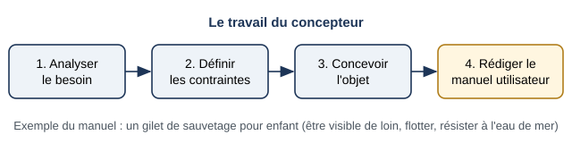
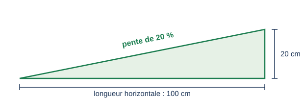

# Séance 1 — Du besoin au manuel de l'utilisateur

!!! info "Séance 1 sur 4 · 45 minutes · Classe entière"

    Je retrouve le travail du concepteur, du besoin au manuel, et j'analyse les modes de représentation d'un manuel.

    [Fiche élève à imprimer (PDF)](fiches/3e-seq3-seance1-eleve.pdf)

    [Trace écrite de la séance](trace-ecrite-seance-1.md)

## AVANT — j'entre dans la question

#### J'observe

Le professeur projette une page du manuel de l'utilisateur d'une tondeuse robot (manuel Nathan, page 51). Je regarde sans lire le détail.

| Je regarde | Ce que j'observe |
|---|---|
| La part du texte et celle des dessins |   |
| Les indications chiffrées |   |
| Les signes qui disent oui ou non |   |

#### Ce qu'on cherche

Une tondeuse robot tond seule. Mais avant, quelqu'un doit l'installer : fixer la station, tendre un câble autour de la pelouse, éviter les pentes. Cette personne n'est pas un expert.

**Comment le concepteur transmet-il à l'utilisateur les contraintes de son objet ?**

J'écris trois choses que je crois savoir. Je n'ai pas besoin d'avoir raison : je reviendrai sur ces lignes à la fin de l'heure.

| N° | Mes hypothèses de départ | Vérifié en fin de séance (✔ / ✘) |
|---|---|---|
| 1 |   |   |
| 2 |   |   |
| 3 |   |   |

#### Vocabulaire à repérer

| Mot | Ce que j'en comprends, avec mes mots |
|---|---|
| **manuel de l'utilisateur** |   |
| **mode de représentation** |   |
| **expérience de l'utilisateur** |   |
| **schéma coté** |   |

## PENDANT — je recherche

### Activité 1 · Le travail du concepteur

*Du besoin au manuel (d'après « À retenir par l'image », manuel p. 55)*

a\. Pour le gilet de sauvetage, je relie chaque contrainte à son interacteur : être visible de loin ; s'adapter au corps et flotter ; résister à l'eau de mer.

b\. Pourquoi le manuel arrive-t-il en dernier ?

### Activité 2 · Analyser le manuel de la tondeuse

| Vignette | Mode de représentation | Contrainte transmise |
|---|---|---|
| 1. Fixer la station |   |   |
| 2. Délimiter la zone |   |   |
| 3. Zones à éviter |   |   |
| 4. Installer le câble |   |   |

*Une pente de 20 % : 20 cm de montée pour 100 cm à l'horizontale*

c\. Sur une longueur horizontale de 2 m, de combien le terrain monte-t-il avec une pente de 20 % ?

d\. Pourquoi cette pente est-elle une contrainte ? Pour qui ?

### Activité 3 · Choisir le bon mode de représentation

e\. Pour chaque information, je choisis le mode de représentation le plus adapté et je justifie : les horaires de tonte de la semaine ; la position de la station dans le jardin ; la procédure de mise en route.

### Mon défi

!!! example "Mon défi · 3e"

    Je dessine un schéma coté qui explique à un utilisateur à quelle distance minimale d'un mur placer une imprimante 3D (10 cm à l'arrière, 20 cm au-dessus).

## APRÈS — je fixe ce que j'ai appris

#### À retenir

!!! note "Deux documents, deux usages"

    Ce bloc se complète en classe, à la fin de l'heure : les phrases à trous se remplissent
    pendant la mise en commun. La [trace écrite de la séance](trace-ecrite-seance-1.md)
    reprend les mêmes notions rédigées, avec les définitions exactes et les compétences
    évaluées. C'est elle qui se colle dans le cahier.

Le concepteur analyse le besoin, définit les contraintes, conçoit l'objet, puis rédige le **manuel de l'utilisateur** qui transmet ces contraintes.

Le manuel choisit pour chaque information le **mode de représentation** le plus clair : texte court, croquis, schéma, **schéma coté**, graphique, algorithme.

Un bon manuel améliore l'**expérience de l'utilisateur** : il se sert de l'objet facilement et sans danger.

Je complète : Une pente de 20 % correspond à `..........` cm de montée pour 1 m à l'horizontale.

Je complète : Un schéma qui porte des dimensions est un schéma `..........`.

#### Je reviens sur mes observations et mes hypothèses

Je coche ✔ ou ✘ chaque hypothèse. J'explique ensuite ce que j'ai observé au début de la séance, avec le vocabulaire de la séance :

#### La question de la prochaine séance

Comment un manuel prévient-il l'utilisateur d'un danger ?

## S'entraîner

[Ouvrir l'exercice autocorrectif :material-arrow-right:](exercices-seance-1.html){ .md-button .md-button--primary target=_blank }

Dix questions sur la séance. Je réponds, puis je vérifie : la correction et une explication s'affichent sous chaque question. Je recommence autant de fois que je veux ; rien n'est envoyé.
