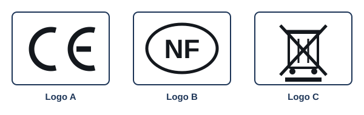

# Séance 2 — La sécurité dans le manuel de l'utilisateur

!!! info "Séance 2 sur 4 · 45 minutes · Demi-groupe"

    J'analyse comment un manuel signale les risques, par niveau de gravité, puis je rédige une consigne de sécurité.

    [Fiche élève à imprimer (PDF)](fiches/3e-seq3-seance2-eleve.pdf)

    [Trace écrite de la séance](trace-ecrite-seance-2.md)

## AVANT — j'entre dans la question

#### J'observe

Chaque binôme reçoit la notice papier d'un appareil électrique (sèche-cheveux, bouilloire, chargeur). Je feuillette les premières pages.

| Je regarde | Ce que j'observe |
|---|---|
| Les encadrés et pictogrammes en tête de notice |   |
| Les mots écrits en majuscules |   |
| Les logos en fin de notice ou sur l'appareil |   |

#### Ce qu'on cherche

Un manuel ne sert pas seulement à expliquer comment utiliser un objet. Il prévient aussi des risques qu'on court si on ne respecte pas certaines règles.

**Comment un manuel prévient-il l'utilisateur d'un danger ?**

J'écris trois choses que je crois savoir. Je n'ai pas besoin d'avoir raison : je reviendrai sur ces lignes à la fin de l'heure.

| N° | Mes hypothèses de départ | Vérifié en fin de séance (✔ / ✘) |
|---|---|---|
| 1 |   |   |
| 2 |   |   |
| 3 |   |   |

#### Vocabulaire à repérer

| Mot | Ce que j'en comprends, avec mes mots |
|---|---|
| **risque** |   |
| **règle de sécurité** |   |
| **étiquetage** |   |
| **niveau de gravité** |   |

## PENDANT — je recherche

### Activité 1 · Les consignes de la tondeuse robot

!!! warning "DANGER"

    Branchez toujours l'alimentation à une prise électrique intérieure protégée contre les intempéries et par un disjoncteur différentiel de moins de 30 mA.

!!! warning "AVERTISSEMENT"

    Laissez le temps aux lames de s'arrêter de tourner avant de soulever ou d'incliner la tondeuse ou de vous approcher des lames.

!!! warning "ATTENTION"

    En cas d'orage, débranchez le câble périphérique de la station et son alimentation.

| Consigne | Risque évité | Qui est protégé ? |
|---|---|---|
| DANGER : prise protégée |   |   |
| AVERTISSEMENT : lames arrêtées |   |   |
| ATTENTION : orage |   |   |

a\. Je range les trois mots du plus grave au moins grave et je justifie avec les exemples.

### Activité 2 · L'étiquetage

*Trois logos à expliquer*

| Logo | Signification |
|---|---|
| A |   |
| B |   |
| C |   |

b\. Pourquoi le manuel doit-il rappeler ces logos ?

### Activité 3 · Rédiger une consigne

c\. À partir de la notice de mon binôme, je rédige une consigne de sécurité absente ou mal expliquée, avec son niveau de gravité, un pictogramme dessiné et une phrase courte à l'impératif.

### Mon défi

!!! example "Mon défi · 3e"

    J'écris pour la trottinette électrique une consigne DANGER et une consigne ATTENTION, chacune en une phrase à l'impératif.

## APRÈS — je fixe ce que j'ai appris

#### À retenir

!!! note "Deux documents, deux usages"

    Ce bloc se complète en classe, à la fin de l'heure : les phrases à trous se remplissent
    pendant la mise en commun. La [trace écrite de la séance](trace-ecrite-seance-2.md)
    reprend les mêmes notions rédigées, avec les définitions exactes et les compétences
    évaluées. C'est elle qui se colle dans le cahier.

Le manuel indique les **risques** encourus et les **règles de sécurité** à respecter. Elles protègent l'utilisateur, les autres personnes et l'objet.

Les consignes sont classées par **niveau de gravité** : DANGER, AVERTISSEMENT, ATTENTION. Elles combinent un pictogramme et une phrase courte à l'impératif.

Le manuel rappelle l'**étiquetage** officiel (CE, NF, poubelle barrée) qui prouve que l'objet peut être utilisé en sécurité.

Je complète : Le niveau de gravité le plus élevé s'écrit `..........`.

Je complète : Le logo `..........` indique la conformité aux règles de sécurité européennes.

#### Je reviens sur mes observations et mes hypothèses

Je coche ✔ ou ✘ chaque hypothèse. J'explique ensuite ce que j'ai observé au début de la séance, avec le vocabulaire de la séance :

#### La question de la prochaine séance

Comment un utilisateur qui n'est pas expert peut-il régler le fonctionnement d'un objet ?

## S'entraîner

[Ouvrir l'exercice autocorrectif :material-arrow-right:](exercices-seance-2.html){ .md-button .md-button--primary target=_blank }

Dix questions sur la séance. Je réponds, puis je vérifie : la correction et une explication s'affichent sous chaque question. Je recommence autant de fois que je veux ; rien n'est envoyé.
