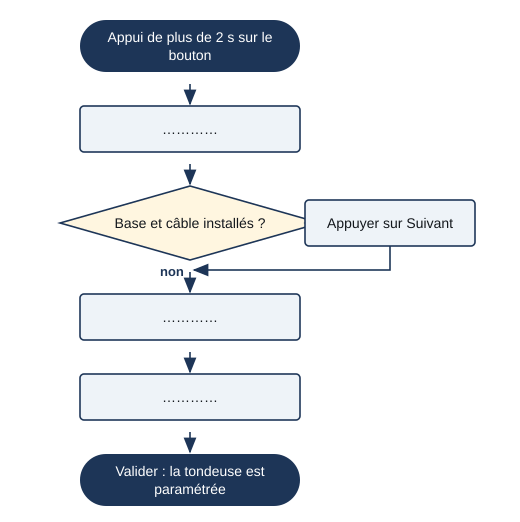

# Séance 3 — Paramétrer un objet : l'algorithme

!!! info "Séance 3 sur 4 · 45 minutes · Classe entière"

    Je décris par un algorithme la façon de paramétrer un objet, puis je programme en langage naturel le salut d'un robot.

    [Fiche élève à imprimer (PDF)](fiches/3e-seq3-seance3-eleve.pdf)

    [Trace écrite de la séance](trace-ecrite-seance-3.md)

## AVANT — j'entre dans la question

#### J'observe

Le professeur projette la séquence d'écrans du paramétrage initial de la tondeuse robot (manuel, page 53), puis une photo du robot humanoïde Nao. Je regarde.

| Je regarde | Ce que j'observe |
|---|---|
| Le geste qui démarre le paramétrage |   |
| L'enchaînement des écrans |   |
| Ce que le robot Nao peut bouger |   |

#### Ce qu'on cherche

Les objets sont de plus en plus autonomes et offrent de plus en plus de fonctionnalités. Pour qu'un utilisateur non expert les règle, le concepteur lui propose une suite de tâches simples à suivre.

**Comment un utilisateur peut-il paramétrer le fonctionnement d'un objet ?**

J'écris trois choses que je crois savoir. Je n'ai pas besoin d'avoir raison : je reviendrai sur ces lignes à la fin de l'heure.

| N° | Mes hypothèses de départ | Vérifié en fin de séance (✔ / ✘) |
|---|---|---|
| 1 |   |   |
| 2 |   |   |
| 3 |   |   |

#### Vocabulaire à repérer

| Mot | Ce que j'en comprends, avec mes mots |
|---|---|
| **autonomie** |   |
| **paramétrer** |   |
| **algorithme** |   |
| **instruction** |   |

## PENDANT — je recherche

### Activité 1 · L'algorithme de paramétrage de la tondeuse

*Algorigramme du paramétrage initial*

a\. Quelle étape est une vérification plutôt qu'un réglage ? Pourquoi est-elle placée là ?

b\. Quels paramètres l'utilisateur fixe-t-il ?

### Activité 2 · Faire saluer le robot Nao

Le robot Nao dispose de ces fonctionnalités : lever ou descendre un bras ; secouer un bras de gauche à droite ; tourner la tête à gauche ou à droite ; bouger la tête en haut ou en bas ; allumer ou éteindre ses yeux ; parler en disant une phrase. J'écris un algorithme qui lui fait saluer une personne (exercice 7).

c\. Mon algorithme, en instructions numérotées :

d\. Quelle instruction de mon algorithme utilise une répétition ? Comment l'écrirais-je dans un langage par blocs ?

### Activité 3 · S'organiser pour rédiger un manuel

Le manuel Nathan propose cinq étapes pour rédiger un manuel de l'utilisateur (« Apprendre à faire », page 54) : bien comprendre qui va utiliser l'objet ; coordonner la rédaction avec un rédacteur et un graphiste ; lister toutes les manières d'utiliser l'objet ; respecter les exigences d'étiquetage ; décider d'un mode de publication.

e\. Pourquoi faire appel à un rédacteur qui n'a pas participé à la conception ?

### Mon défi

!!! example "Mon défi · 3e"

    Nao doit aussi dire au revoir. Je modifie mon algorithme pour qu'il salue en arrivant et dise au revoir quand la personne s'éloigne, en utilisant une condition.

## APRÈS — je fixe ce que j'ai appris

#### À retenir

!!! note "Deux documents, deux usages"

    Ce bloc se complète en classe, à la fin de l'heure : les phrases à trous se remplissent
    pendant la mise en commun. La [trace écrite de la séance](trace-ecrite-seance-3.md)
    reprend les mêmes notions rédigées, avec les définitions exactes et les compétences
    évaluées. C'est elle qui se colle dans le cahier.

Les objets sont de plus en plus **autonomes**. Pour les **paramétrer**, l'utilisateur suit une procédure décrite sous forme d'**algorithme** simple.

Un algorithme est une suite finie d'**instructions** précises dans un ordre donné. On peut l'écrire en étapes numérotées ou le dessiner en algorigramme.

Rédiger un manuel s'organise : comprendre l'utilisateur, coordonner rédacteur et graphiste, lister les usages, respecter l'étiquetage, choisir la publication.

Je complète : La capacité d'un objet à se gérer lui-même s'appelle l'`..........`.

Je complète : Régler la langue, la hauteur de coupe et les horaires, c'est `..........` la tondeuse.

#### Je reviens sur mes observations et mes hypothèses

Je coche ✔ ou ✘ chaque hypothèse. J'explique ensuite ce que j'ai observé au début de la séance, avec le vocabulaire de la séance :

#### La question de la prochaine séance

Saurai-je décrire l'expérience de l'utilisateur d'un robot explorateur, comme au brevet ?

## S'entraîner

[Ouvrir l'exercice autocorrectif :material-arrow-right:](exercices-seance-3.html){ .md-button .md-button--primary target=_blank }

Dix questions sur la séance. Je réponds, puis je vérifie : la correction et une explication s'affichent sous chaque question. Je recommence autant de fois que je veux ; rien n'est envoyé.
