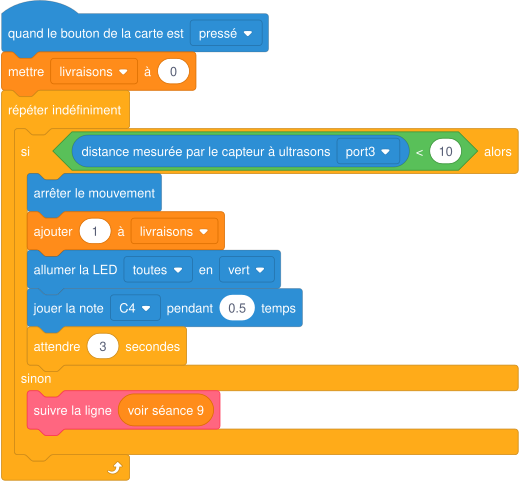

# Séance 10 — Le défi du robot livreur

!!! info "Séance 10 sur 10 · 55 minutes · Demi-groupe"

    Je programme un robot livreur qui suit la ligne, s'arrête devant chaque colis et compte ses livraisons, puis je le fais tester.

    [Fiche élève à imprimer (PDF)](fiches/3e-arduino-mbot-seance10-eleve.pdf)

    [Trace écrite de la séance](trace-ecrite-seance-10.md)

## AVANT — j'entre dans la question

#### J'observe

Le professeur fait rouler un robot livreur sur la piste. Des boîtes en carton sont posées sur la ligne.

| Je regarde | Ce que j'observe |
|---|---|
| Ce que fait le robot entre deux boîtes |   |
| Ce qu'il fait devant une boîte |   |
| Ce qui se passe quand on retire la boîte |   |

#### Ce qu'on cherche

Le défi rassemble tout ce que la séquence a construit : capteurs, boucles, conditions, variables, étalonnage et tests. Le robot doit respecter un cahier des charges.

**Comment programmer un robot qui livre des colis de façon fiable, et le prouver ?**

#### Vocabulaire à repérer

| Mot | Ce que j'en comprends, avec mes mots |
|---|---|
| **cahier des charges** |   |
| **compteur** |   |
| **test croisé** |   |
| **critère** |   |

## PENDANT — je recherche

### Activité 1 · Le cahier des charges

Je lis le cahier des charges et je repère le capteur ou le bloc qui permet de respecter chaque exigence.

| Exigence | Capteur ou bloc utilisé |
|---|---|
| Suivre la ligne noire du départ à l'arrivée |   |
| S'arrêter à moins de 10 cm d'un colis sans le toucher |   |
| Compter les livraisons |   |
| Signaler chaque livraison |   |
| Fonctionner seul, sans câble |   |

### Activité 2 · Programmer le livreur

Je complète mon programme de la séance 9. Le bloc « suivre la ligne » représente les quatre tests du suiveur.



*Structure du programme du robot livreur*

a\. Pourquoi le robot attend-il 3 secondes après une livraison ?

b\. Où la variable livraisons est-elle initialisée ? Pourquoi à cet endroit ?

En mode connecté, mBlock montre aussi le code Arduino produit par les blocs. Voici la partie de la livraison.

*Traduction en langage Arduino (noms de fonctions à vérifier dans mBlock)*

```cpp
if (ultrasonic_3.distanceCm() < 10) {
  motor_9.run(0);                  // arrêter le mouvement (moteur gauche)
  motor_10.run(0);                 // arrêter le mouvement (moteur droit)
  livraisons = livraisons + 1;     // ajouter 1 à livraisons
  buzzer.tone(262, 500);           // jouer la note C4 pendant 0,5 temps
  delay(3000);                     // attendre 3 secondes
}
```

c\. Quel bloc correspond à la ligne `livraisons = livraisons + 1;` ? Et à `delay(3000);` ?

### Activité 3 · Test croisé et QCM

Un autre binôme teste mon robot sur la piste avec trois colis. Je remplis la grille du sien.

| Critère | Points | Note |
|---|---|---|
| Suit la ligne du départ à l'arrivée sans sortir | 6 |   |
| S'arrête devant chaque colis sans le toucher | 4 |   |
| Compte correctement les livraisons (affichage ou son) | 4 |   |
| Signale chaque livraison | 2 |   |
| Programme lisible : blocs rangés, variable bien nommée | 4 |   |
| Total | 20 |   |

d\. J'écris un point fort du robot testé et une amélioration précise.

Je termine par le QCM de fin de séquence sur 10 questions, dans « S'évaluer ».

### Mon défi

!!! example "Mon défi · 3e"

    J'écris en langage Arduino la condition « si livraisons = 3, arrêter les moteurs et jouer trois notes ».

## APRÈS — je fixe ce que j'ai appris

#### À retenir

!!! note "Deux documents, deux usages"

    Ce bloc se complète en classe, à la fin de l'heure : les phrases à trous se remplissent
    pendant la mise en commun. La [trace écrite de la séance](trace-ecrite-seance-10.md)
    reprend les mêmes notions rédigées, avec les définitions exactes et les compétences
    évaluées. C'est elle qui se colle dans le cahier.

Un projet se conduit à partir d'un **cahier des charges** : chaque exigence est reliée à un capteur ou un bloc.

Un **compteur** est une variable initialisée à 0 qui augmente de 1 à chaque événement.

Le **test croisé** vérifie chaque exigence avec des **critères** précis et notés ; il montre ce qu'il faut améliorer.

Les blocs de mBlock sont traduits en langage Arduino : chaque bloc correspond à une ou plusieurs lignes de code.

Je complète : La variable livraisons est `..........` à 0 au démarrage.

Je complète : Pour que le robot roule seul, le programme est `..........` dans la carte.

#### Retour sur mes observations

Je relis ce que j'ai noté dans « J'observe ». J'explique maintenant ce que j'ai vu, avec le vocabulaire de la séance :

## S'évaluer

[Ouvrir l'évaluation de la séance :material-arrow-right:](evaluation-seance-10.html){ .md-button .md-button--primary target=_blank }

Dix questions reprenant les activités et le vocabulaire de la séance. J'indique mon nom, mon prénom et ma classe : la note s'affiche à la fin et elle est envoyée au professeur. Je relis la trace écrite avant de commencer.
