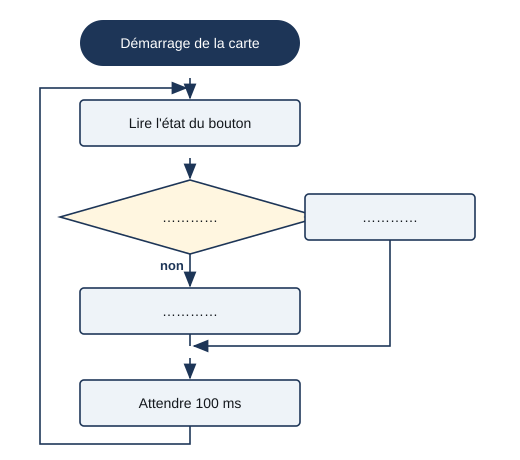

# Séance 3 — Un bouton pour commander

!!! info "Séance 3 sur 10 · 55 minutes · Classe entière (salle info)"

    Je lis l'état d'un bouton, je l'affiche au moniteur série et j'allume une LED selon cet état.

    [Fiche élève à imprimer (PDF)](fiches/3e-arduino-mbot-seance3-eleve.pdf)

    [Trace écrite de la séance](trace-ecrite-seance-3.md)

## AVANT — j'entre dans la question

#### Ce qu'on cherche

Dans Scratch, le bloc « touche pressée ? » répondait vrai ou faux. La carte Arduino doit, elle, lire une tension sur une broche pour savoir si un bouton est enfoncé.

**Comment la carte sait-elle qu'on appuie sur un bouton ?**

J'écris trois choses que je crois savoir. Je n'ai pas besoin d'avoir raison : je reviendrai sur ces lignes à la fin de l'heure.

| N° | Mes hypothèses de départ | Vérifié en fin de séance (✔ / ✘) |
|---|---|---|
| 1 |   |   |
| 2 |   |   |
| 3 |   |   |

#### Vocabulaire à repérer

| Mot | Ce que j'en comprends, avec mes mots |
|---|---|
| **entrée numérique** |   |
| **résistance de rappel** |   |
| **moniteur série** |   |
| **si sinon** |   |

## PENDANT — je recherche

### Activité 1 · Lire l'état du bouton dans Tinkercad

Dans Tinkercad, j'ouvre le circuit préparé par le professeur : un bouton relié au 5 V et à la broche 2, une résistance de 10 kΩ entre la broche 2 et GND. Je lance la simulation et j'ouvre le **moniteur série**.

*bouton-v1.ino*

```cpp
// bouton-v1 : la LED s'allume tant qu'on appuie sur le bouton
// Montage : bouton entre 5V et broche 2 ; résistance de rappel 10 kilohms entre broche 2 et GND
//           LED sur la broche 8 avec sa résistance de 220 ohms

const int BOUTON = 2;
const int LED = 8;

void setup() {
  pinMode(BOUTON, INPUT);
  pinMode(LED, OUTPUT);
  Serial.begin(9600);           // ouvrir le moniteur série à 9600 bauds
}

void loop() {
  int etat = digitalRead(BOUTON);   // 1 si appuyé, 0 sinon
  Serial.println(etat);
  if (etat == HIGH) {
    digitalWrite(LED, HIGH);
  } else {
    digitalWrite(LED, LOW);
  }
  delay(100);
}
```

| Situation | Valeur affichée |
|---|---|
| Bouton relâché |   |
| Bouton enfoncé |   |

a\. J'enlève la résistance de 10 kΩ. Que se passe-t-il sur le vrai montage quand le bouton est relâché ?

### Activité 2 · L'algorigramme de l'interrupteur

Je complète l'algorigramme du programme bouton-v1.



*Algorigramme de bouton-v1*

b\. Dans le programme, quelle ligne correspond au losange ?

c\. Pourquoi écrit-on `==` et pas `=` dans le test ?

### Activité 3 · Du bouton au télérupteur

Dans un couloir, un **télérupteur** allume la lumière au premier appui et l'éteint au suivant. Le bouton n'est plus maintenu : il faut mémoriser l'état de la lampe.

d\. De quelle variable le programme a-t-il besoin ?

e\. Pourquoi faut-il attendre que le bouton soit relâché avant de lire un nouvel appui ?

### Mon défi

!!! example "Mon défi · 3e"

    J'écris le programme du télérupteur.

## APRÈS — je fixe ce que j'ai appris

#### À retenir

!!! note "Deux documents, deux usages"

    Ce bloc se complète en classe, à la fin de l'heure : les phrases à trous se remplissent
    pendant la mise en commun. La [trace écrite de la séance](trace-ecrite-seance-3.md)
    reprend les mêmes notions rédigées, avec les définitions exactes et les compétences
    évaluées. C'est elle qui se colle dans le cahier.

Une **entrée numérique** lit deux états : **1** (HIGH, 5 V) ou **0** (LOW, 0 V). `digitalRead(2)` renvoie l'état de la broche 2.

Une **résistance de rappel** (10 kΩ vers GND) donne un état sûr quand le bouton est relâché.

Le **moniteur série** affiche ce que la carte envoie avec `Serial.println()` : c'est l'outil pour voir ce que lit la carte.

La structure **si sinon** (`if` / `else`) choisit entre deux actions, comme le bloc « si alors sinon » de Scratch.

Je complète : Bouton enfoncé, digitalRead renvoie `..........` ; relâché, il renvoie `..........`.

Je complète : Dans un test, on compare avec `..........`.

#### Je reviens sur mes hypothèses

Je remonte en haut de la fiche et je coche ✔ ou ✘. J'écris ici ce qui m'a le plus surpris :

#### La question de la prochaine séance

Peut-on faire un jeu de réflexe avec une LED et un bouton ?

## S'évaluer

[Ouvrir l'évaluation de la séance :material-arrow-right:](evaluation-seance-3.html){ .md-button .md-button--primary target=_blank }

Treize questions reprenant les activités et le vocabulaire de la séance. J'indique mon nom, mon prénom et ma classe : la note s'affiche à la fin et elle est envoyée au professeur. Je relis la trace écrite avant de commencer.
