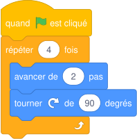
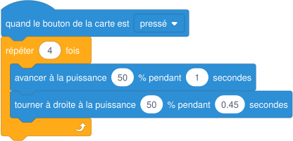

# Séance 7 — Le robot mBot

!!! info "Séance 7 sur 10 · 55 minutes · Classe entière"

    Je découvre le robot mBot, je programme un camarade « robot » puis je passe de Scratch à mBlock.

    [Fiche élève à imprimer (PDF)](fiches/3e-arduino-mbot-seance7-eleve.pdf)

    [Trace écrite de la séance](trace-ecrite-seance-7.md)

## AVANT — j'entre dans la question

#### Ce qu'on cherche

Le mBot est un petit robot à deux roues. Sa carte, la mCore, est une carte Arduino UNO adaptée. Il se programme avec mBlock 5, un logiciel construit à partir de Scratch.

**Qu'est-ce qui change quand le programme doit faire rouler un robot plutôt qu'un lutin ?**

J'écris trois choses que je crois savoir. Je n'ai pas besoin d'avoir raison : je reviendrai sur ces lignes à la fin de l'heure.

| N° | Mes hypothèses de départ | Vérifié en fin de séance (✔ / ✘) |
|---|---|---|
| 1 |   |   |
| 2 |   |   |
| 3 |   |   |

#### Vocabulaire à repérer

| Mot | Ce que j'en comprends, avec mes mots |
|---|---|
| **robot** |   |
| **moteur à courant continu** |   |
| **mode connecté** |   |
| **mode téléversé** |   |

## PENDANT — je recherche

### Activité 1 · Les éléments du mBot

Le professeur montre un mBot. Je complète le tableau.

| Élément | Capteur, actionneur ou traitement ? | Rôle |
|---|---|---|
| Carte mCore |   |   |
| Deux moteurs à courant continu |   |   |
| Capteur à ultrasons (port 3) |   |   |
| Suiveur de ligne (port 2) |   |   |
| Deux LED de couleur, buzzer |   |   |
| Bouton de la carte |   |   |

a\. Quel capteur du mBot ressemble à celui de la séance 6 ?

### Activité 2 · Le robot débranché

Un élève joue le robot. La classe écrit un programme qui lui fait parcourir un carré de 2 pas de côté. Première version sans boucle, puis version avec boucle.

*Le carré, avec une boucle*

b\. Combien d'instructions faut-il sans boucle ? Et avec la boucle ?

c\. Le « robot » a tourné un peu trop à chaque angle. Que devient le carré ?

### Activité 3 · De Scratch à mBlock

mBlock 5 reprend l'interface de Scratch. On y ajoute le mBot dans l'onglet **Appareils**, puis des blocs de déplacement apparaissent. Voici le carré pour le vrai robot (libellés à vérifier dans mBlock).

*Programme du carré pour le mBot, en mode téléversé*

|  | Mode connecté | Mode téléversé |
|---|---|---|
| Où s'exécute le programme ? |   |   |
| Le robot doit-il rester relié ? |   |   |
| Peut-on utiliser les lutins de la scène ? |   |   |

d\. Pour le défi du robot livreur, où le robot devra rouler seul sur une piste, quel mode choisir ?

e\. En mode téléversé, mBlock traduit les blocs en langage Arduino avant de les envoyer. Pourquoi ?

### Mon défi

!!! example "Mon défi · 3e"

    J'explique pourquoi un robot programmé « au temps » (pendant 1 seconde) ne refait jamais exactement le même carré.

## APRÈS — je fixe ce que j'ai appris

#### À retenir

!!! note "Deux documents, deux usages"

    Ce bloc se complète en classe, à la fin de l'heure : les phrases à trous se remplissent
    pendant la mise en commun. La [trace écrite de la séance](trace-ecrite-seance-7.md)
    reprend les mêmes notions rédigées, avec les définitions exactes et les compétences
    évaluées. C'est elle qui se colle dans le cahier.

Un **robot** perçoit son environnement par des **capteurs**, décide avec un **programme** et agit par des **actionneurs**, comme ses deux **moteurs à courant continu**.

La **boucle** évite de répéter les mêmes instructions ; une petite erreur répétée dans une boucle s'accumule.

mBlock 5 reprend Scratch. En **mode connecté**, le programme tourne sur l'ordinateur ; en **mode téléversé**, il est dans le robot, qui est autonome.

Je complète : Le suiveur de ligne et le capteur à ultrasons sont des `..........` ; les moteurs sont des `..........`.

Je complète : Pour que le robot roule seul, j'utilise le mode `..........`.

#### Je reviens sur mes hypothèses

Je remonte en haut de la fiche et je coche ✔ ou ✘. J'écris ici ce qui m'a le plus surpris :

#### La question de la prochaine séance

Comment faire parcourir au robot une distance précise ?

## S'évaluer

[Ouvrir l'évaluation de la séance :material-arrow-right:](evaluation-seance-7.html){ .md-button .md-button--primary target=_blank }

Treize questions reprenant les activités et le vocabulaire de la séance. J'indique mon nom, mon prénom et ma classe : la note s'affiche à la fin et elle est envoyée au professeur. Je relis la trace écrite avant de commencer.
