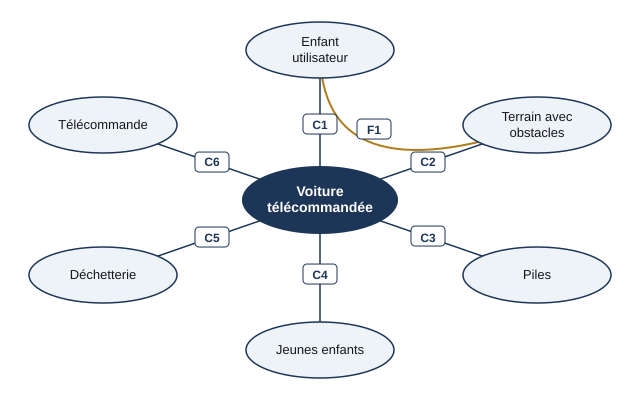

# Séance 2 — La sécurité d'un jouet : la voiture télécommandée

!!! info "Séance 2 sur 4 · 45 minutes · Demi-groupe"

    J'explique les choix de conception d'une voiture télécommandée et les contraintes de sécurité que son manuel décrit.

    [Fiche élève à imprimer (PDF)](fiches/4e-seq3-seance2-eleve.pdf)

    [Trace écrite de la séance](trace-ecrite-seance-2.md)

## AVANT — j'entre dans la question

#### J'observe

Le professeur fait rouler une voiture télécommandée tout-terrain (ou projette la photo du manuel, page 59), puis montre l'autocollant collé dessous. Je regarde.

| Je regarde | Ce que j'observe |
|---|---|
| La forme et la taille des roues |   |
| Le poids de la voiture quand je la prends en main |   |
| L'autocollant sous la voiture |   |

#### Ce qu'on cherche

Ce jouet va vite dans des endroits pleins d'obstacles. Il est piloté par un enfant, parfois près de plus petits que lui. Chaque détail de sa forme répond à une contrainte.

**Comment le concepteur d'un jouet protège-t-il ses utilisateurs ?**

J'écris trois choses que je crois savoir. Je n'ai pas besoin d'avoir raison : je reviendrai sur ces lignes à la fin de l'heure.

| N° | Mes hypothèses de départ | Vérifié en fin de séance (✔ / ✘) |
|---|---|---|
| 1 |   |   |
| 2 |   |   |
| 3 |   |   |

#### Vocabulaire à repérer

| Mot | Ce que j'en comprends, avec mes mots |
|---|---|
| **choix de conception** |   |
| **contrainte de sécurité** |   |
| **interacteur** |   |
| **DEEE** |   |

## PENDANT — je recherche

### Activité 1 · Expliquer les choix de conception

| Choix du concepteur | Raison | Famille de contrainte |
|---|---|---|
| Ressembler à une vraie voiture |   |   |
| Voiture légère |   |   |
| Grosses roues |   |   |
| Autocollant poubelle barrée |   |   |

### Activité 2 · Les dessins de sécurité du manuel

Le manuel de l'utilisateur de la voiture contient trois dessins : un pied qui écrase la voiture près d'une vraie voiture ; un bébé qui attrape la voiture ; un enfant qui se blesse l'œil avec l'antenne.

| Dessin | Contrainte de sécurité décrite |
|---|---|
| 1 |   |
| 2 |   |
| 3 |   |

a\. Quelle conséquence la dangerosité de l'antenne a-t-elle sur la conception ?

b\. Le moteur peut être chaud après une longue utilisation. Je décris par une phrase le quatrième dessin que j'ajouterais au manuel.

### Activité 3 · Le diagramme des interacteurs

Je complète les contraintes du diagramme de la voiture télécommandée.

*Diagramme des interacteurs de la voiture télécommandée*

- **F1** : permettre à l'enfant de piloter la voiture sur un terrain accidenté
- **C1** : `..........`
- **C2** : `..........`
- **C3** : `..........`
- **C4** : `..........`
- **C5** : `..........`
- **C6** : recevoir les ordres de la télécommande à distance

### Mon défi

!!! example "Mon défi · 4e"

    Je dessine sur ma fiche, en croquis simple, le quatrième dessin de sécurité (moteur chaud), avec un pictogramme compréhensible sans texte.

## APRÈS — je fixe ce que j'ai appris

#### À retenir

!!! note "Deux documents, deux usages"

    Ce bloc se complète en classe, à la fin de l'heure : les phrases à trous se remplissent
    pendant la mise en commun. La [trace écrite de la séance](trace-ecrite-seance-2.md)
    reprend les mêmes notions rédigées, avec les définitions exactes et les compétences
    évaluées. C'est elle qui se colle dans le cahier.

Chaque **choix de conception** (forme, poids, taille des roues, matériaux) répond à une contrainte.

Les **contraintes de sécurité** protègent l'utilisateur, les autres personnes et l'objet. Le manuel de l'utilisateur les décrit souvent par des dessins, compréhensibles sans lire.

La poubelle barrée signale un **DEEE** : l'objet se dépose en point de collecte. Le diagramme des **interacteurs** permet de n'oublier aucune contrainte.

Je complète : Les grosses roues répondent à une contrainte d'`..........` : franchir les obstacles.

Je complète : Un jouet électrique usagé est un `..........` : il se dépose en point de collecte.

#### Je reviens sur mes observations et mes hypothèses

Je coche ✔ ou ✘ chaque hypothèse. J'explique ensuite ce que j'ai observé au début de la séance, avec le vocabulaire de la séance :

#### La question de la prochaine séance

Comment expliquer à un utilisateur comment se servir d'un appareil, sans qu'il ait besoin d'un expert ?

## S'entraîner

[Ouvrir l'exercice autocorrectif :material-arrow-right:](exercices-seance-2.html){ .md-button .md-button--primary target=_blank }

Dix questions sur la séance. Je réponds, puis je vérifie : la correction et une explication s'affichent sous chaque question. Je recommence autant de fois que je veux ; rien n'est envoyé.
