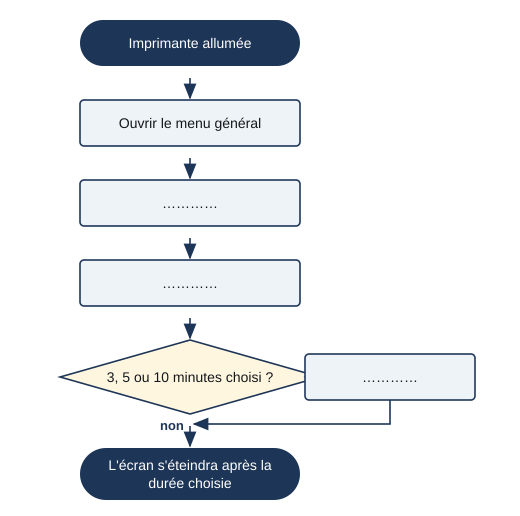

# Séance 3 — Décrire l'expérience de l'utilisateur : le manuel

!!! info "Séance 3 sur 4 · 45 minutes · Classe entière"

    Je découvre comment un manuel décrit l'utilisation d'un objet, du texte au dessin puis à l'algorigramme.

    [Fiche élève à imprimer (PDF)](fiches/4e-seq3-seance3-eleve.pdf)

    [Trace écrite de la séance](trace-ecrite-seance-3.md)

## AVANT — j'entre dans la question

#### J'observe

Le professeur projette une page du manuel de l'utilisateur d'une tondeuse robot (manuel Nathan, page 51) : quatre vignettes, fixation de la station, zone de tonte, pente, câble. Je regarde.

| Je regarde | Ce que j'observe |
|---|---|
| Ce qui est écrit, ce qui est dessiné |   |
| Les nombres sur les dessins |   |
| Les deux petits dessins avec une coche et une croix |   |

#### Ce qu'on cherche

Le concepteur connaît son objet par cœur. L'acheteur, lui, le découvre. Le manuel de l'utilisateur doit lui permettre de s'en servir seul, facilement, sans danger.

**Comment décrire à quelqu'un la façon d'utiliser un objet ?**

J'écris trois choses que je crois savoir. Je n'ai pas besoin d'avoir raison : je reviendrai sur ces lignes à la fin de l'heure.

| N° | Mes hypothèses de départ | Vérifié en fin de séance (✔ / ✘) |
|---|---|---|
| 1 |   |   |
| 2 |   |   |
| 3 |   |   |

#### Vocabulaire à repérer

| Mot | Ce que j'en comprends, avec mes mots |
|---|---|
| **manuel de l'utilisateur** |   |
| **expérience de l'utilisateur** |   |
| **mode de représentation** |   |
| **algorigramme** |   |

## PENDANT — je recherche

### Activité 1 · Les modes de représentation d'un manuel

| Vignette du manuel de la tondeuse | Mode de représentation | Ce qu'elle apprend à l'utilisateur |
|---|---|---|
| 1. Fixer la station au sol |   |   |
| 2. Délimiter la zone de tonte |   |   |
| 3. Zones à éviter |   |   |
| 4. Installer le câble |   |   |

a\. Pourquoi un manuel utilise-t-il autant de dessins ?

### Activité 2 · Le manuel d'une imprimante

Dans le manuel d'une imprimante (exercice 4), on trouve trois dessins : 1. des tas de feuilles, trois barrés et un coché ; 2. une feuille au coin corné qui devient une feuille bien plate ; 3. un réservoir d'encre qu'on remplit, capot ouvert.

| Dessin | Ce qu'il veut dire |
|---|---|
| 1 |   |
| 2 |   |
| 3 |   |

### Activité 3 · Du texte à l'algorigramme

Pour économiser l'énergie, l'écran de l'imprimante peut s'éteindre seul. Le manuel dit en texte : aller dans le menu général, puis « Maintenance », puis « Minuterie », et choisir 3, 5 ou 10 minutes d'inactivité. Je complète l'algorigramme de cette procédure.

*Algorigramme du réglage de la minuterie*

b\. Pour l'utilisateur, qu'apporte l'algorigramme par rapport au texte ?

### Mon défi

!!! example "Mon défi · 4e"

    J'écris en cinq étapes numérotées, sans phrase inutile, comment allumer un ordinateur de la salle et ouvrir la session.

## APRÈS — je fixe ce que j'ai appris

#### À retenir

!!! note "Deux documents, deux usages"

    Ce bloc se complète en classe, à la fin de l'heure : les phrases à trous se remplissent
    pendant la mise en commun. La [trace écrite de la séance](trace-ecrite-seance-3.md)
    reprend les mêmes notions rédigées, avec les définitions exactes et les compétences
    évaluées. C'est elle qui se colle dans le cahier.

Le **manuel de l'utilisateur** indique de façon compréhensible les contraintes de l'objet et la façon de s'en servir.

Il utilise plusieurs **modes de représentation** : texte court, croquis, schéma coté, algorigramme. On passe du langage naturel au schéma pour être plus clair.

Un bon manuel rend l'**expérience de l'utilisateur** facile : il comprend vite, sans aide d'un expert, et sans danger.

Je complète : Une procédure à suivre étape par étape se représente par un `..........`.

Je complète : Le document qui explique comment utiliser un objet est le `..........`.

#### Je reviens sur mes observations et mes hypothèses

Je coche ✔ ou ✘ chaque hypothèse. J'explique ensuite ce que j'ai observé au début de la séance, avec le vocabulaire de la séance :

#### La question de la prochaine séance

Saurai-je concevoir un objet nouveau en tenant compte de toutes ses contraintes ?

## S'entraîner

[Ouvrir l'exercice autocorrectif :material-arrow-right:](exercices-seance-3.html){ .md-button .md-button--primary target=_blank }

Dix questions sur la séance. Je réponds, puis je vérifie : la correction et une explication s'affichent sous chaque question. Je recommence autant de fois que je veux ; rien n'est envoyé.
