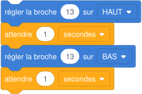

# Séance 1 — De Scratch à Arduino

!!! info "Séance 1 sur 10 · 55 minutes · Classe entière (salle info)"

    Je passe d'un programme qui agit sur un écran à un programme qui agit sur un objet réel.

    [Fiche élève à imprimer (PDF)](fiches/4e-arduino-mbot-seance1-eleve.pdf)

    [Trace écrite de la séance](trace-ecrite-seance-1.md)

## AVANT — j'entre dans la question

#### Ce qu'on cherche

Dans Scratch, le programme faisait bouger des lutins sur un écran. Une carte Arduino exécute aussi un programme, mais elle commande des composants réels : une lampe, un moteur, un buzzer.

**Comment un programme peut-il agir sur un objet réel ?**

J'écris trois choses que je crois savoir. Je n'ai pas besoin d'avoir raison : je reviendrai sur ces lignes à la fin de l'heure.

| N° | Mes hypothèses de départ | Vérifié en fin de séance (✔ / ✘) |
|---|---|---|
| 1 |   |   |
| 2 |   |   |
| 3 |   |   |

#### Vocabulaire à repérer

| Mot | Ce que j'en comprends, avec mes mots |
|---|---|
| **microcontrôleur** |   |
| **capteur** |   |
| **actionneur** |   |
| **broche** |   |
| **simulation** |   |

## PENDANT — je recherche

### Activité 1 · Les composants du kit

Le professeur présente le kit. Je complète le tableau.

| Composant du kit | Rôle | Capteur, actionneur ou traitement ? |
|---|---|---|
| Carte Arduino UNO |   |   |
| Bouton poussoir |   |   |
| LED |   |   |
| Photorésistance |   |   |
| Capteur à ultrasons HC-SR04 |   |   |
| Buzzer |   |   |
| Servomoteur |   |   |

a\. Dans le jeu Scratch, qu'est-ce qui jouait le rôle du capteur ? Et de l'actionneur ?

### Activité 2 · Premier programme dans Tinkercad

Je me connecte à Tinkercad Circuits avec le code de la classe. Je place une carte Arduino UNO, j'ouvre l'onglet **Code** et je choisis l'affichage en **Blocs**. Les blocs placés dans la zone de code se répètent en boucle, comme dans un « répéter indéfiniment ».



*Programme en blocs dans Tinkercad (libellés à vérifier sur l'interface)*

b\. Je lance la simulation. Que fait la petite LED marquée L sur la carte ?

c\. Je remplace les deux « 1 seconde » par 0,2. Qu'est-ce qui change ?

### Activité 3 · Les blocs deviennent du texte

Je passe l'affichage en **Blocs + Texte**. Tinkercad montre le même programme écrit en langage Arduino (C++).

*Le même programme en texte*

```cpp
void setup()
{
  pinMode(LED_BUILTIN, OUTPUT);
}

void loop()
{
  digitalWrite(LED_BUILTIN, HIGH);
  delay(1000); // Wait for 1000 millisecond(s)
  digitalWrite(LED_BUILTIN, LOW);
  delay(1000); // Wait for 1000 millisecond(s)
}
```

| Partie du programme | Quand est-elle exécutée ? |
|---|---|
| setup() |   |
| loop() |   |

d\. Dans quelle unité `delay()` compte-t-il le temps ?

### Mon défi

!!! example "Mon défi · 4e"

    Je fais clignoter la LED deux fois vite (0,2 s), puis je laisse une pause d'une seconde, et ainsi de suite.

## APRÈS — je fixe ce que j'ai appris

#### À retenir

!!! note "Deux documents, deux usages"

    Ce bloc se complète en classe, à la fin de l'heure : les phrases à trous se remplissent
    pendant la mise en commun. La [trace écrite de la séance](trace-ecrite-seance-1.md)
    reprend les mêmes notions rédigées, avec les définitions exactes et les compétences
    évaluées. C'est elle qui se colle dans le cahier.

Une carte Arduino contient un **microcontrôleur** qui exécute un programme. Elle **acquiert** des informations par des **capteurs**, les **traite**, puis **agit** par des **actionneurs**.

Chaque composant est branché sur une **broche** numérotée.

Un programme Arduino a deux parties : **setup()**, exécutée une fois au démarrage, et **loop()**, répétée sans fin.

Tinkercad permet une **simulation** : on teste le programme avant de toucher au matériel.

Je complète : Le bouton poussoir est un `..........` ; la LED est un `..........`.

Je complète : delay(500) attend `..........`, soit une demi-seconde.

#### Je reviens sur mes hypothèses

Je remonte en haut de la fiche et je coche ✔ ou ✘. J'écris ici ce qui m'a le plus surpris :

#### La question de la prochaine séance

Comment brancher une vraie LED sur la carte sans l'abîmer ?

## S'évaluer

[Ouvrir l'évaluation de la séance :material-arrow-right:](evaluation-seance-1.html){ .md-button .md-button--primary target=_blank }

Douze questions reprenant les activités et le vocabulaire de la séance. J'indique mon nom, mon prénom et ma classe : la note s'affiche à la fin et elle est envoyée au professeur. Je relis la trace écrite avant de commencer.
