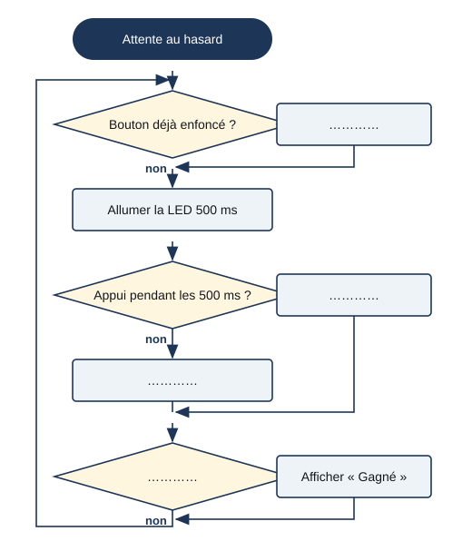

# Séance 4 — Le jeu « attrape la lumière »

!!! info "Séance 4 sur 10 · 55 minutes · Demi-groupe"

    Je joue à un jeu de réflexe programmé sur la carte, je découvre une triche et je propose une correction.

    [Fiche élève à imprimer (PDF)](fiches/4e-arduino-mbot-seance4-eleve.pdf)

    [Trace écrite de la séance](trace-ecrite-seance-4.md)

## AVANT — j'entre dans la question

#### J'observe

Le professeur joue à reflexe-v1 devant la classe, moniteur série projeté. Puis il garde le bouton enfoncé en permanence.

| Je regarde | Ce que j'observe |
|---|---|
| Le moment où la LED s'allume |   |
| Le moniteur série après chaque essai |   |
| Le score quand le bouton reste enfoncé |   |

#### Ce qu'on cherche

Le jeu reprend les idées du jeu vidéo programmé dans Scratch : un score, des vies, une fin de partie. Mais un joueur malin a trouvé comment gagner à tous les coups.

**Comment programmer un jeu de réflexe juste, où l'on ne peut pas tricher ?**

#### Vocabulaire à repérer

| Mot | Ce que j'en comprends, avec mes mots |
|---|---|
| **variable** |   |
| **nombre aléatoire** |   |
| **millis()** |   |
| **cas de test** |   |

## PENDANT — je recherche

### Activité 1 · Lire le programme

Je téléverse **reflexe-v1.ino** (montage : LED broche 8, bouton broche 2) et je lis le programme.

*reflexe-v1.ino*

```cpp
// reflexe-v1 : jeu « attrape la lumière »
// La LED s'allume au hasard ; il faut appuyer sur le bouton en moins d'une demi-seconde.
// Montage : LED sur la broche 8 (220 ohms), bouton sur la broche 2 (rappel 10 kilohms vers GND)
// Cette version contient une triche : à trouver pendant la séance.

const int LED = 8;
const int BOUTON = 2;
int score = 0;
int vies = 3;

void setup() {
  pinMode(LED, OUTPUT);
  pinMode(BOUTON, INPUT);
  Serial.begin(9600);
  randomSeed(analogRead(A0));    // broche A0 en l'air : un départ différent à chaque fois
  Serial.println("Attrape la lumiere !");
}

void loop() {
  if (vies < 1) {                // partie terminée : on ne fait plus rien
    return;
  }
  delay(random(1000, 3000));     // attente au hasard entre 1 et 3 secondes
  digitalWrite(LED, HIGH);
  unsigned long debut = millis();
  bool attrape = false;
  while (millis() - debut < 500) {        // pendant 500 ms
    if (digitalRead(BOUTON) == HIGH) {
      attrape = true;
    }
  }
  digitalWrite(LED, LOW);
  if (attrape) {
    score = score + 1;
  } else {
    vies = vies - 1;
  }
  Serial.print("Score : ");
  Serial.print(score);
  Serial.print("   Vies : ");
  Serial.println(vies);
  if (vies < 1) {
    Serial.println("Perdu !");
  }
}
```

| Élément du jeu | Ligne du programme |
|---|---|
| Le score et les vies au départ |   |
| L'attente au hasard |   |
| La fenêtre de 500 ms pour appuyer |   |
| La fin de partie |   |

a\. Pourquoi l'attente est-elle tirée au hasard ?

### Activité 2 · Trouver la triche

Je joue une partie honnête, puis une partie en gardant le bouton enfoncé. Je compare.

| Cas de test | Score au bout de 5 essais | Vies |
|---|---|---|
| Je joue normalement |   |   |
| Je garde le bouton enfoncé |   |   |

b\. Pourquoi la triche marche-t-elle ?

### Activité 3 · Corriger : reflexe-v2

Je décris la correction avant de l'écrire. Juste avant d'allumer la LED, le programme doit vérifier le bouton.



*Algorigramme de reflexe-v2*

c\. Quel test faut-il refaire après la correction ?

### Mon défi

!!! example "Mon défi · 4e"

    Je fais afficher au moniteur série le temps de réaction du joueur quand il réussit.

## APRÈS — je fixe ce que j'ai appris

#### À retenir

!!! note "Deux documents, deux usages"

    Ce bloc se complète en classe, à la fin de l'heure : les phrases à trous se remplissent
    pendant la mise en commun. La [trace écrite de la séance](trace-ecrite-seance-4.md)
    reprend les mêmes notions rédigées, avec les définitions exactes et les compétences
    évaluées. C'est elle qui se colle dans le cahier.

Un jeu sur carte utilise des **variables** comme dans Scratch : score, vies.

`random(1000, 3000)` tire un **nombre aléatoire** : le joueur ne peut pas prévoir. `millis()` mesure le temps écoulé.

Un programme se teste aussi avec des **cas de test** anormaux : bouton maintenu, appui trop tôt. C'est ainsi qu'on trouve une triche.

On décrit la correction (algorigramme) avant de l'écrire, puis on refait tous les tests.

Je complète : random(1000, 3000) donne un nombre entre 1 000 et `..........`.

Je complète : Le cas de test « bouton `..........` » révèle la triche de la version 1.

#### Retour sur mes observations

Je relis ce que j'ai noté dans « J'observe ». J'explique maintenant ce que j'ai vu, avec le vocabulaire de la séance :

#### La question de la prochaine séance

Comment la carte mesure-t-elle une grandeur qui varie, comme la lumière ?

## S'évaluer

[Ouvrir l'évaluation de la séance :material-arrow-right:](evaluation-seance-4.html){ .md-button .md-button--primary target=_blank }

Douze questions reprenant les activités et le vocabulaire de la séance. J'indique mon nom, mon prénom et ma classe : la note s'affiche à la fin et elle est envoyée au professeur. Je relis la trace écrite avant de commencer.
