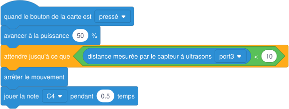

# Séance 8 — Étalonner les déplacements du robot

!!! info "Séance 8 sur 10 · 55 minutes · Demi-groupe"

    Je mesure ce que fait vraiment le robot, j'en déduis les bons réglages, puis je le fais s'arrêter devant un obstacle.

    [Fiche élève à imprimer (PDF)](fiches/4e-arduino-mbot-seance8-eleve.pdf)

    [Trace écrite de la séance](trace-ecrite-seance-8.md)

## AVANT — j'entre dans la question

#### J'observe

Le professeur lance deux fois le même programme : « avancer à la puissance 50 % pendant 1 seconde ». Un élève marque au sol le point d'arrivée.

| Je regarde | Ce que j'observe |
|---|---|
| La distance parcourue lors des deux essais |   |
| La trajectoire du robot |   |
| Le robot à la fin du mouvement |   |

#### Ce qu'on cherche

Le programme ne dit pas « avance de 30 cm » mais « avance pendant 1 seconde ». Pour obtenir une distance précise, il faut mesurer ce que fait réellement le robot.

**Comment obtenir d'un robot un déplacement précis ?**

#### Vocabulaire à repérer

| Mot | Ce que j'en comprends, avec mes mots |
|---|---|
| **étalonnage** |   |
| **moyenne** |   |
| **vitesse** |   |
| **attendre jusqu'à ce que** |   |

## PENDANT — je recherche

### Activité 1 · Mesurer la distance parcourue

Je téléverse un programme « avancer à 50 % pendant 1 seconde ». Je fais trois essais et je mesure à la règle.

| Essai | 1 | 2 | 3 | Moyenne |
|---|---|---|---|---|
| Distance (cm) |   |   |   |   |

a\. Je calcule la vitesse moyenne du robot en cm/s.

b\. Pendant combien de temps faut-il avancer pour parcourir 45 cm ?

### Activité 2 · Étalonner un quart de tour

Je cherche la durée de rotation qui donne un angle droit à 50 %. J'essaie plusieurs durées et je note.

| Durée de rotation | 0,3 s | 0,4 s | 0,5 s | 0,6 s |
|---|---|---|---|---|
| Angle obtenu (environ) |   |   |   |   |

*livreur-v1 : le carré, à régler avec mes mesures*

c\. Je remplace 0,45 par ma durée mesurée et je teste le carré. Se referme-t-il ?

### Activité 3 · S'arrêter devant un obstacle

Au lieu d'avancer pendant un temps fixé, le robot avance jusqu'à ce que le capteur à ultrasons mesure moins de 10 cm.

*livreur-v2 : avancer jusqu'à l'obstacle*

d\. Pourquoi cette méthode est-elle plus sûre que « avancer pendant 2 secondes » ?

### Mon défi

!!! example "Mon défi · 4e"

    Je fais faire au robot un aller-retour de 50 cm : avancer, faire demi-tour, revenir au point de départ.

## APRÈS — je fixe ce que j'ai appris

#### À retenir

!!! note "Deux documents, deux usages"

    Ce bloc se complète en classe, à la fin de l'heure : les phrases à trous se remplissent
    pendant la mise en commun. La [trace écrite de la séance](trace-ecrite-seance-8.md)
    reprend les mêmes notions rédigées, avec les définitions exactes et les compétences
    évaluées. C'est elle qui se colle dans le cahier.

Un robot programmé « au temps » ne parcourt pas toujours la même distance : sol, piles, glissements.

L'**étalonnage** relie un réglage à un résultat. On fait plusieurs essais et on calcule la **moyenne**.

À partir de la **vitesse** mesurée, on calcule la durée : **durée = distance ÷ vitesse**.

Un capteur rend le robot plus sûr : « **attendre jusqu'à ce que** distance < 10 » arrête le robot sur une mesure réelle.

Je complète : Pour parcourir 60 cm à 30 cm/s, il faut avancer pendant `..........` secondes.

Je complète : On fait plusieurs essais et on calcule la `..........`.

#### Retour sur mes observations

Je relis ce que j'ai noté dans « J'observe ». J'explique maintenant ce que j'ai vu, avec le vocabulaire de la séance :

#### La question de la prochaine séance

Comment un robot peut-il suivre une ligne noire au sol ?

## S'évaluer

[Ouvrir l'évaluation de la séance :material-arrow-right:](evaluation-seance-8.html){ .md-button .md-button--primary target=_blank }

Douze questions reprenant les activités et le vocabulaire de la séance. J'indique mon nom, mon prénom et ma classe : la note s'affiche à la fin et elle est envoyée au professeur. Je relis la trace écrite avant de commencer.
