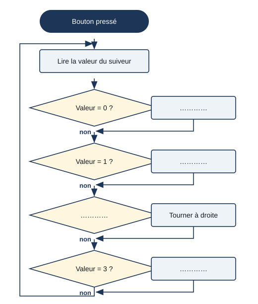
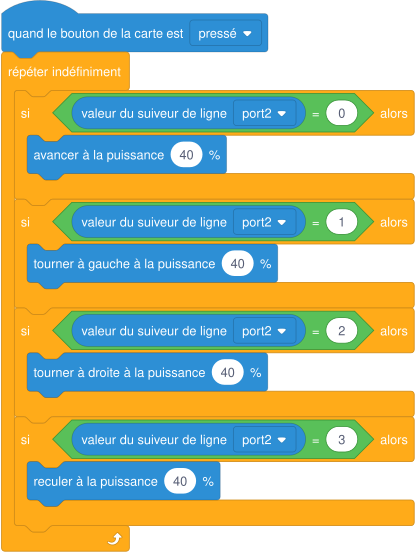

# Séance 9 — Suivre une ligne

!!! info "Séance 9 sur 10 · 55 minutes · Classe entière (salle info)"

    Je comprends comment le robot détecte une ligne noire, j'écris l'algorithme du suiveur et je choisis la puissance.

    [Fiche élève à imprimer (PDF)](fiches/4e-arduino-mbot-seance9-eleve.pdf)

    [Trace écrite de la séance](trace-ecrite-seance-9.md)

## AVANT — j'entre dans la question

#### Ce qu'on cherche

Dans un entrepôt, des robots transportent des colis en suivant des lignes tracées au sol. Le mBot possède sous son avant un capteur à deux « yeux » tourné vers le sol.

**Comment un robot peut-il suivre une ligne noire sans la voir comme nous ?**

J'écris trois choses que je crois savoir. Je n'ai pas besoin d'avoir raison : je reviendrai sur ces lignes à la fin de l'heure.

| N° | Mes hypothèses de départ | Vérifié en fin de séance (✔ / ✘) |
|---|---|---|
| 1 |   |   |
| 2 |   |   |
| 3 |   |   |

#### Vocabulaire à repérer

| Mot | Ce que j'en comprends, avec mes mots |
|---|---|
| **capteur infrarouge** |   |
| **réflexion** |   |
| **valeur du suiveur** |   |
| **compromis** |   |

## PENDANT — je recherche

### Activité 1 · Ce que voit le suiveur de ligne

Chaque « œil » émet de la lumière infrarouge vers le sol. Sur le blanc, la lumière revient ; sur le noir, elle est absorbée. La carte résume les deux yeux par une valeur de 0 à 3. Dans le montage de la classe, la valeur 1 signifie : œil gauche sur le noir, œil droit sur le blanc.

| Œil gauche | Œil droit | Valeur | Position du robot | Que faire ? |
|---|---|---|---|---|
| noir | noir | 0 |   |   |
| noir | blanc | 1 |   |   |
| blanc | noir | 2 |   |   |
| blanc | blanc | 3 |   |   |

a\. Pourquoi le robot ne peut-il pas suivre une ligne grise sur un sol gris ?

### Activité 2 · L'algorithme du suiveur

Je complète l'algorigramme, puis je le compare au programme.

*Algorigramme du suiveur de ligne*

*Programme du suiveur de ligne (libellés à vérifier dans mBlock)*

b\. Pourquoi le programme est-il dans une boucle « répéter indéfiniment » ?

### Activité 3 · Choisir la puissance

La classe teste le programme sur la piste à trois puissances. Je note les résultats.

| Puissance | Temps pour un tour de piste | Sorties de piste |
|---|---|---|
| 30 % |   |   |
| 50 % |   |   |
| 70 % |   |   |

c\. Quelle puissance retenir ? Je justifie par un compromis.

### Mon défi

!!! example "Mon défi · 4e"

    J'ajoute au programme une LED verte quand le robot est sur la ligne (valeur 0) et rouge quand il l'a perdue (valeur 3).

## APRÈS — je fixe ce que j'ai appris

#### À retenir

!!! note "Deux documents, deux usages"

    Ce bloc se complète en classe, à la fin de l'heure : les phrases à trous se remplissent
    pendant la mise en commun. La [trace écrite de la séance](trace-ecrite-seance-9.md)
    reprend les mêmes notions rédigées, avec les définitions exactes et les compétences
    évaluées. C'est elle qui se colle dans le cahier.

Le suiveur de ligne est un **capteur infrarouge** : le blanc **réfléchit** la lumière, le noir l'absorbe. Il faut un bon contraste.

La **valeur du suiveur** résume les deux yeux : **0** sur la ligne, **1** ligne à gauche, **2** ligne à droite, **3** ligne perdue.

L'algorithme lit le capteur **sans arrêt** dans une boucle et choisit le mouvement selon la valeur.

La puissance est un **compromis** entre vitesse et précision : on la choisit par des essais.

Je complète : Valeur 1 : l'œil gauche est sur le noir, le robot tourne à `..........`.

Je complète : Sur le blanc, la lumière infrarouge est `..........` ; sur le noir, elle est absorbée.

#### Je reviens sur mes hypothèses

Je remonte en haut de la fiche et je coche ✔ ou ✘. J'écris ici ce qui m'a le plus surpris :

#### La question de la prochaine séance

Le robot peut-il livrer un colis en suivant la ligne et en s'arrêtant au bon endroit ?

## S'évaluer

[Ouvrir l'évaluation de la séance :material-arrow-right:](evaluation-seance-9.html){ .md-button .md-button--primary target=_blank }

Douze questions reprenant les activités et le vocabulaire de la séance. J'indique mon nom, mon prénom et ma classe : la note s'affiche à la fin et elle est envoyée au professeur. Je relis la trace écrite avant de commencer.
