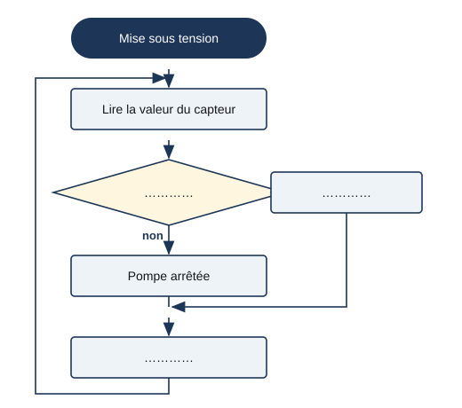

# Séance 2 — Qui décide d'arroser ? Les deux chaînes et la règle « si »

!!! info "Séance 2 sur 3 · 40 minutes · Classe entière"

    Je décris comment le kit Grove décide d'arroser : ses deux chaînes, la valeur donnée par le capteur, puis la règle « si la terre est sèche, alors arroser ».

    [Fiche élève à imprimer (PDF)](fiches/4e-jardin-seance2-eleve.pdf)

    [Trace écrite de la séance](trace-ecrite-seance-2.md)

## AVANT — j'entre dans la question

#### J'observe

Le professeur présente le kit Grove monté : carte Arduino avec son Base Shield, capteur d'humidité planté dans un pot, relais, pompe dans un bocal. Il plante le capteur dans de la terre sèche, puis dans de la terre mouillée. Je regarde et j'écoute.

| Je regarde | Ce que j'observe |
|---|---|
| Quand le capteur est dans la terre sèche |   |
| Quand le capteur est dans la terre mouillée |   |

#### Ce qu'on cherche

Personne ne touche la pompe : le système décide seul. Il mesure quelque chose, compare, puis donne un ordre. Pour le programmer, il faut savoir ce que mesure le capteur et écrire la règle de décision.

**Comment le système sait-il qu'il faut arroser ?**

J'écris trois choses que je crois savoir. Je n'ai pas besoin d'avoir raison : je reviendrai sur ces lignes à la fin de l'heure.

| N° | Mes hypothèses de départ | Vérifié en fin de séance (✔ / ✘) |
|---|---|---|
| 1 |   |   |
| 2 |   |   |
| 3 |   |   |

#### Vocabulaire à repérer

| Mot | Ce que j'en comprends, avec mes mots |
|---|---|
| **capteur** |   |
| **actionneur** |   |
| **chaîne d'information** |   |
| **seuil** |   |

## PENDANT — je recherche

### Activité 1 · Les deux chaînes du kit Grove

Je place chaque composant du kit dans la bonne case : alimentation 12 V, capteur d'humidité, carte Arduino, relais, pompe, tuyau et goutteurs.

| Chaîne | Fonction | Composant du kit |
|---|---|---|
| information | acquérir (mesurer l'humidité) |   |
| information | traiter (comparer, décider) |   |
| information | communiquer (donner l'ordre) |   |
| énergie | alimenter |   |
| énergie | distribuer |   |
| énergie | convertir |   |
| énergie | transmettre |   |

a\. Quelle grandeur physique le capteur mesure-t-il ?

b\. Pourquoi dit-on que le relais fait le lien entre les deux chaînes ?

### Activité 2 · Étalonner, puis écrire la règle

!!! note "Relevés d'étalonnage de la classe"

    Le capteur renvoie un nombre entre 0 et 1023. Terre sèche : **200**. Terre juste arrosée : **600**. Plus la terre est humide, plus le nombre est grand.

    Humidité en % = 100 × (valeur − 200) ÷ (600 − 200)

c\. Le capteur renvoie 400. Quelle est l'humidité en pourcentage ?

d\. Nos plantes xérophytes sont arrosées quand l'humidité descend sous 30 %. À quelle valeur du capteur cela correspond-il ?

*Algorigramme de l'arrosage automatique*

e\. Pourquoi attendre longtemps (30 minutes dans le jardin) après un arrosage avant de relire le capteur ?

### Mon défi

!!! example "Mon défi · 4e"

    Le capteur se débranche : la carte lit 0 en permanence. Que fait le programme ? Je propose une sécurité.

    *Prolongement : en fin d'heure si le temps le permet, sinon à la maison.*

## APRÈS — je fixe ce que j'ai appris

#### À retenir

!!! note "Deux documents, deux usages"

    Ce bloc se complète en classe, à la fin de l'heure : les phrases à trous se remplissent
    pendant la mise en commun. La [trace écrite de la séance](trace-ecrite-seance-2.md)
    reprend les mêmes notions rédigées, avec les définitions exactes et les compétences
    évaluées. C'est elle qui se colle dans le cahier.

Le système automatisé se décrit par deux chaînes. La **chaîne d'information** acquiert (capteur), traite (carte Arduino) et communique (ordre au relais). La chaîne d'énergie alimente (12 V), distribue (relais), convertit (pompe) et transmet (tuyau, goutteurs).

Le **capteur** transforme l'humidité en nombre ; l'**actionneur**, la pompe, transforme l'énergie en action.

L'**étalonnage** consiste à relever la valeur du capteur dans deux états connus : terre sèche (200), terre arrosée (600).

La règle s'écrit dans un algorigramme : **si** la valeur est sous le **seuil** de 320 (30 %), **alors** la pompe tourne 3 s, puis on attend.

Je complète : Le composant qui mesure l'humidité de la terre est le `..........`.

Je complète : La valeur limite qui déclenche l'arrosage est le `..........`.

#### Je reviens sur mes observations et mes hypothèses

Je coche ✔ ou ✘ chaque hypothèse. J'explique ensuite ce que j'ai observé au début de la séance, avec le vocabulaire de la séance :

#### La question de la prochaine séance

Comment mettre cette règle dans la carte et la tester sur le vrai kit ?

## S'entraîner

[Ouvrir l'exercice autocorrectif :material-arrow-right:](exercices-seance-2.html){ .md-button .md-button--primary target=_blank }

Dix questions sur la séance. Je réponds, puis je vérifie : la correction et une explication s'affichent sous chaque question. Je recommence autant de fois que je veux ; rien n'est envoyé.
