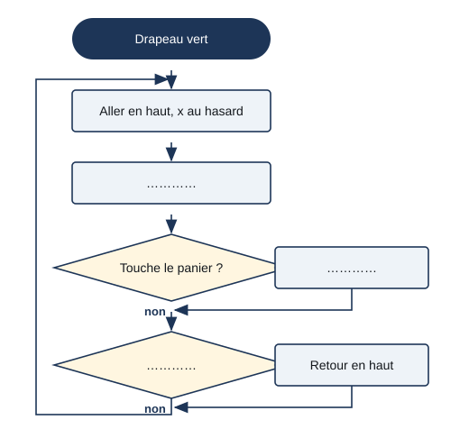

# Séance 3 — Règles, algorithme et variables

!!! info "Séance 3 sur 8 · 55 minutes · Classe entière"

    J'écris les règles du jeu de façon assez précise pour qu'une machine puisse les suivre.

    [Fiche élève à imprimer (PDF)](fiches/4e-jeu-video-seance3-eleve.pdf)

    [Trace écrite de la séance](trace-ecrite-seance-3.md)

## AVANT — j'entre dans la question

#### Ce qu'on cherche

Un camarade joue le rôle d'un robot : il exécute exactement ce qu'on lui dit, ni plus ni moins. On lui demande d'« attraper les mangues ».

**Comment écrire les règles d'un jeu pour qu'un ordinateur puisse les appliquer ?**

J'écris trois choses que je crois savoir. Je n'ai pas besoin d'avoir raison : je reviendrai sur ces lignes à la fin de l'heure.

| N° | Mes hypothèses de départ | Vérifié en fin de séance (✔ / ✘) |
|---|---|---|
| 1 |   |   |
| 2 |   |   |
| 3 |   |   |

#### Vocabulaire à repérer

| Mot | Ce que j'en comprends, avec mes mots |
|---|---|
| **algorithme** |   |
| **algorigramme** |   |
| **variable** |   |
| **ambiguïté** |   |

## PENDANT — je recherche

### Activité 1 · Le robot joueur

Par deux : l'un est le robot, l'autre le programmeur. Des boules de papier jouent les mangues. Le programmeur donne des ordres ; le robot les exécute à la lettre.

a\. Je recopie une instruction qui a posé problème au robot. Pourquoi ?

b\. Je la réécris pour qu'elle soit sans ambiguïté.

### Activité 2 · L'algorigramme de la mangue

Voici les règles de la mangue : elle apparaît en haut ; elle descend ; si elle touche le panier, le score augmente de 1 et elle remonte ; si elle touche le bas, elle remonte sans point. Je complète l'algorigramme.

*Algorigramme de la Mangue : la flèche de gauche ramène au début de la boucle*

c\. Quel symbole représente une question dont la réponse est oui ou non ?

d\. Dans le script de la mangue, quel bloc Scratch correspond au losange ?

### Activité 3 · La carte d'identité du jeu

Le jeu retient des informations qui changent pendant la partie. Ce sont des **variables**. Je complète la carte d'identité.

| Variable | Valeur au départ | Quand elle change | Comment |
|---|---|---|---|
| score |   |   |   |
| vies |   |   |   |
| vitesse |   |   |   |

e\. Si le jeu se joue à deux joueurs, quelles variables faut-il ajouter ?

f\. Quelle règle met fin à la partie ?

### Mon défi

!!! example "Mon défi · 4e"

    Je dessine l'algorigramme du scarabée.

## APRÈS — je fixe ce que j'ai appris

#### À retenir

!!! note "Deux documents, deux usages"

    Ce bloc se complète en classe, à la fin de l'heure : les phrases à trous se remplissent
    pendant la mise en commun. La [trace écrite de la séance](trace-ecrite-seance-3.md)
    reprend les mêmes notions rédigées, avec les définitions exactes et les compétences
    évaluées. C'est elle qui se colle dans le cahier.

Un **algorithme** est une suite d'instructions précises, sans **ambiguïté**, qui résout un problème. Un ordinateur exécute exactement ce qu'on lui écrit.

Un **algorigramme** dessine l'algorithme : l'ovale pour le début, le rectangle pour une action, le losange pour une question à réponse oui ou non.

Une **variable** est une case mémoire qui porte un nom et contient une valeur qui change, comme le score ou les vies.

Je complète : Dans un algorigramme, une question oui ou non se dessine dans un `..........`.

Je complète : Au début de la partie, la variable vies vaut `..........`.

#### Je reviens sur mes hypothèses

Je remonte en haut de la fiche et je coche ✔ ou ✘. J'écris ici ce qui m'a le plus surpris :

#### La question de la prochaine séance

Comment le jeu sait-il que la partie est finie ?

## S'évaluer

[Ouvrir l'évaluation de la séance :material-arrow-right:](evaluation-seance-3.html){ .md-button .md-button--primary target=_blank }

Treize questions reprenant les activités et le vocabulaire de la séance. J'indique mon nom, mon prénom et ma classe : la note s'affiche à la fin et elle est envoyée au professeur. Je relis la trace écrite avant de commencer.
