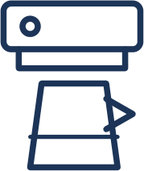

# Séance 2 — Plusieurs objets pour un même service

!!! info "Séance 2 sur 3 · 40 minutes"

    Famille d'objets, principes techniques, fonction d'estime.

    [Fiche élève à imprimer (PDF)](fiches/5e-seq1-seance2-eleve.pdf)

    [Trace écrite de la séance](trace-ecrite-seance-2.md)

## AVANT — j'entre dans la question

#### Ce qu'on cherche

Le bus, le vélo et la trottinette me conduisent tous les trois au collège. Ils n'ont ni la même forme, ni le même fonctionnement, ni le même prix.

**Plusieurs objets techniques peuvent-ils rendre le même service ? Et si oui, comment les distinguer les uns des autres ?**

J'écris trois choses que je crois savoir. Je n'ai pas besoin d'avoir raison : je reviendrai sur ces lignes à la fin de l'heure.

| N°  | Mes hypothèses de départ | Vérifié en fin de séance (✔ / ✘) |
|-----|--------------------------|----------------------------------|
| 1   |                          |                                  |
| 2   |                          |                                  |
| 3   |                          |                                  |

#### Vocabulaire à repérer

| Mot                    | Ce que j'en comprends, avec mes mots |
|------------------------|--------------------------------------|
| **famille d'objets**   |                                      |
| **principe technique** |                                      |
| **fonction d'estime**  |                                      |

## PENDANT — je recherche

### Activité 1 · La famille des cafetières

Question : si quatre objets rendent le même service, qu'est-ce qui les sépare ?

J'observe les quatre cafetières ci-dessous.

 <small>Cafetière italienne</small> <small>Cafetière thermos programmable</small> <small>Cafetière expresso</small> <small>Cafetière à piston</small>

a\. J'écris la fonction d'usage commune aux quatre objets : ......... .

b\. Je complète le tableau de comparaison.

<table>
<colgroup>
<col style="width: 25%" />
<col style="width: 25%" />
<col style="width: 25%" />
<col style="width: 25%" />
</colgroup>
<thead>
<tr class="header">
<th style="width: 34mm">Cafetière</th>
<th>Comment l'eau chauffe et traverse le café 
(principe technique)</th>
<th style="width: 30mm">Quantité obtenue</th>
<th style="width: 30mm">Ce qui me plaît ou non 
(forme, couleur, marque)</th>
</tr>
</thead>
<tbody>
<tr class="odd">
<td> Italienne</td>
<td class="vide"></td>
<td></td>
<td></td>
</tr>
<tr class="even">
<td> Thermos programmable</td>
<td class="vide"></td>
<td></td>
<td></td>
</tr>
<tr class="odd">
<td> Expresso design</td>
<td class="vide"></td>
<td></td>
<td></td>
</tr>
<tr class="even">
<td> À piston</td>
<td class="vide"></td>
<td></td>
<td></td>
</tr>
</tbody>
</table>

c\. Les quatre objets forment une ......... d'objets : ils rendent le ......... service.

### Activité 2 · Une même fonction technique, plusieurs principes

Question : pour faire la même chose à l'intérieur de l'objet, y a-t-il une seule solution ?

Une **fonction technique** est une tâche que l'objet doit assurer pour rendre son service : chauffer l'eau, produire de la lumière, freiner. Le **principe technique** est la façon dont l'objet s'y prend.

Je relie chaque fonction technique aux principes techniques possibles, puis je complète.

| Fonction technique     | Principe technique n° 1 | Principe technique n° 2    | Principe technique n° 3 |
|------------------------|-------------------------|----------------------------|-------------------------|
| Produire de la lumière |  flamme d'une bougie     |  filament chauffé (ampoule) |                         |
| Chauffer de l'eau      |                         |                            |                         |
| Ralentir un vélo       |                         |                            |                         |
| Conserver des aliments |                         |                            |                         |

d\. *(Prolongement : à la maison si le temps manque.)* Pour la fonction « produire de la lumière », quel principe technique consomme le moins d'énergie ? Sur quelle donnée est-ce que je m'appuie pour répondre ?

### Activité 3 · Trier des objets du laboratoire

Le professeur affiche douze objets. Je les range en trois familles et je nomme chaque famille par sa fonction d'usage.

| Famille 1 : ......... | Famille 2 : ......... | Famille 3 : ......... |
|-----------------------|-----------------------|-----------------------|
|                       |                       |                       |
|                       |                       |                       |

e\. Des objets qui satisfont le même besoin ont forcément le même fonctionnement. □ a. Vrai    □ b. Faux    Je justifie : ......... .

## APRÈS — je fixe ce que j'ai appris

#### À retenir

!!! note "Deux documents, deux usages"

    Ce bloc se complète en classe, à la fin de l'heure : les phrases à trous se remplissent pendant
    la mise en commun. La [trace écrite de la séance](trace-ecrite-seance-2.md) reprend les mêmes
    notions rédigées et corrigées, avec les définitions exactes, les exemples datés et les
    compétences évaluées. C'est elle qui se colle dans le cahier.

Une **famille d'objets** réunit des objets qui remplissent la même **fonction d'usage** : ils rendent le même service.

À l'intérieur d'une famille, les objets se distinguent par leurs caractéristiques et par le **principe technique** retenu pour chaque fonction technique.

Ils se distinguent aussi par leur **fonction d'estime** : le design, la taille, la couleur, la marque, tout ce qui dépend des goûts de l'utilisateur.

Je complète : deux objets d'une même famille ont la même ......... mais pas forcément le même ......... .

#### Je reviens sur mes hypothèses

Je remonte en haut de la fiche et je coche ✔ ou ✘. J'écris ici ce qui m'a le plus surpris :

#### La question de la prochaine séance

Les cafetières d'aujourd'hui ne ressemblent pas à celles de mes grands-parents. Qu'est-ce qui a poussé les objets à changer ainsi ?

## S'évaluer

[Ouvrir l'évaluation de la séance :material-arrow-right:](evaluation-seance-2.html){ .md-button .md-button--primary target=_blank }

Seize questions reprenant les exercices de la séquence et les définitions de la fiche. J'indique
mon nom, mon prénom et ma classe : la note s'affiche à la fin et elle est envoyée au
professeur. Je relis la trace écrite avant de commencer.
