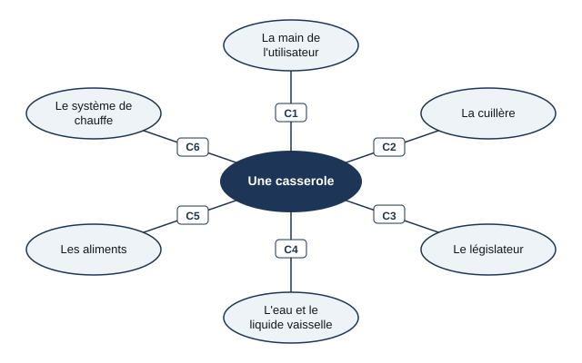
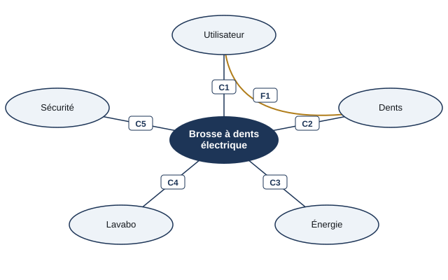

# Séance 3 — Le diagramme des interacteurs

!!! info "Séance 3 sur 4 · 45 minutes · Classe entière"

    J'apprends à lister tout ce qui est en lien avec un objet pour n'oublier aucune contrainte.

    [Fiche élève à imprimer (PDF)](fiches/5e-seq3-seance3-eleve.pdf)

    [Trace écrite de la séance](trace-ecrite-seance-3.md)

## AVANT — j'entre dans la question

#### J'observe

Le professeur pose une casserole sur son bureau et demande : « avec quoi est-elle en contact dans sa vie ? » Je regarde et je note.

| Je regarde | Ce que j'observe |
|---|---|
| Ce qui touche la casserole quand on cuisine |   |
| Ce qui la touche après le repas |   |

#### Ce qu'on cherche

Un objet est en lien avec beaucoup d'éléments pendant sa vie : quand on le transporte, quand on l'utilise, quand on le jette. Chacun lui impose une contrainte. Il ne faut en oublier aucun.

**Comment faire pour n'oublier aucune contrainte ?**

J'écris deux choses que je crois savoir. Je n'ai pas besoin d'avoir raison : je reviendrai sur ces lignes à la fin de l'heure.

| N° | Mes hypothèses de départ | Vérifié en fin de séance (✔ / ✘) |
|---|---|---|
| 1 |   |   |
| 2 |   |   |

#### Vocabulaire à repérer

| Mot | Ce que j'en comprends, avec mes mots |
|---|---|
| **interacteur** |   |
| **diagramme des interacteurs** |   |
| **cycle de vie** |   |

## PENDANT — je recherche

### Activité 1 · La méthode avec la casserole

On construit un diagramme des interacteurs en trois étapes : 1. je place l'objet au centre ; 2. je dessine autour tous les éléments qui interagissent avec lui ; 3. je relie chaque élément à l'objet et j'écris la contrainte que l'objet doit respecter.

*Diagramme des interacteurs d'une casserole (manuel, page 50)*

- **C1** : permettre à la main de l'utilisateur de porter l'objet
- **C2** : supporter le contact avec la cuillère
- **C3** : respecter les contraintes imposées par le législateur
- **C4** : permettre à l'eau et au liquide vaisselle de nettoyer l'objet
- **C5** : contenir les aliments
- **C6** : s'adapter au système de chauffe

a\. Quel interacteur n'est pas un objet ni une personne présente dans la cuisine ?

b\. J'ajoute un interacteur de la fin de vie de la casserole et sa contrainte.

### Activité 2 · La tablette numérique

Je complète le tableau : pour chaque contrainte, j'indique l'interacteur, puis le type de contrainte : utilisation, esthétisme, sécurité ou environnement (exercice 1 du manuel).

| Contrainte | Interacteur | Type |
|---|---|---|
| Afficher distinctement les informations |   |   |
| Résister aux chocs lors d'une chute |   |   |
| Ne pas utiliser trop de matériaux rares |   |   |
| Se recharger sur le réseau électrique |   |   |
| Être agréable à toucher |   |   |

Pour mon défi : voici le diagramme des interacteurs d'une brosse à dents électrique (exercice 2). Elle se recharge sur un socle par induction : l'énergie passe sans aucun contact électrique.

*Diagramme des interacteurs de la brosse à dents électrique*

- **F1** : permettre à l'utilisateur de se brosser les dents
- **C1** : la brosse doit pouvoir s'utiliser facilement
- **C2** : la brosse ne doit pas abîmer les dents
- **C3** : la brosse doit être autonome en énergie
- **C4** : `..........`
- **C5** : la brosse doit respecter les règles de sécurité électrique

### Mon défi

!!! example "Mon défi · 5e"

    Brosse à dents électrique : je lis le diagramme, j'écris la contrainte C4 (liée au lavabo), puis j'explique pourquoi la brosse se recharge par induction, sans contact électrique.

## APRÈS — je fixe ce que j'ai appris

#### À retenir

!!! note "Deux documents, deux usages"

    Ce bloc se complète en classe, à la fin de l'heure : les phrases à trous se remplissent
    pendant la mise en commun. La [trace écrite de la séance](trace-ecrite-seance-3.md)
    reprend les mêmes notions rédigées, avec les définitions exactes et les compétences
    évaluées. C'est elle qui se colle dans le cahier.

Un **interacteur** est tout ce qui est en lien avec l'objet à un moment de son **cycle de vie** : fabrication, transport, utilisation, fin de vie.

Le **diagramme des interacteurs** place l'objet au centre, les interacteurs autour, et écrit sur chaque liaison la contrainte à respecter. Il sert à n'en oublier aucune.

Un interacteur peut être une personne (l'utilisateur), un autre objet (la cuillère), un élément de l'environnement (l'eau) ou une règle (le législateur).

Je complète : Le schéma qui liste toutes les contraintes d'un objet s'appelle le diagramme des `..........`.

Je complète : Dans ce diagramme, l'objet est placé au `..........`.

#### Je reviens sur mes observations et mes hypothèses

Je coche ✔ ou ✘ chaque hypothèse. J'explique ensuite ce que j'ai observé au début de la séance, avec le vocabulaire de la séance :

#### La question de la prochaine séance

Saurai-je construire seul le diagramme des interacteurs d'un robot aspirateur ?

## S'entraîner

[Ouvrir l'exercice autocorrectif :material-arrow-right:](exercices-seance-3.html){ .md-button .md-button--primary target=_blank }

Dix questions sur la séance. Je réponds, puis je vérifie : la correction et une explication s'affichent sous chaque question. Je recommence autant de fois que je veux ; rien n'est envoyé.
