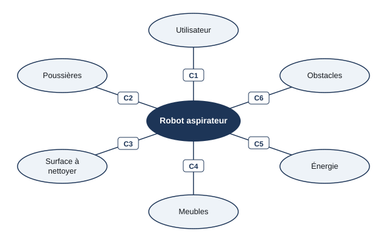

# Séance 4 — Bilan : le robot aspirateur, puis l'évaluation

!!! info "Séance 4 sur 4 · 45 minutes · Demi-groupe (salle informatique)"

    Je complète seul le diagramme des interacteurs d'un robot aspirateur, puis je passe l'évaluation de la séquence.

    [Fiche élève à imprimer (PDF)](fiches/5e-seq3-seance4-eleve.pdf)

    [Trace écrite de la séance](trace-ecrite-seance-4.md)

## AVANT — j'entre dans la question

#### J'observe

Le professeur montre une courte vidéo ou une photo d'un robot aspirateur qui nettoie une pièce. Je regarde.

| Je regarde | Ce que j'observe |
|---|---|
| Où passe le robot |   |
| Ce qu'il fait devant un obstacle |   |

#### Ce qu'on cherche

Le robot aspirateur nettoie seul, sans que personne le pousse. Pour cela il doit respecter beaucoup de contraintes.

**Quelles contraintes un robot aspirateur doit-il respecter pour nettoyer seul ?**

J'écris deux choses que je crois savoir. Je n'ai pas besoin d'avoir raison : je reviendrai sur ces lignes à la fin de l'heure.

| N° | Mes hypothèses de départ | Vérifié en fin de séance (✔ / ✘) |
|---|---|---|
| 1 |   |   |
| 2 |   |   |

#### Vocabulaire à repérer

| Mot | Ce que j'en comprends, avec mes mots |
|---|---|
| **autonomie** |   |
| **interacteur** |   |
| **contrainte** |   |

## PENDANT — je recherche

### Activité 1 · Le diagramme du robot aspirateur

*Diagramme des interacteurs du robot aspirateur (exercice 3 du manuel)*

- **C1** : `..........`
- **C6** : éviter les obstacles
- **C5** : être autonome en énergie
- **C4** : passer sous les meubles
- **C3** : `..........`
- **C2** : aspirer les poussières

a\. Pour fixer la hauteur maximale du robot, de quoi faut-il tenir compte ? Quelle contrainte ?

b\. Quelle autonomie me semble raisonnable pour la contrainte C5 ?

c\. J'ajoute un autre interacteur et sa contrainte.

### Activité 2 · L'évaluation de fin de séquence

Sur le poste, j'ouvre la page de la séquence et je clique sur **Évaluation de fin de séquence**. J'indique mon nom, mon prénom et ma classe. Je réponds aux 40 questions, puis je termine : ma note s'affiche et elle est envoyée au professeur.

| Ma note | Ce que je dois revoir |
|---|---|
| / 20 |   |

### Mon défi

!!! example "Mon défi · 5e"

    Si j'ai terminé l'évaluation en avance : je choisis un objet de la salle et je dessine son diagramme des interacteurs avec au moins quatre interacteurs.

## APRÈS — je fixe ce que j'ai appris

#### À retenir

!!! note "Deux documents, deux usages"

    Ce bloc se complète en classe, à la fin de l'heure : les phrases à trous se remplissent
    pendant la mise en commun. La [trace écrite de la séance](trace-ecrite-seance-4.md)
    reprend les mêmes notions rédigées, avec les définitions exactes et les compétences
    évaluées. C'est elle qui se colle dans le cahier.

L'**autonomie** est la capacité d'un objet à fonctionner seul. Elle impose de nombreuses contraintes : énergie, obstacles, passages.

Le diagramme des interacteurs liste toutes les **contraintes** d'un objet à partir de ses **interacteurs**. On l'établit avant de concevoir l'objet.

Je complète : Le robot doit être assez bas pour passer sous les `..........`.

Je complète : Fonctionner seul, sans être guidé, c'est l'`..........`.

#### Je reviens sur mes observations et mes hypothèses

Je coche ✔ ou ✘ chaque hypothèse. J'explique ensuite ce que j'ai observé au début de la séance, avec le vocabulaire de la séance :

## S'entraîner

[Ouvrir l'exercice autocorrectif :material-arrow-right:](exercices-seance-4.html){ .md-button .md-button--primary target=_blank }

Huit questions sur la séance. Je réponds, puis je vérifie : la correction et une explication s'affichent sous chaque question. Je recommence autant de fois que je veux ; rien n'est envoyé.

## S'évaluer : l'évaluation de la séquence

[Ouvrir l'évaluation de fin de séquence :material-arrow-right:](evaluation-sequence.html){ .md-button .md-button--primary target=_blank }

40 questions sur toute la séquence. J'indique mon nom, mon prénom et ma classe : la note s'affiche à la fin et elle est envoyée au professeur.
