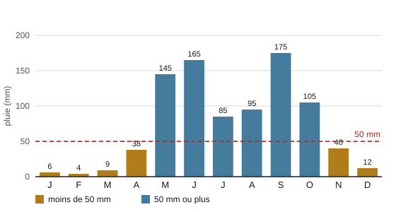

# Séance 1 — De combien d'eau ce jardin aura-t-il besoin ?

!!! info "Séance 1 sur 3 · 40 minutes · Demi-groupe (dans la cour)"

    Je mesure la cour à aménager, puis je calcule l'eau qu'il faudrait pour y faire vivre des plantes pendant la saison sèche.

    [Fiche élève à imprimer (PDF)](fiches/5e-jardin-seance1-eleve.pdf)

    [Trace écrite de la séance](trace-ecrite-seance-1.md)

## AVANT — j'entre dans la question

#### J'observe

Le demi-groupe sort dans le couloir gravillonné qui longe le bâtiment. Je regarde le sol et ce qui entoure le couloir, et je note.

| Je regarde | Ce que j'observe |
|---|---|
| Le sol du couloir |   |
| Ce qui borde le couloir |   |

#### Ce qu'on cherche

L'établissement veut transformer ce couloir en jardin. À Tegucigalpa, il ne pleut presque pas pendant une grande partie de l'année. Avant de dessiner quoi que ce soit, il faut savoir de quelle place on dispose et de combien d'eau les plantes auront besoin.

**Combien d'eau faudra-t-il chaque jour pour faire vivre un jardin dans cette cour pendant la saison sèche ?**

J'écris deux choses que je crois savoir. Je n'ai pas besoin d'avoir raison : je reviendrai sur ces lignes à la fin de l'heure.

| N° | Mes hypothèses de départ | Vérifié en fin de séance (✔ / ✘) |
|---|---|---|
| 1 |   |   |
| 2 |   |   |

#### Vocabulaire à repérer

| Mot | Ce que j'en comprends, avec mes mots |
|---|---|
| **besoin** |   |
| **contrainte** |   |
| **saison sèche** |   |

## PENDANT — je recherche

### Activité 1 · Je mesure la cour

Par équipes de quatre, avec le décamètre : un élève tient le zéro, un deuxième lit la mesure, un troisième vérifie, le quatrième note. Je mesure ce que demande le tableau.

| Ce que je mesure | Ma mesure | Mesure de référence |
|---|---|---|
| Longueur du couloir |   | 12 m |
| Largeur du couloir |   | 4 m |
| Largeur de la bande occupée par la haie |   | 0,6 m |
| Largeur du passage à laisser libre |   | 1,2 m |

Pour les calculs, j'utilise les mesures de référence.

a\. Je calcule la surface totale du couloir.

b\. Je calcule la surface de la haie, puis celle du passage, sur toute la longueur.

c\. J'en déduis la surface que l'on peut réellement planter.

### Activité 2 · Combien d'eau pendant la saison sèche ?

*Précipitations moyennes mensuelles à Tegucigalpa, en millimètres (ordres de grandeur)*

d\. Quels mois reçoivent moins de 50 mm de pluie ? Combien de jours environ cela représente-t-il ?

Huit jardinières de 0,96 m² chacune donnent environ **7,7 m²** de culture.

| Scénario | Eau par m² et par jour | Eau par jour pour 7,7 m² | Eau sur 180 jours |
|---|---|---|---|
| A · potager classique | 5 L |   |   |
| B · jardin sec | 0,8 L |   |   |

e\. Quelle quantité d'eau le scénario B économise-t-il sur la saison sèche ?

f\. J'écris le besoin sous la forme d'une contrainte mesurable.

### Mon défi

!!! example "Mon défi · 5e"

    Le jardin sec demande 6,2 L par jour. Combien de bouteilles de 1,5 L faut-il remplir chaque jour ? Et pour toute la saison sèche ?

    *Prolongement : en fin d'heure si le temps le permet, sinon à la maison.*

## APRÈS — je fixe ce que j'ai appris

#### À retenir

!!! note "Deux documents, deux usages"

    Ce bloc se complète en classe, à la fin de l'heure : les phrases à trous se remplissent
    pendant la mise en commun. La [trace écrite de la séance](trace-ecrite-seance-1.md)
    reprend les mêmes notions rédigées, avec les définitions exactes et les compétences
    évaluées. C'est elle qui se colle dans le cahier.

La cour mesure **48 m²**. Une fois la haie et le passage retirés, il reste **26,4 m²** que l'on peut planter.

À Tegucigalpa, la **saison sèche** va de novembre à avril : environ 180 jours avec moins de 50 mm de pluie par mois.

Un potager classique demanderait 5 L par m² et par jour, un jardin sec 0,8 L. Sur nos huit jardinières, on passe de 6 930 L à environ 1 109 L.

Le besoin s'écrit sous forme de **contrainte** mesurable : consommer moins de 1 L par m² et par jour.

Je complète : Une obligation chiffrée imposée à la solution est une `..........`.

Je complète : La saison sèche dure environ `..........` jours.

#### Je reviens sur mes observations et mes hypothèses

Je coche ✔ ou ✘ chaque hypothèse. J'explique ensuite ce que j'ai observé au début de la séance, avec le vocabulaire de la séance :

#### La question de la prochaine séance

Quelle jardinière, quelles plantes et quel paillage choisir pour consommer si peu d'eau ?

## S'entraîner

[Ouvrir l'exercice autocorrectif :material-arrow-right:](exercices-seance-1.html){ .md-button .md-button--primary target=_blank }

Dix questions sur la séance. Je réponds, puis je vérifie : la correction et une explication s'affichent sous chaque question. Je recommence autant de fois que je veux ; rien n'est envoyé.
