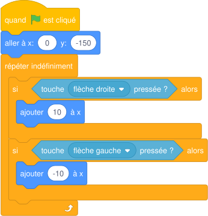

# Séance 2 — Faire bouger un lutin au clavier

!!! info "Séance 2 sur 8 · 55 minutes · Demi-groupe"

    Je programme le panier pour qu'il se déplace avec les flèches, puis la mangue pour qu'elle tombe.

    [Fiche élève à imprimer (PDF)](fiches/5e-jeu-video-seance2-eleve.pdf)

    [Trace écrite de la séance](trace-ecrite-seance-2.md)

## AVANT — j'entre dans la question

#### J'observe

Le professeur déplace le panier avec les flèches, l'affichage des coordonnées ouvert. Je regarde et je note.

| Je regarde | Ce que j'observe |
|---|---|
| Les nombres x et y sous la scène quand le panier bouge |   |
| Ce qui se passe quand on garde la flèche enfoncée |   |
| Ce qui se passe au bord de la scène |   |

#### Ce qu'on cherche

Pour faire bouger un lutin, il faut savoir où il se trouve. La scène de Scratch est un repère, comme en mathématiques.

**Comment un lutin sait-il où il est, et comment le faire bouger au clavier ?**

#### Vocabulaire à repérer

| Mot | Ce que j'en comprends, avec mes mots |
|---|---|
| **coordonnées** |   |
| **boucle** |   |
| **condition** |   |

## PENDANT — je recherche

### Activité 1 · La scène est un repère

La scène mesure 480 pas de large et 360 pas de haut. Le centre est le point (0 ; 0). x va de -240 (bord gauche) à 240 (bord droit), y va de -180 (bas) à 180 (haut).

a\. Quelles sont les coordonnées du centre de la scène ?

b\. Le panier doit rester en bas de l'écran. Quelle valeur de y lui donner ?

c\. Où se trouve un lutin placé en (200 ; 150) ?

### Activité 2 · Le script du panier

Je sélectionne le lutin Panier et je reproduis ce script, puis je clique sur le drapeau vert.

*Script du Panier*

d\. À quoi sert le bloc « répéter indéfiniment » ?

e\. Que se passe-t-il si je remplace 10 par 20 ?

!!! abstract "Pour information : la mangue qui tombe"

    Le professeur a déjà programmé la mangue : elle apparaît en haut, à un endroit tiré au hasard, puis elle descend jusqu'en bas et recommence. J'enregistre mon projet sous le nom **CUEILLETTE-v1**.

### Mon défi

!!! example "Mon défi · 5e"

    Je change la vitesse du panier : j'essaie 5, puis 15. J'écris la valeur que je préfère et pourquoi.

## APRÈS — je fixe ce que j'ai appris

#### À retenir

!!! note "Deux documents, deux usages"

    Ce bloc se complète en classe, à la fin de l'heure : les phrases à trous se remplissent
    pendant la mise en commun. La [trace écrite de la séance](trace-ecrite-seance-2.md)
    reprend les mêmes notions rédigées, avec les définitions exactes et les compétences
    évaluées. C'est elle qui se colle dans le cahier.

La position d'un lutin est donnée par ses **coordonnées** (x ; y). x augmente vers la droite, y augmente vers le haut.

Le bloc **répéter indéfiniment** est une **boucle** : il fait tester les touches pendant toute la partie.

Le bloc **si alors** contient une **condition** : son contenu n'est exécuté que si la condition est vraie.

J'enregistre mon travail en **versions** numérotées : CUEILLETTE-v1, puis v2, puis v3.

Je complète : Pour aller vers la droite, on ajoute un nombre `..........` à x.

Je complète : Sans la `..........`, les flèches ne seraient testées qu'une seule fois.

#### Retour sur mes observations

Je relis ce que j'ai noté dans « J'observe ». J'explique maintenant ce que j'ai vu, avec le vocabulaire de la séance :

#### La question de la prochaine séance

Comment écrire les règles du jeu pour qu'un ordinateur puisse les appliquer ?

## S'évaluer

[Ouvrir l'évaluation de la séance :material-arrow-right:](evaluation-seance-2.html){ .md-button .md-button--primary target=_blank }

Onze questions reprenant les activités et le vocabulaire de la séance. J'indique mon nom, mon prénom et ma classe : la note s'affiche à la fin et elle est envoyée au professeur. Je relis la trace écrite avant de commencer.
