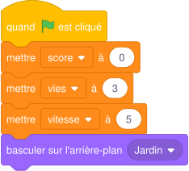
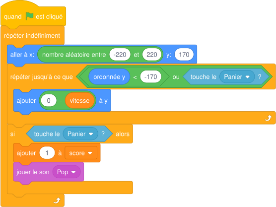
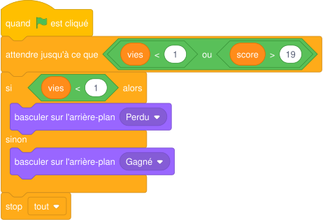

# Séance 4 — Score, vies, fin de partie et chasse aux bogues

!!! info "Séance 4 sur 8 · 55 minutes · Demi-groupe"

    Je fais compter les points et les vies, j'arrête la partie au bon moment et je corrige des bogues.

    [Fiche élève à imprimer (PDF)](fiches/5e-jeu-video-seance4-eleve.pdf)

    [Trace écrite de la séance](trace-ecrite-seance-4.md)

## AVANT — j'entre dans la question

#### J'observe

Le professeur lance une version du jeu qui contient des erreurs. Je regarde le score et les vies pendant une minute.

| Je regarde | Ce que j'observe |
|---|---|
| Le score quand une mangue reste posée sur le panier |   |
| Le nombre de vies après plusieurs scarabées |   |
| Le score au début d'une nouvelle partie |   |

#### Ce qu'on cherche

Un jeu qui compte mal n'est pas jouable. Une erreur de programme s'appelle un bogue ; on la trouve en testant.

**Comment le jeu compte-t-il les points et sait-il que la partie est finie ?**

#### Vocabulaire à repérer

| Mot | Ce que j'en comprends, avec mes mots |
|---|---|
| **initialiser** |   |
| **bogue** |   |
| **tester** |   |

## PENDANT — je recherche

### Activité 1 · Compter les points

Je crée les variables **score**, **vies** et **vitesse** (pour tous les lutins). Sur la scène, je place le script d'initialisation. Dans la Mangue, je remplace l'ancien script par celui-ci.

*Script de la Scène : initialisation*

*Script de la Mangue, version 2*

a\. Pourquoi met-on le score à 0 au clic sur le drapeau vert ?

b\. Pourquoi la mangue remonte-t-elle dès qu'elle touche le panier ?

### Activité 2 · Finir la partie

Sur la scène, j'ajoute ce second script. Il attend que la partie soit perdue ou gagnée.

*Script de la Scène : fin de partie*

c\. Quelles sont les deux façons de finir la partie ?

!!! abstract "Pour information : les bogues"

    Un **bogue** est une erreur de programme. Pour le trouver, on **teste** : on joue en regardant ce qui ne va pas. On corrige une erreur à la fois, puis on teste à nouveau. J'enregistre mon projet sous le nom **CUEILLETTE-v2**.

### Mon défi

!!! example "Mon défi · 5e"

    Je fais perdre une vie quand le scarabée touche le panier : j'écris le bloc qu'il faut ajouter dans le script du scarabée.

## APRÈS — je fixe ce que j'ai appris

#### À retenir

!!! note "Deux documents, deux usages"

    Ce bloc se complète en classe, à la fin de l'heure : les phrases à trous se remplissent
    pendant la mise en commun. La [trace écrite de la séance](trace-ecrite-seance-4.md)
    reprend les mêmes notions rédigées, avec les définitions exactes et les compétences
    évaluées. C'est elle qui se colle dans le cahier.

Une variable doit être **initialisée** : on lui donne sa valeur de départ au clic sur le drapeau vert.

La fin de partie est une condition : **vies < 1** ou **score > 19**. Les blocs **et**, **ou**, **non** sont des **opérateurs logiques** qui combinent des conditions.

Un **bogue** est une erreur de programme. Pour le trouver, je **teste** ; je corrige une erreur à la fois, puis je teste à nouveau.

Je complète : Au clic sur le drapeau vert, on `..........` les variables.

Je complète : La partie est perdue quand vies < `..........`.

#### Retour sur mes observations

Je relis ce que j'ai noté dans « J'observe ». J'explique maintenant ce que j'ai vu, avec le vocabulaire de la séance :

#### La question de la prochaine séance

Comment un ordinateur peut-il trouver un visage dans l'image d'une caméra ?

## S'évaluer

[Ouvrir l'évaluation de la séance :material-arrow-right:](evaluation-seance-4.html){ .md-button .md-button--primary target=_blank }

Douze questions reprenant les activités et le vocabulaire de la séance. J'indique mon nom, mon prénom et ma classe : la note s'affiche à la fin et elle est envoyée au professeur. Je relis la trace écrite avant de commencer.
