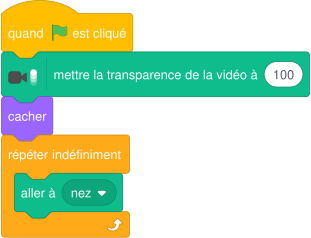
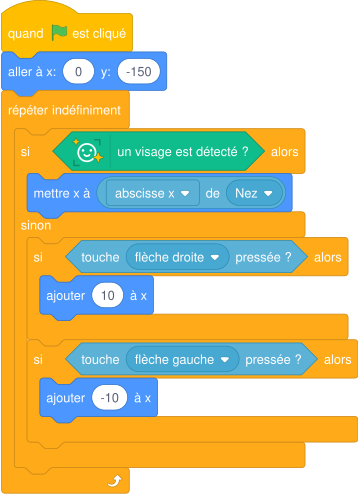

# Séance 6 — Le panier piloté au nez, l'écran titre dans Scratch Lab

!!! info "Séance 6 sur 8 · 55 minutes · Demi-groupe"

    Je fais suivre le nez par le panier, je prévois un mode clavier si la caméra échoue et je crée un écran titre.

    [Fiche élève à imprimer (PDF)](fiches/5e-jeu-video-seance6-eleve.pdf)

    [Trace écrite de la séance](trace-ecrite-seance-6.md)

## AVANT — j'entre dans la question

#### J'observe

Le professeur active l'extension Détection de visage sur le jeu. Je regarde l'écran.

| Je regarde | Ce que j'observe |
|---|---|
| La scène au moment où la caméra s'allume |   |
| Le lutin quand le professeur bouge la tête |   |
| Le lutin quand le professeur sort du champ |   |

#### Ce qu'on cherche

La détection de visage allume la webcam. Son image recouvre l'arrière-plan. Il faut la rendre invisible sans arrêter la détection, puis relier le panier au nez.

**Comment piloter le panier avec le nez, et que faire si la caméra ne marche pas ?**

#### Vocabulaire à repérer

| Mot | Ce que j'en comprends, avec mes mots |
|---|---|
| **extension** |   |
| **transparence** |   |
| **mode de secours** |   |

## PENDANT — je recherche

### Activité 1 · Un lutin invisible suit le nez

J'ouvre CUEILLETTE-v2. J'ajoute les extensions **Détection de visage** et **Détection vidéo**. Je crée un lutin nommé **Nez** (un simple point) et je lui donne ce script.

*Script du lutin Nez*

a\. Pourquoi mettre la transparence de la vidéo à 100 plutôt que d'arrêter la vidéo ?

b\. Pourquoi cacher le lutin Nez ?

### Activité 2 · Le panier suit le nez, sinon le clavier

Je remplace le script du Panier. Le panier suit l'abscisse du Nez quand un visage est détecté ; sinon, il revient au clavier.

*Script du Panier, version 3*

c\. Que se passe-t-il si la pièce est trop sombre pour détecter le visage ?

Je teste avec et sans visage devant la caméra, puis j'enregistre **CUEILLETTE-v3**.

!!! abstract "Pour information : Scratch Lab"

    Scratch Lab propose des blocs de texte animé, en anglais, pour faire un bel écran titre. Un projet qui les contient ne s'ouvre pas dans Scratch : on le garde dans un fichier séparé. Le jour de la Nuit du Code, on travaille uniquement dans Scratch.

### Mon défi

!!! example "Mon défi · 5e"

    Je fais grossir le panier quand je m'approche de la caméra : quel bloc de la Détection de visage utiliser ?

## APRÈS — je fixe ce que j'ai appris

#### À retenir

!!! note "Deux documents, deux usages"

    Ce bloc se complète en classe, à la fin de l'heure : les phrases à trous se remplissent
    pendant la mise en commun. La [trace écrite de la séance](trace-ecrite-seance-6.md)
    reprend les mêmes notions rédigées, avec les définitions exactes et les compétences
    évaluées. C'est elle qui se colle dans le cahier.

Une **extension** ajoute une famille de blocs. La Détection de visage allume la caméra : on règle la **transparence** de la vidéo à 100 pour la rendre invisible sans arrêter la détection.

Un lutin caché qui suit le nez permet au panier de lire la position du visage.

Un bon jeu prévoit un **mode de secours** : si aucun visage n'est détecté, le clavier reprend la main.

Je complète : Pour cacher l'image de la caméra sans arrêter la détection, je mets la transparence de la vidéo à `..........`.

Je complète : Si aucun visage n'est détecté, le joueur utilise le `..........`.

#### Retour sur mes observations

Je relis ce que j'ai noté dans « J'observe ». J'explique maintenant ce que j'ai vu, avec le vocabulaire de la séance :

#### La question de la prochaine séance

Comment une équipe organise-t-elle six heures pour rendre un jeu qui marche ?

## S'évaluer

[Ouvrir l'évaluation de la séance :material-arrow-right:](evaluation-seance-6.html){ .md-button .md-button--primary target=_blank }

Dix questions reprenant les activités et le vocabulaire de la séance. J'indique mon nom, mon prénom et ma classe : la note s'affiche à la fin et elle est envoyée au professeur. Je relis la trace écrite avant de commencer.
