# SketchUp 4e : Le bac et les espaces extérieurs

!!! abstract "Objectif de la séance"
    Poser la cour, ses murs et sa haie, y implanter les huit bacs par copie en série, puis ajouter le fût et la ligne d'arrosage.

!!! tip "En fin de séance, j'envoie mon dessin"
    J'enregistre mon modèle, je fais une capture d'écran de mon dessin et je l'envoie au professeur avec le formulaire [en bas de la page](#jenvoie-mon-dessin).

| Durée | Outil | Étapes |
|---|---|---|
| 40 minutes, demi-groupe | SketchUp Free, app.sketchup.com | 12 |

## À préparer

- Le fichier bac-nom-prenom de 5e, ou le composant Bac_5e fourni
- Le croquis de la cour avec l'emplacement des murs, de la haie et des bacs

## Le pas à pas

| # | Geste |
|---|---|
| 1 | Ouvrir le fichier de 5e. Si le bac manque, insérer le composant Bac_5e. |
| 2 | Outil Rectangle à l'origine : tracer le sol de la cour. |
| 3 | Sélectionner le sol, clic droit, Créer un groupe. |
| 4 | Rectangle le long du bord droit, puis Pousser/Tirer. C'est le mur du bâtiment. |
| 5 | Rectangle au fond, puis Pousser/Tirer. C'est le mur de soutènement. |
| 6 | Rectangle le long du bord gauche, Pousser/Tirer, puis Colorier en vert. C'est la haie. |
| 7 | Outil Déplacer. Poser le bac dans la cour, près du coin avant gauche. |
| 8 | Déplacer avec Ctrl vers la droite, puis taper 3x : quatre bacs alignés. |
| 9 | Sélectionner les quatre bacs, Déplacer avec Ctrl vers le mur. C'est la seconde rangée. |
| 10 | Cercle puis Pousser/Tirer : le fût. Le poser sur un socle. |
| 11 | Ligne le long de l'allée, petit Cercle à son extrémité, outil Suivez-moi. C'est le tuyau. |
| 12 | Outil Mètre : mesurer le passage libre entre les deux rangées. Enregistrer. |

## La planche des douze étapes

**1.** Ouvrir le fichier de 5e. Si le bac manque, insérer le composant Bac_5e.

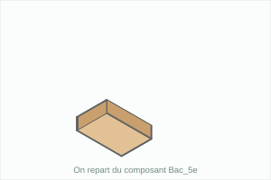

**2.** Outil Rectangle à l'origine : tracer le sol de la cour.

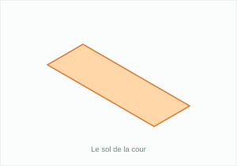

**3.** Sélectionner le sol, clic droit, Créer un groupe.

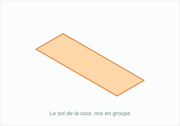

**4.** Rectangle le long du bord droit, puis Pousser/Tirer. C'est le mur du bâtiment.

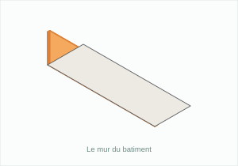

**5.** Rectangle au fond, puis Pousser/Tirer. C'est le mur de soutènement.

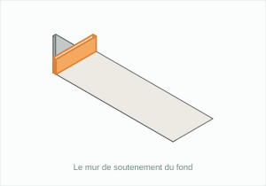

**6.** Rectangle le long du bord gauche, Pousser/Tirer, puis Colorier en vert. C'est la haie.

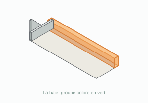

**7.** Outil Déplacer. Poser le bac dans la cour, près du coin avant gauche.

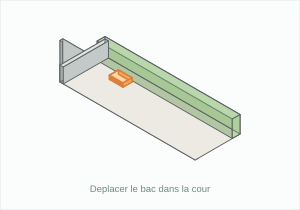

**8.** Déplacer avec Ctrl vers la droite, puis taper 3x : quatre bacs alignés.

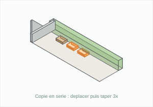

**9.** Sélectionner les quatre bacs, Déplacer avec Ctrl vers le mur. C'est la seconde rangée.

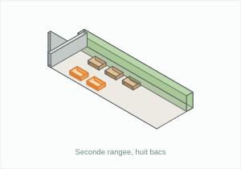

**10.** Cercle puis Pousser/Tirer : le fût. Le poser sur un socle.

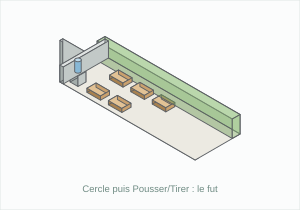

**11.** Ligne le long de l'allée, petit Cercle à son extrémité, outil Suivez-moi. C'est le tuyau.

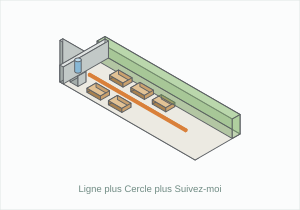

**12.** Outil Mètre : mesurer le passage libre entre les deux rangées. Enregistrer.

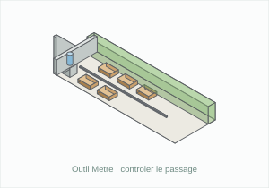

## Raccourcis

| Touche | Outil |
|---|---|
| R | Rectangle |
| C | Cercle |
| L | Ligne |
| P | Pousser/Tirer |
| M | Déplacer |
| T | Mètre |
| Ctrl | Copier en déplaçant |

## Ce que je retiens

Chaque élément est enfermé dans un ________ pour rester modifiable seul.  
La ___________________ se fait avec Déplacer et la touche ________, puis en tapant le nombre de copies suivi de la lettre ________.  
Le fût est un ________ extrudé, posé sur un socle.  
Le tuyau se construit avec l'outil ______________ : un cercle parcourt une ligne.  
L'outil ________ permet de vérifier que le passage entre les deux rangées reste libre.

## J'envoie mon dessin

J'indique la dernière étape réussie et j'ajoute une capture d'écran de mon dessin (la vue 3D avec tout le modèle visible). Le professeur la reçoit directement.

Pour la capture : Windows + Maj + S, ou Cmd + Ctrl + Maj + 4 sur Mac, puis je colle l'image dans la zone prévue. Je peux aussi utiliser Fichier, Exporter, PNG dans SketchUp et choisir le fichier obtenu.

