# SketchUp 5e : Créer le bac dans SketchUp Free

!!! abstract "Objectif de la séance"
    Construire et enregistrer la jardinière dans SketchUp Free, en suivant le croquis du cahier des charges.

!!! tip "En fin de séance, j'envoie mon dessin"
    J'enregistre mon modèle, je fais une capture d'écran de mon dessin et je l'envoie au professeur avec le formulaire [en bas de la page](#jenvoie-mon-dessin).

| Durée | Outil | Étapes |
|---|---|---|
| 40 minutes, demi-groupe | SketchUp Free, app.sketchup.com | 12 |

## À préparer

- Un compte Trimble par élève, créé à l'avance
- app.sketchup.com ouvert dans Chrome
- Le cahier des charges de la jardinière (séquence jardin sec, séance 2) sous les yeux

## Le pas à pas

| # | Geste |
|---|---|
| 1 | Ouvrir app.sketchup.com, cliquer Créer un modèle, choisir le modèle Mètres. |
| 2 | Cliquer sur le personnage, appuyer sur Suppr. |
| 3 | Outil Rectangle. Cliquer à l'origine, puis cliquer une seconde fois : c'est la forme du fond. |
| 4 | Outil Pousser/Tirer. Cliquer la face et la soulever un peu. C'est le fond. |
| 5 | Outil Rectangle. Tracer une bande fine sur le dessus du fond, le long du bord avant. |
| 6 | Outil Pousser/Tirer. Monter cette bande. C'est la première paroi longue. |
| 7 | Refaire les étapes 5 et 6 sur le bord arrière. C'est la seconde paroi longue. |
| 8 | Rectangle entre les deux parois, côté gauche, puis Pousser/Tirer jusqu'au haut des parois. |
| 9 | Refaire l'étape 8 à droite. Le caisson est fermé. |
| 10 | Outil Mètre. Mesurer la hauteur du bac et noter la valeur trouvée. |
| 11 | Sélectionner tout, clic droit, Créer un composant. Nom : Bac_5e. |
| 12 | Ajouter la terre puis le paillage dans le bac, puis enregistrer sous bac-nom-prenom. |

## La planche des douze étapes

**1.** Ouvrir app.sketchup.com, cliquer Créer un modèle, choisir le modèle Mètres.

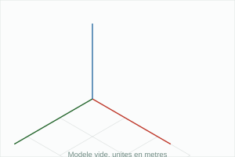

**2.** Cliquer sur le personnage, appuyer sur Suppr.

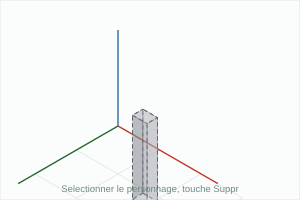

**3.** Outil Rectangle. Cliquer à l'origine, puis cliquer une seconde fois : c'est la forme du fond.

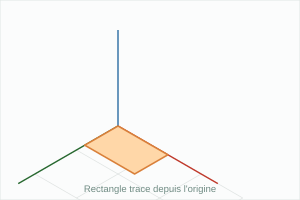

**4.** Outil Pousser/Tirer. Cliquer la face et la soulever un peu. C'est le fond.

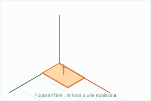

**5.** Outil Rectangle. Tracer une bande fine sur le dessus du fond, le long du bord avant.

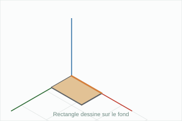

**6.** Outil Pousser/Tirer. Monter cette bande. C'est la première paroi longue.

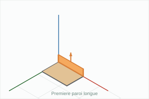

**7.** Refaire les étapes 5 et 6 sur le bord arrière. C'est la seconde paroi longue.

**8.** Rectangle entre les deux parois, côté gauche, puis Pousser/Tirer jusqu'au haut des parois.

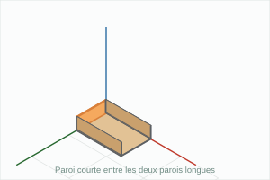

**9.** Refaire l'étape 8 à droite. Le caisson est fermé.

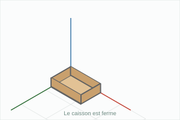

**10.** Outil Mètre. Mesurer la hauteur du bac et noter la valeur trouvée.

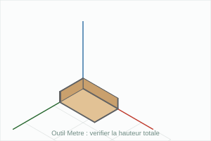

**11.** Sélectionner tout, clic droit, Créer un composant. Nom : Bac_5e.

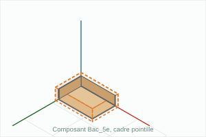

**12.** Ajouter la terre puis le paillage dans le bac, puis enregistrer sous bac-nom-prenom.

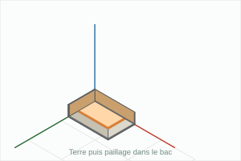

## Raccourcis

| Touche | Outil |
|---|---|
| R | Rectangle |
| P | Pousser/Tirer |
| M | Déplacer |
| T | Mètre |
| O | Orbite |
| Espace | Sélection |

## Ce que je retiens

SketchUp Free s'ouvre sur ______________________ et fonctionne dans le navigateur, sans installation.  
On choisit toujours le modèle en ________ pour dessiner à l'échelle réelle.  
L'outil ____________ dessine une surface, l'outil __________________ lui donne une épaisseur.  
L'outil ____________ sert à mesurer une longueur sur le modèle.  
Un ____________ se met à jour dans toutes ses copies, un groupe non.

## J'envoie mon dessin

J'indique la dernière étape réussie et j'ajoute une capture d'écran de mon dessin (la vue 3D avec tout le modèle visible). Le professeur la reçoit directement.

Pour la capture : Windows + Maj + S, ou Cmd + Ctrl + Maj + 4 sur Mac, puis je colle l'image dans la zone prévue. Je peux aussi utiliser Fichier, Exporter, PNG dans SketchUp et choisir le fichier obtenu.

